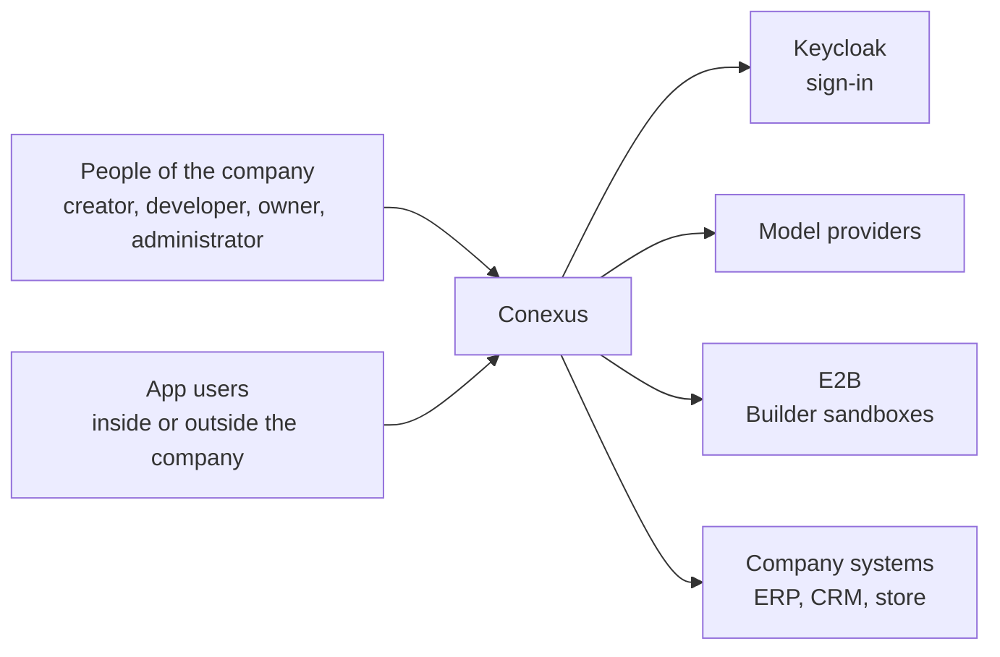
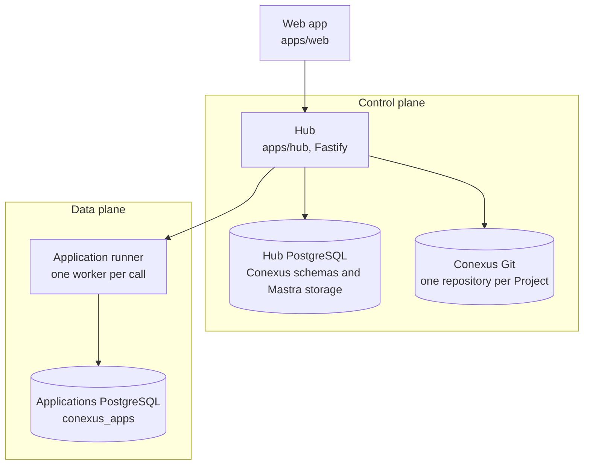

# Architecture

How Conexus is built and why. This guide follows the twelve sections of the
[arc42 template](https://arc42.org/overview), with [C4](https://c4model.com/) diagrams for context
and containers. It states the architecture Conexus must have. Code that departs from it is a
defect, listed in section 11 with the wave that fixes it. A part marked "not built" belongs to the
architecture but is absent from the code, so nothing may call it yet.

Owners next door: [product](../product/contract.md), [database](database.md),
[security](security-and-authority.md), [the wire contract](../product/wire-contract.md), and
[code](../development/codebase-principles.md). Mastra evidence lives in
[the Mastra reference](mastra/index.md).

## 1. Introduction and goals

### 1.1 Requirements overview

Conexus is the platform where a company turns its data and knowledge into results: integrations
with its systems, company knowledge, the Builder, apps on the data, agents and workflows, and
security. [The product guide](../product/contract.md) owns the requirements, the people and the
journeys.

### 1.2 Quality goals

Four qualities drive every architectural choice, in this order. When two conflict, the higher one
wins.

| Priority | Quality | Goal |
| --- | --- | --- |
| 1 | Security and isolation | Data of one company, Project or person never reaches anyone without access to it. Generated code never touches the core. |
| 2 | Truth | What a screen shows comes from the owner of that fact. Nothing is invented. |
| 3 | Recovery | A crash, a restart or a retry never loses work and never leaves a half-done state. |
| 4 | Evolution | Each concept has one owner, native comes first, and the code reads clearly to a person and to an agent, so the next capability costs less than the last. |

**Why.** Without an order, each person and each agent settles a conflict a different way, and the
system stops being coherent.

**Right.** On reconnect the screen rereads the conversation, the run and the source from their
owners, at the cost of one more request. Truth wins over speed.

**Wrong.** The screen caches run state to feel fast and, after a crash, shows a run as running that
already settled.

Speed and cost come after these four. A performance number enters section 10 when it becomes a
requirement.

### 1.3 Stakeholders

| Who | Expects from this guide |
| --- | --- |
| The operator | The architecture to approve, and the departures each wave fixes |
| Developers and coding agents | Where a change belongs, which owner it touches, and what it must never do |
| Reviewers | The rule a change is judged against |

## 2. Architecture constraints

### Native first

Mastra, PostgreSQL, Keycloak and E2B do what they already do. A Conexus mechanism (a table, an SQL
function, a module, a cookie, a provider setting or an exported helper) enters only with a named
requirement, the native API read at the installed version, the limitation proven, and a smaller
configuration or composition rejected for a stated reason. A gap never justifies a fork or a
parallel engine. It goes back to the spec. Owning a business rule does not oblige Conexus to own the
engine that runs it.

**Why.** Every engine Conexus writes beside Mastra is one more thing to keep correct, and it drifts
from the framework the rest of the code follows.

**Right.** A question from the Builder waits inside the run through Mastra's own suspend and resume.

**Wrong.** A Conexus table that mirrors Mastra's messages so the screen can read them.

### Dependencies

A dependency enters only with a current consumer, a named limitation, the exact API and version
examined, a probe, and evidence against an alternative. An existing dependency wins when it is
enough. A pinned dev-only check tool is exempt. Versions are exact. The roadmap's
[technology baseline](../roadmap.md#technology-baseline) lists what is in and what waits.

### Technical and organizational constraints

| Constraint | Explanation |
| --- | --- |
| One installation serves one company | Nothing shares a database, a sign-in realm or a model account between companies (C-024). |
| TypeScript on Node, PostgreSQL only | Strict TypeScript everywhere. PostgreSQL is the only database engine. |
| One fixed stack for generated apps | Pinned in `apps/hub/compiler-template/package.json` (C-033). |
| The repository is public | No company data, credential or private name enters it. |

## 3. Context and scope

### 3.1 Business context

| Partner | Exchange |
| --- | --- |
| People of the company | Requests, conversations, settings, and the code and Previews they read |
| App users | The apps they were given access to |
| Keycloak | Who a person is. It authenticates and grants nothing |
| Model providers | Model calls, made only from the Hub |
| E2B | The Builder's sandbox, which holds files and runs commands and checks |
| Company systems | Reads through the integration executor. Writes are not built |

### 3.2 Technical context

| Channel | Between | Protocol |
| --- | --- | --- |
| Hub, Preview and app hosts | Browser and Hub | HTTPS, one host each |
| Sign-in | Hub and Keycloak | OpenID Connect |
| Model calls | Hub and providers | Each provider's HTTPS API |
| Sandbox | Hub and E2B | The E2B API |
| Runner | Hub and application runner | HTTP over an owner-only unix socket |
| Vendor requests | Integration executor and company systems | The vendor's own format |

## 4. Solution strategy

Conexus is a common core with creations on top of it. The core owns what every creation uses:

- who a person is and what they may do (`identity-access`),
- the connected systems (`connectors`),
- the model accounts,
- where generated code runs and is hosted (`app-runner`, `registry`, `mar`),
- periodic work (`platform/jobs.ts`).

Each creation uses the core through a port and never holds its own copy of it. The creation built
today is the app, made by the Builder. Agents and workflows are not built. They will run on what
Mastra already provides (agents, workflows, memory and retrieval) and use the same core.

**Why.** The core is what makes the second creation cheaper than the first. A new agent finds the
integrations, the accounts and the access already in place.

**Right.** The Builder reads company systems through `BuilderConnectorPort`
(`apps/hub/src/builder/module.ts`), and a future agent uses the same port.

**Wrong.** An agent gets its own ERP client and its own table of model accounts.

## 5. Building block view

### System map

Level 1, the whole system:

| Block | Responsibility | Where |
| --- | --- | --- |
| Hub | Every product API, the Builder, admission, the job executor, and serving Previews and apps | `apps/hub` |
| Web app | The screens. It calls the Hub only through `apps/web/src/app/http.ts` | `apps/web` |
| Hub PostgreSQL | Conexus schemas and Mastra storage, in one cluster | `apps/hub/migrations` |
| Conexus Git | One repository per Project. Its `main` is the admitted revision | `apps/hub/src/builder/conexus-git.ts` |
| Application runner | Runs generated handlers and Project migrations in isolated workers | `apps/hub/src/app-runner` |
| Applications PostgreSQL | One schema per Project and environment, with bounded storage per Project | `apps/hub/src/app-runner/data-plane.ts` |
| Contract package | The shared types and wire declarations of the Hub and the web app | `packages/contract` |

Level 2, the Hub:

| Module | Responsibility |
| --- | --- |
| `identity-access` | Sign-in, Accounts, membership, admission, installation administrators, expiry |
| `workspace`, `project` | Workspaces and their rosters, Projects and their settings |
| `builder` | The Builder harness, runs, conversations and Conexus Git |
| `connectors` | Integrators, connections, bindings and the integration executor |
| `registry` | Built apps and their artifacts |
| `mar` | Serving Previews and apps on their own hosts |
| `app-runner` | The Hub's client of the application runner, and the runner itself |
| `telemetry` | Metrics and log codes |
| `platform`, `http` | Shared technical layers every module may use |

### One owner per concept

Each concept has one owner. The other side holds a link to the owner's record, never a copy.

| Concept | Owner | Others hold |
| --- | --- | --- |
| Sign-in | Keycloak | An Account keyed by issuer and subject |
| Account, Workspace, membership, installation administrator | Conexus IAM (`identity-access`) | The Account id |
| Conversation and its messages | A Mastra thread | Nothing. Conexus keeps no conversation store |
| The live turn | The Mastra session stream, behind Conexus access | No Conexus copy of the stream |
| A Builder run | Conexus, one state machine with a generated vocabulary | Mastra holds the agent's steps |
| Current source | `main` in Conexus Git, moved only by the Hub's fast forward from the run's base | Runs and sandboxes hold a branch mirror |
| Built app and Preview | The registry | Publication alone selects what app users receive. Not built |
| Model accounts | Conexus, one per person and provider, sealed | Model calls run in the Hub. The sandbox holds no secret |
| Project app data | Conexus allocates it. The Project's repository owns its migrations | The runner holds a per-Project role |
| Integrators, connections, bindings | Conexus, every call recorded | Handlers and the Builder reach a connection only through the Hub executor |
| Periodic work and expiry | One job executor, `platform/jobs.ts` | No other timer |
| Diagnostic traces | Mastra observability | Never source, settlement or Preview authority |
| Company knowledge, agents, workflows | Mastra memory, agents and workflows, under the core's access. Not built | |

**Why.** A copy drifts from its owner, and then two parts of the system disagree about the same fact.

**Right.** The screen reads a conversation's messages from the Mastra thread.

**Wrong.** A Conexus table caches the last messages for a faster list, and a deleted message stays
on screen.

### Layers

`platform` and `http` import no application module, and the composition root imports only what
`scripts/check-import-law.mjs` allows. A module reaches another only through its public module
constructor, never by a deep import.

## 6. Runtime view

### A request to the Builder

1. The person sends a message from the web app. The Hub admits it: the person may build in the
   Project, and the Project has no active run.
2. The run starts. The agent runs in the Hub on the conversation's Mastra session. It edits files
   and runs commands in the conversation's E2B sandbox, on a branch mirror of the source.
3. A question to the person waits inside the run through Mastra's suspend and resume.
4. The agent's "done" is one checked verdict. The candidate is checked and built in the sandbox,
   running its code only as the agent's user. A red check goes back to the agent in the same run.
5. Admission moves `main` by fast forward from the run's base. When `main` moved during the run,
   nothing is applied.
6. The built app goes to the registry, and the Preview launches. The run settles, and a settled run
   is never rewritten.

A conversation keeps one Mastra session, one E2B sandbox and one branch mirror across its turns.
Idle sweeps release the session and the paused sandbox, and the mirror stays. A stop records the
intent before it signals the run, so a pending stop prevents a later success. A reconnect reads the
thread, the run, the source and the Preview from their owners, so a missed live event never loses
state.

### A person using an app

1. The browser opens the app's address. The Hub resolves the app from the host name.
2. The person signs in through Keycloak. Every request checks again that they hold app access or
   Workspace membership.
3. The Hub serves the app's built files from the registry.
4. A call to the app's server goes to the application runner. A fresh worker runs the handler and
   reaches only its own Project's database role through a per-call relay.

### Reading a company system

1. The Builder, or an app's handler, asks the Hub executor for an operation on a connection bound to
   the Project.
2. The executor checks the binding and the read rule, and the integrator's adapter makes the request
   in the vendor's own format.
3. The call is recorded, and the result returns. A failed read returns as a failure, never as empty
   data.

### A Hub restart

When the Hub stops, every open run ends `INTERRUPTED` with `HUB_RESTART`. `main` holds only admitted
revisions, so no admitted work is lost. The next request starts from the current source.

## 7. Deployment view

### Where code runs

Generated code never runs in the Hub process. The Builder's agent and its model calls run in the
Hub, and its E2B sandbox holds the files and runs the commands and checks. Generated handlers and
Project migrations run in the application runner, each in a fresh rootless bubblewrap worker with no
network except the Hub's connector socket for that call, no host files, no credential, and bounded
time, memory and output. The Builder never receives a Hub, connector or production credential.
Bootstrap, secret custody, role provisioning, ingress and connector execution are platform code,
never generated code.

### Infrastructure

| Node | Runs |
| --- | --- |
| Hub process | The Hub, the web app's built files, Previews and apps |
| Application runner process | The runner and its workers, reached by the Hub's unix socket |
| Hub PostgreSQL cluster | Conexus schemas and Mastra storage |
| Applications PostgreSQL cluster | `conexus_apps` |
| Keycloak | Sign-in |
| E2B (outside) | Builder sandboxes |
| OpenTelemetry collector | Telemetry, configured in `infra/telemetry` |

The two PostgreSQL clusters are independent, so a full Applications cluster never stops the control
plane. No database, server or container exists per Project. The pilot runbook is
[`infra/pilot/README.md`](../../infra/pilot/README.md).

## 8. Cross-cutting concepts

### Generated apps are ordinary source

The browser app lives under `app/`, server handlers under `conexus/handlers/`, forward SQL under
`conexus/migrations/` and the contract in `conexus/manifest.json`. An app imports only its fixed
stack and calls its server through the client generated from its manifest. Regeneration never
overwrites source the app owns.

### Bind to Mastra, never mirror it

Binding to a Mastra id is allowed. Mirroring Mastra's messages, states or lifecycles, or wrapping it
to hide it, is not. Conexus never forks, patches or reaches into Mastra internals, writes Mastra
tables or replaces a method on a Mastra object. The extension point is a documented subclass or
option. Each crossing has its evidence and removal trigger in [the Mastra boundary](mastra/boundary.md).
Identity reaches Mastra code in the `RequestContext` keys the server sets, never in agent or tool
input. A provider setting that forces compensating code (locks, retries, polling) names the
requirement it serves, or both go.

### The web app

The web app shows what the Hub says. It owns no business lifecycle, no authorization decision, no
parallel schema and no copy of a business entity. Its cache and preferences are never server truth.
A hard screen never justifies a screen-shaped endpoint. A missing endpoint goes to its owner.

### Failures, security and data

Failures follow [code](../development/codebase-principles.md), access and secrets follow
[security](security-and-authority.md), and transactions and roles follow [database](database.md).

## 9. Architecture decisions

The decisions that shape this architecture. Each one's text and reasons are in
[the decisions register](../decisions/index.md).

| Decision | What it shapes |
| --- | --- |
| C-015 | Keycloak authenticates. Conexus owns identity mapping, grants and its own session |
| C-023 | The Builder's sandbox has open internet egress (an accepted risk, section 11) |
| C-024 | One installation serves one company |
| C-026 | Installation-wide actions belong to an installation administrator |
| C-028 | Generated apps run on a managed application platform, not a backend per Project |
| C-029 | Every connector call is recorded |
| C-030 | One integrator per external system, one executor for all calls |
| C-032 | The Builder is a Conexus harness on Mastra's engine |
| C-033 | Generated apps use one fixed stack |
| C-036 | A conversation is private to the person who started it. Not built |

## 10. Quality requirements

### 10.1 Overview

The four goals of section 1.2 are the quality requirements. Each has scenarios below.

### 10.2 Quality scenarios

| Quality | Scenario | Expected response |
| --- | --- | --- |
| Security | A generated handler tries to open a network connection or read a host file | The worker blocks it, and the call fails |
| Security | A person whose app access was removed sends a request | It is refused on that request |
| Security | The Builder's sandbox looks for a Hub or connector credential | It finds none |
| Truth | A company system read fails | The consumer receives a failure, never empty data |
| Truth | The screen missed live events while offline | On reconnect it shows the owners' current state |
| Recovery | The Hub restarts during a run | The run ends `INTERRUPTED`, and no admitted source is lost |
| Recovery | `main` moved while a run worked | The run's result is not applied, and nothing is overwritten |
| Recovery | The Applications cluster fills up | The Hub keeps serving its own screens and APIs |
| Evolution | A module deep-imports another, or `platform` imports a module | `scripts/check-import-law.mjs` fails the build |

## 11. Risks and technical debt

Each departure from this guide, with the wave in [the roadmap](../roadmap.md) that removes it. The
pull request that fixes one deletes its line.

| Departure or risk | Wave |
| --- | --- |
| `apps/hub/src/platform/receipt.ts` imports `identity-access`, and the import checker allows it | S1 |
| `apps/web/src/generated/iam-client.ts` calls the Hub with `fetch`, outside `http.ts` | S1 |
| The first access is refused: `admitBootstrap` is not built | S1, part 6 |
| Model accounts and the Mastra instance live in `builder`, not in the core | Hub base, after S1 |
| Nothing bounds one Project's storage in the Applications cluster | Hub base, after S1 |
| An `archived` Project state exists that nothing produces | Project lifecycle, after S1 |
| `ProjectPurged` is told apart by `projectRevision: ''`, and `archived` and `deleting` are booleans | Project lifecycle, after S1 |
| Rows read without a schema, response bodies cast with `as`, and ids typed `string` in module ports (counted by `scripts/census-boundaries.mjs`) | S1 |
| `startHub`, `createHttpApp` and the Builder module stay past the function size limit by suppression | Hub base, after S1 |
| `Scope` in `apps/hub/src/connectors/scope.ts` is a class with mutable state | Hub base, after S1 |
| About 400 named top-level functions are `const` arrows, eight class fields use `#private` outside secret values, and six types are `interface` without augmenting a library | Hub base, after S1 |
| `app-runner/http.ts` reads a failure code from `error.message` | Hub base, after S1 |
| Ten operations are still declared in YAML, and `identity-access/routes.ts` parses `Idempotency-Key` by hand | S1 |
| `GET .../workspaces/{workspaceId}/projects` returns a top-level array, and lists that grow have no continuation token | Hub base, after S1 |
| Stores not yet ported run as `hub_runtime` (`unportedPool`, the instance lock session), with `legacy` roles, `legacy_owner` and `legacy_runtime` policies, and SQL functions that hold business rules | S1, parts 4 to 6 |
| Three migrations drop with `CASCADE` | S1 reset |
| Tests read production source text (`builder-harness.test.mjs`, `builder-template-pins.test.mjs`, `builder-check-bundle.test.mjs`, `connector-adapter-source.test.mjs`) | Hub base, after S1 |
| PostgreSQL tests skip without an `opt-in:` reason when no database is configured, and `keycloak-theme:check` is outside CI | Hub base, after S1 |
| The Hub swallows a failed run publish and the screen polls instead, and `liveRuns` and the session `subscriptions` share module state | S5 |
| No route lets a person or an administrator end sessions, and a restore has no step that ends them | Hub base, after S1 |
| The Hub has no rate limit, and the realm has no brute-force protection | Hub base, after S1 |
| Keys have no rotation procedure | Hub base, after S1 |
| Screen stylesheets write values by hand: radii (`14px`, `999px` and others), shadows and the overlay as raw `rgb()`, shadows at rest (`styles.css`, `projects-home.css`, `lens-surfaces.css`, `construir.css`), a gradient texture in `.cx-thumb-placeholder`, and about 49 unused selectors in `styles.css` that carry them | Web style, after S1 |
| `tokens.css` has no `card` or `pill` radius and no spacing scale, no test ties the front matter of `DESIGN.md` to `tokens.css`, and `.impeccable/design.json` repeats the tokens with no reader | Web style, after S1 |
| `accent-text` on `canvas`, `surface-3` and `accent-soft`, and `success` on `surface-3` and `surface-4`, fall below 4.5:1 | Web style, after S1 |
| `.cx-nav-soon` text is 10.4px | Web style, after S1 |
| `composer.css` overrides Mastra's `composer-box` per component, and its controls show focus by a fill, not the outline | Web style, after S1 |
| The composer's animated conic ring and the shimmer on "Pensando…" are motions beyond Encaixe | Web style, after S1 |
| An icon has stroke 1.75 (`builder-conversation.tsx`), icons use sizes 13, 15 and 17, and `ask-user-pt.tsx` types a `✓` glyph | Web style, after S1 |
| Retry buttons say "Tentar novamente" in two places and "Tentar de novo" in a third | Web style, after S1 |
| The Builder's sandbox has open internet egress (C-023) | Accepted risk |
| Project handlers can read other Projects' schema names (C-037) | Accepted risk |
| A deleted Project's prompts stay in trace spans for up to 30 days (C-038) | Accepted risk |
| One Mastra crossing remains in `apps/hub/src/builder/mastra-leftovers.ts` until mastra-ai/mastra#25903 | Accepted risk |

## 12. Glossary

Product concepts are in section 4 of [the product guide](../product/contract.md#4-concepts). The
technical terms:

| Term | Definition |
| --- | --- |
| Hub | The Conexus server process: every API, the Builder and app serving |
| Control plane | The Hub, its PostgreSQL, Conexus Git, Keycloak and E2B |
| Data plane | The application runner and the Applications PostgreSQL |
| Core | The parts every creation uses: identity, integrations, model accounts, hosting and jobs |
| Creation | Something people build on the core: an app today, an agent or a workflow later |
| Conexus Git | The Hub's Git store, one repository per Project |
| Branch mirror | The copy of a Project's source a conversation's sandbox works on |
| Candidate | A revision the agent proposes, before admission |
| Admission | Moving `main` to a checked candidate by fast forward from the run's base |
| Registry | The store of built apps |
| Application runner | The process that runs generated handlers and migrations in isolated workers |
| Integration executor | The one path from Conexus to a company system |
| Integrator | The adapter for one kind of external system |
| Port | The interface through which a creation uses a core part |
