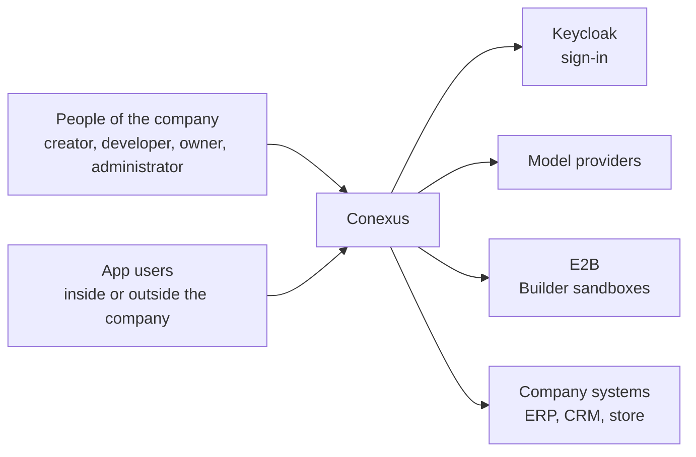
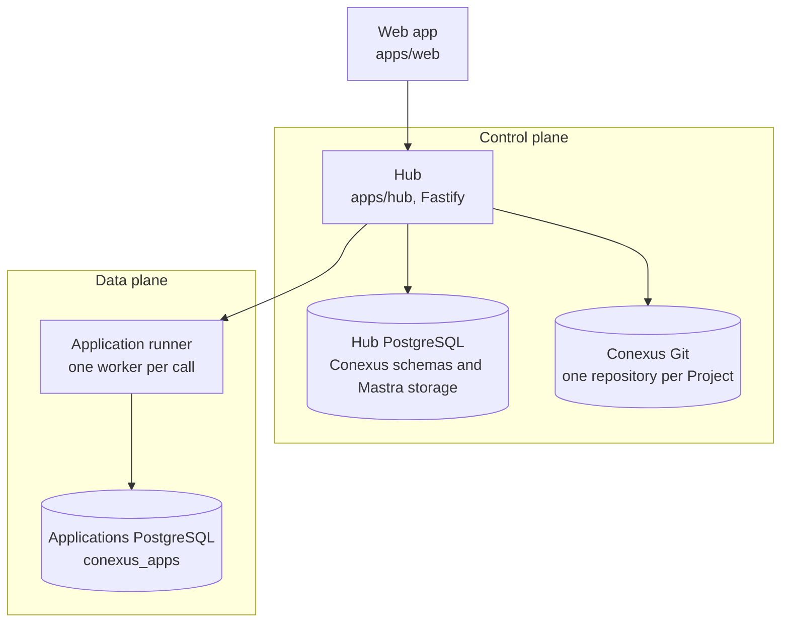

# Architecture

How Conexus is built and why. The structure follows [arc42](https://arc42.org/overview), with
[C4](https://c4model.com/) diagrams for context and containers. This guide states the architecture
Conexus must have. Code that departs from it is a defect, fixed by the wave that owns the area in
[the roadmap](../roadmap.md). A part marked "not built" is part of the architecture but absent from
the code, so nothing may call it yet.

Owners next door: [product](../product/contract.md) for what Conexus is for and its vocabulary,
[database](database.md), [security](security-and-authority.md),
[the wire contract](../product/wire-contract.md), and [code](../development/codebase-principles.md).
Decisions and their reasons live in [the decisions register](../decisions/index.md). Mastra
evidence lives in [the Mastra reference](mastra/index.md).

## 1. Quality goals

Four qualities drive every architectural choice, in this order. When two conflict, the higher one
wins.

1. **Security and isolation.** Data of one company, Project or person never reaches anyone without
   access to it. Generated code never touches the core.
2. **Truth.** What a screen shows comes from the owner of that fact, and nothing is invented.
3. **Recovery.** A crash, a restart or a retry never loses work and never leaves a half-done state.
4. **Evolution.** Each concept has one owner, native comes first, and the code reads clearly to a
   person and to an agent, so the next capability costs less than the last.

**Why.** Without an order, each person and each agent settles a conflict a different way, and the
system stops being coherent.

**Right.** On reconnect the screen rereads the conversation, the run and the source from their
owners, at the cost of one more request. Truth wins over speed.

**Wrong.** The screen caches run state to feel fast and, after a crash, shows a run as running
that already settled.

Speed and cost come after these four. A performance number enters this list when it becomes a
requirement.

## 2. Constraints

### Native first

Mastra, PostgreSQL, Keycloak and E2B do what they already do. A Conexus mechanism (a table, an SQL
function, a module, a cookie, a provider setting or an exported helper) enters only with a named
requirement, the native API read at the installed version, the limitation proven, and a smaller
configuration or composition rejected for a stated reason. A gap never justifies a fork or a
parallel engine. It goes back to the spec. Owning a business rule does not oblige Conexus to own
the engine that runs it.

**Why.** Every engine Conexus writes beside Mastra is one more thing to keep correct, and it drifts
from the framework the rest of the code follows.

**Right.** A question from the Builder waits inside the run through Mastra's own suspend and resume.

**Wrong.** A Conexus table that mirrors Mastra's messages so the screen can read them.

### Dependencies

A dependency enters only with a current consumer, a named limitation, the exact API and version
examined, a probe, and evidence against an alternative. An existing dependency wins when it is
enough. A pinned dev-only check tool is exempt. Versions are exact. The roadmap's
[technology baseline](../roadmap.md#technology-baseline) lists what is in and what waits.

### Other constraints

- One installation serves one company. Nothing in the design shares a database, a sign-in realm or
  a model account between companies.
- The code is TypeScript, strict, on Node, with PostgreSQL as the only database engine.
- A generated app runs on one fixed stack, pinned in `apps/hub/compiler-template/package.json`.

## 3. Context and scope

Conexus is one system for one company. People reach it through a browser. It depends on four
outside systems and owns everything between them.

Keycloak authenticates and grants nothing. Model providers answer model calls made from the Hub.
E2B hosts the Builder's sandbox. Company systems are reached only through the integration
executor, and today only to read.

## 4. Solution strategy

Conexus is a common core with creations on top of it. The core owns what every creation uses:

- who a person is and what they may do (`identity-access`),
- the connected systems (`connectors`),
- the model accounts,
- where generated code runs and is hosted (`app-runner`, `registry`, `mar`),
- periodic work (`platform/jobs.ts`).

Each creation uses the core through a port and never holds its own copy of it. The creation built
today is the app, made by the Builder. Agents and workflows are not built. They will run on what
Mastra already provides (agents, workflows, memory and retrieval) and use the same core.

**Why.** The core is what makes the second creation cheaper than the first. A new agent finds the
integrations, the accounts and the access already in place.

**Right.** The Builder reads company systems through `BuilderConnectorPort`
(`apps/hub/src/builder/module.ts`), and a future agent uses the same port.

**Wrong.** An agent gets its own ERP client and its own table of model accounts.

## 5. Building blocks

### System map

| Part | Job | Where |
| --- | --- | --- |
| Hub | Every product API, the Builder, admission, the job executor, and serving Previews and apps | `apps/hub` |
| Web app | The screens. It calls the Hub only through `apps/web/src/app/http.ts` | `apps/web` |
| Hub PostgreSQL | Conexus schemas and Mastra storage, in one cluster | `apps/hub/migrations` |
| Conexus Git | One repository per Project. Its `main` is the admitted revision | `apps/hub/src/builder/conexus-git.ts` |
| Application runner | Runs generated handlers and Project migrations in isolated workers | `apps/hub/src/app-runner` |
| Applications PostgreSQL | One schema per Project and environment, with bounded storage per Project | `apps/hub/src/app-runner/data-plane.ts` |
| Contract package | The shared types and wire declarations of the Hub and the web app | `packages/contract` |

The Hub modules are `identity-access`, `workspace`, `project`, `builder`, `connectors`, `registry`,
`mar` (serving apps and Previews), `app-runner` and `telemetry`, over `platform` and `http`.

### One owner per concept

Each concept has one owner. The other side holds a link to the owner's record, never a copy.

| Concept | Owner | Others hold |
| --- | --- | --- |
| Sign-in | Keycloak | An Account keyed by issuer and subject |
| Account, Workspace, membership, installation administrator | Conexus IAM (`identity-access`) | The Account id |
| Conversation and its messages | A Mastra thread | Nothing. Conexus keeps no conversation store |
| The live turn | The Mastra session stream, behind Conexus access | No Conexus copy of the stream |
| A Builder run | Conexus, one state machine with a generated vocabulary | Mastra holds the agent's steps |
| Current source | `main` in Conexus Git, moved only by the Hub's fast forward from the run's base | Runs and sandboxes hold a branch mirror |
| Built app and Preview | The registry | Publication alone selects what app users receive. Not built |
| Model accounts | Conexus, one per person and provider, sealed | Model calls run in the Hub. The sandbox holds no secret |
| Project app data | Conexus allocates it. The Project's repository owns its migrations | The runner holds a per-Project role |
| Integrators, connections, bindings | Conexus, every call recorded | Handlers and the Builder reach a connection only through the Hub executor |
| Periodic work and expiry | One job executor, `platform/jobs.ts` | No other timer |
| Diagnostic traces | Mastra observability | Never source, settlement or Preview authority |
| Company knowledge, agents, workflows | Mastra memory, agents and workflows, under the core's access. Not built | |

**Why.** A copy drifts from its owner, and then two parts of the system disagree about the same
fact.

**Right.** The screen reads a conversation's messages from the Mastra thread.

**Wrong.** A Conexus table caches the last messages for a faster list, and a deleted message stays
on screen.

### Layers

`platform` imports no application module, and the composition root imports only what
`scripts/check-import-law.mjs` allows. A module reaches another only through its public module
constructor, never by a deep import.

## 6. Runtime view

### A request to the Builder

1. The person sends a message from the web app. The Hub admits it: the person may build in the
   Project, and the Project has no active run.
2. The run starts. The agent runs in the Hub on the conversation's Mastra session. It edits files
   and runs commands in the conversation's E2B sandbox, on a branch mirror of the source.
3. A question to the person waits inside the run through Mastra's suspend and resume.
4. The agent's "done" is one checked verdict. The candidate is checked and built in the sandbox,
   running its code only as the agent's user. A red check goes back to the agent in the same run.
5. Admission moves `main` by fast forward from the run's base. When `main` moved during the run,
   nothing is applied.
6. The built app goes to the registry, and the Preview launches. The run settles, and a settled run
   is never rewritten.

A conversation keeps one Mastra session, one E2B sandbox and one branch mirror across its turns.
Idle sweeps release the session and the paused sandbox, and the mirror stays. A stop records the intent before it signals the run, so a pending stop prevents a later success.
A reconnect reads the thread, the run, the source and the Preview from their owners, so a missed
live event never loses state.

### A person using an app

1. The browser opens the app's address. The Hub resolves the app from the host name.
2. The person signs in through Keycloak. Every request checks again that they hold app access or
   Workspace membership.
3. The Hub serves the app's built files from the registry.
4. A call to the app's server goes to the application runner. A fresh worker runs the handler and
   reaches only its own Project's database role through a per-call relay.

### Reading a company system

1. The Builder, or an app's handler, asks the Hub executor for an operation on a connection bound to
   the Project.
2. The executor checks the binding and the read rule, and the integrator's adapter makes the
   request in the vendor's own format.
3. The call is recorded, and the result returns. A failed read returns as a failure, never as empty
   data.

## 7. Deployment view

### Where code runs

Generated code never runs in the Hub process. The Builder's agent and its model calls run in the
Hub, and its E2B sandbox holds the files and runs the commands and checks. Generated handlers and
Project migrations run in the application runner, each in a fresh rootless bubblewrap worker with
no network except the Hub's connector socket for that call, no host files, no credential, and
bounded time, memory and output. The Builder never receives a Hub, connector or production
credential. Bootstrap, secret custody, role provisioning, ingress and connector execution are
platform code, never generated code.

### Processes and stores

An installation runs the Hub and the application runner as two supervised processes, two
independent PostgreSQL clusters, and Keycloak. A full Applications cluster never stops the control
plane. No database, server or container exists per Project. Telemetry leaves through an
OpenTelemetry collector (`infra/telemetry`). The pilot runbook is
[`infra/pilot/README.md`](../../infra/pilot/README.md).

## 8. Crosscutting concepts

- **Generated apps are ordinary source.** The browser app lives under `app/`, server handlers under
  `conexus/handlers/`, forward SQL under `conexus/migrations/` and the contract in
  `conexus/manifest.json`. An app imports only its fixed stack and calls its server through the
  client generated from its manifest. Regeneration never overwrites source the app owns.
- **Identity travels in Mastra's `RequestContext`.** The keys the server sets carry the person and
  the Project, never agent or tool input.
- **Bind to Mastra, never mirror it.** Binding to a Mastra id is allowed. Mirroring Mastra's
  messages, states or lifecycles, or wrapping it to hide it, is not. Conexus never forks, patches or
  reaches into Mastra internals, writes Mastra tables or replaces a method on a Mastra object. The
  extension point is a documented subclass or option. Each crossing has its evidence and removal
  trigger in [the Mastra boundary](mastra/boundary.md).
- **A provider setting that forces compensating code** (locks, retries, polling) names the
  requirement it serves, or both go.
- **Errors, security and data** follow their guides: [code](../development/codebase-principles.md)
  for failures, [security](security-and-authority.md) for access and secrets, and
  [database](database.md) for transactions and roles.

### The web app

The web app shows what the Hub says. It owns no business lifecycle, no authorization decision, no
parallel schema and no copy of a business entity. Its cache and preferences are never server truth.
A hard screen never justifies a screen-shaped endpoint. A missing endpoint goes to its owner.

## 9. Decisions, risks and glossary

Decisions and their reasons are in [the decisions register](../decisions/index.md). Known departures
from this guide and their fixes are waves in [the roadmap](../roadmap.md). The vocabulary is section
4 of [the product guide](../product/contract.md#4-concepts).
