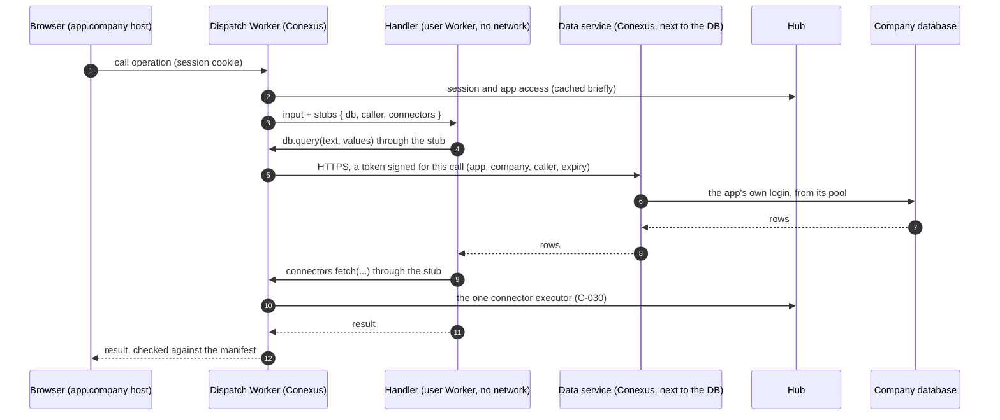

# Study: where generated app code runs (A1)

**Date**: 2026-10-09
**Base**: `wave/company-model-accounts-spec` at `7a202a3`
**Earlier studies used**:
- [hosting](../hosting/study.md): S5, Docker refuses the runner's sandbox without a seccomp change;
- [open decisions](../architecture/open-decisions.md): A1 and A2;
- [Mitra](../mitra/index.md).

The operator's direction of 2026-10-09: bubblewrap was an old choice, not a requirement. The app
runtime may be rebuilt to be simpler and cloud-friendly, with nothing kept for compatibility.

Research, not execution authority. Decisions go to the operator (section 9).

## 1. Short answer

**What a generated app needs from its runtime is small.**
- **Screens:** static files.
- **Handlers:** TypeScript functions called as `handler(input, { db, caller, connectors })`
  (`apps/hub/src/app-runner/worker.ts:165`). The Builder's skill forbids them anything else: "no
  file system and no environment" (`builder-skills/conexus-server/SKILL.md:109`).

**Yet today's runtime is heavy.** About 3,100 lines run that code:
- a runner process with a supervisor;
- a bubblewrap process per call, which needs Linux user namespaces and so a plain VM;
- a per-call database relay with a client certificate;
- certificate-only login in `pg_hba`;
- app hosting inside the Hub.

**The spikes ran the skill's example handler unchanged in two lighter runtimes.**
- **isolated-vm:** a fresh V8 isolate per call took about 4 ms. There was no Node API, no network
  and no file system, and a runaway loop was stopped at 100 ms.
- **workerd:** SQL went through a service binding and every other fetch was refused. But a
  runaway loop blocked the runtime: self-hosted workerd enforces no CPU limit.

**The references say an isolate alone is not the boundary.**
- isolated-vm: "keep instances of `isolated-vm` in a different nodejs process"; it is in
  maintenance mode.
- workerd: "is not a hardened sandbox … run it inside an appropriate secure sandbox, such as a
  virtual machine".
- Node: `node:vm` "is not a security mechanism".

**The service built for this case is Cloudflare Workers for Platforms.** It wraps each app's
isolate in Cloudflare's process sandbox and patch cadence. It also gives:
- a CPU limit per call that the platform sets;
- capabilities passed as objects that hold no secret;
- an outbound Worker that refuses every other connection;
- each app's static files and host name.

It costs $25 a month. Lovable and Bolt run generated backends the same way, on Supabase Edge
Functions.

**Recommendation.**
- Move generated code to Workers for Platforms.
- Keep the handler contract exactly as it is.
- Keep isolated-vm in a locked-down process as the tested way out.
- Delete the bubblewrap runner, the relay, the certificate scripts and the Hub's app hosting.

Then nothing in Conexus needs Linux user namespaces. The Hub and the Builder become ordinary
containers that any cloud runs.

## 2. Today (census)

Command: `bash docs/research/app-runtime/census.sh`

| Mechanism | Count | Where |
| --- | --- | --- |
| Application runner: supervisor, worker, sandbox, relay, data plane | 13 files, 1,902 lines | `apps/hub/src/app-runner/` |
| Hosting of Previews and apps in the Hub | 9 files, 760 lines | `apps/hub/src/hosting/` |
| Applications cluster setup: provisioning, certificate-only `pg_hba`, start | 3 files, 427 lines | `scripts/provision-application-database.mjs`, `confine-application-cluster.mjs`, `run-application-cluster.sh` |
| The handler call | input + `{ db, caller, connectors }` | `apps/hub/src/app-runner/worker.ts:165` |
| The capabilities the skill teaches | `Db.query(text, values)`, `Caller`, `Connectors.fetch(request)` | `builder-skills/conexus-server/SKILL.md:70-72` |
| Kernel features required | unprivileged user namespaces (`--unshare-user`, `max_user_namespaces`) | `apps/hub/src/app-runner/sandbox.ts:66`, `:75-76` |
| The relay's client certificate | `ca.pem`, `relay.pem`, `relay-key.pem`; `tls.connect` | `apps/hub/src/app-runner/pg-relay.ts:28`, `:41`, `:188` |

**How it works now.**
1. A browser on an app's host calls an operation.
2. The Hub authenticates the person, checks app access, reads the manifest and validates the input.
3. The Hub sends a job to the runner over a unix socket.
4. The runner starts a bubblewrap worker (no network, no host files, a fresh process) that imports
   the handler module and calls it.
5. `db.query` opens a connection through a per-call relay. The relay logs in to the Applications
   cluster as the Project's role with the runner's client certificate, which never enters the
   worker. `connectors.fetch` posts to a socket the Hub binds for that call.
6. The answer is checked against the manifest's output schema.

**Gotchas:**
- **The worker gets a real database login.** It is a `pg.Client` with the Project role
  (`worker.ts:122-125`), so the database is the wall, not the code.
- **The handler can write the result channel itself** (`worker.ts:11-13`). The supervisor checks it.

## 3. Why it is so

| Source | What it decided | What it was solving |
| --- | --- | --- |
| Q1 (#196), ACCEPT_WITH_BOUNDARY | Handlers run outside the Hub, with Project-scoped data and no platform authority | Generated code never touches the core ([architecture §1.2](../../reference/architecture.md#12-quality-goals)) |
| C-028 | A managed application platform, no backend per Project | One runtime for every app |
| [Architecture §7](../../reference/architecture.md#7-deployment-view) | "a fresh rootless bubblewrap worker with no network except the Hub's connector socket" | Chosen on the laptop pilot, where a Linux kernel was at hand |
| [Database §1](../../reference/database.md#1-stores) | Project roles admitted only by the runner's client certificate | A role password could never be a secret a handler holds |
| [Roadmap, deferred](../../roadmap.md#technology-baseline) | "Cloud Run, Fly, Kubernetes and per-Project deployment" deferred | No consumer then; the operator now names one (cloud hosting) |

## 4. References

### Sources and versions

| Reference | Version | What we read |
| --- | --- | --- |
| isolated-vm | `laverdet/isolated-vm` at `6f9fa6cf`; npm 6.2.0 in the spike | README, API |
| Budibase | at `dfd89260` | `packages/server/src/jsRunner/` |
| n8n task runners | `n8n-io/n8n` at `88a25315` | `packages/@n8n/task-runner`, `task-runner-python`, `docker/images/runners` |
| Supabase edge-runtime | at `d4a4f606` | `crates/base`, `ext/workers`, `examples/main`, README |
| workerd | at `d08010b9`; npm 1.20261009.1 in the spike | README, `src/workerd/server/workerd.capnp`, `server.c++`, samples |
| Cloudflare Workers for Platforms, Dynamic Workers | documentation, read from `cloudflare/cloudflare-docs`, October 2026 | isolation, custom limits, dynamic dispatch, outbound Workers, static assets, hostname routing, pricing |
| Node, Deno, AWS Lambda tenant isolation, Vercel, Fly, E2B | documentation | security statements and pricing |
| Lovable, Bolt, Replit, v0, Mitra | documentation and the Mitra SDKs | how each runs generated backends |

### The questions

1. How is user code isolated, and what does the reference say it does not protect against?
2. How do host capabilities (a database query, a platform API) reach the code without secrets?
3. Which limits (CPU, memory) exist, and who enforces them?
4. Is it per call or pooled, and what does a start cost?
5. What are the network and file system defaults?
6. What deployment does the reference ask for?

### Answers

**isolated-vm.**
1. V8 isolates in the host process. "keep instances of `isolated-vm` in a different nodejs process"
   (`README.md:126-129`). A leaked handle is "a springboard back into the nodejs isolate"
   (`:115-117`). The README says it is "currently in maintenance mode" (`:35`).
2. A `Callback` copies its arguments (`:439`).
3. Memory is "more of a guideline … A determined attacker could use 2-3 times this limit"
   (`:186-188`). There is no timeout by default (`:325-326`).
4. The caller decides. Spike R1 measured about 4 ms per call with a fresh isolate.
5. There is no network and no file system (`:763`).
6. A separate process, and a container. A 2026 advisory (GHSA-864f-rcv7-6rh4, type confusion in
   `ExternalCopy`) is fixed in 6.2.0 and 7.0.1.

**Budibase.**
1. isolated-vm inside the server (`vm/isolated-vm.ts:41-43`).
2. Data copied in; only pure helpers (`:60-86`).
3. 64 MB and 1,500 ms per execution, and a CPU budget per request (`environment.ts:32,38`;
   `isolated-vm.ts:178-182`).
4. One isolate per request.
5. No network.
6. An ordinary container with `--no-node-snapshot` (`Dockerfile:86-87`).

**n8n.**
1. A separate runner process, a non-root sidecar (`docker/images/runners/Dockerfile:146-156`).
   Inside it, `node:vm` with hardening (`js-task-runner.ts:23`, `:666-667`).
2. Data over a broker. "Code Node doesn't have credentials" (`runner-types.ts:132-134`). `env: {}`
   (`js-task-runner.ts:500-503`).
3. A 300 s timeout and a concurrency of 10. No memory limit.
4. A long-lived process, a fresh context per task.
5. No `fetch`; HTTP goes through a helper over the broker.
6. A non-root sidecar.

**Supabase edge-runtime.**
1. A main worker and user workers, each a Deno isolate in one process. "Beta Software"
   (`README.md:13`).
2. The main worker chooses `envVars` (default `[]`) and a `context`.
3. Real CPU soft and hard limits and a heap cap (`supervisor/strategy_per_worker.rs:344-352`).
4. Per worker or per request.
5. Network open by default; a virtual file system.
6. Not stated.

**workerd.**
1. V8 isolates. "`workerd` is not a hardened sandbox … you must run it inside an appropriate secure
   sandbox, such as a virtual machine" (`README.md:32-34`).
2. "a Worker has access to no privileged resources at all, and you must explicitly declare
   'bindings'" (`workerd.capnp:25-26`).
3. None when self-hosted: "IsolateLimitEnforcer that enforces no limits" (`server.c++:3331`).
   Spike R2 confirmed it: a runaway loop blocked the runtime.
4. Long-lived, one isolate per configured Worker.
5. `globalOutbound` defaults to the public internet (`workerd.capnp:673`) and can be pointed at a
   service that refuses.
6. `User=nobody`, `NoNewPrivileges`, inside a VM.

**Cloudflare Workers for Platforms** (documentation).
1. A user Worker per app in a dispatch namespace, in "untrusted" mode. Around the isolate:
   - a process sandbox;
   - "cordons" that separate plans;
   - a V8 patch gap under 24 hours;
   - Spectre mitigations.

   Sources: [worker isolation](https://developers.cloudflare.com/cloudflare-for-platforms/workers-for-platforms/reference/worker-isolation/),
   [security model](https://developers.cloudflare.com/workers/reference/security-model/).
2. The dispatch Worker, which is ours, passes RPC stubs to the user Worker, valid for one request
   only ([dynamic dispatch](https://developers.cloudflare.com/cloudflare-for-platforms/workers-for-platforms/configuration/dynamic-dispatch/)).
   The user Worker holds no binding, and an outbound Worker catches every other `fetch`
   ([outbound Workers](https://developers.cloudflare.com/cloudflare-for-platforms/workers-for-platforms/configuration/outbound-workers/)).
3. `limits: { cpuMs, subRequests }` per call, set by the dispatcher
   ([custom limits](https://developers.cloudflare.com/cloudflare-for-platforms/workers-for-platforms/configuration/custom-limits/)).
   The platform caps an isolate at 128 MB.
4. Isolates start in milliseconds (vendor claim).
5. Network only through the outbound Worker. No file system.
6. Managed.
- **Static files and hosts.**
  - Static assets attach to each user Worker, and requests for them are free.
  - One wildcard route sends every app host to the dispatcher
    ([hostname routing](https://developers.cloudflare.com/cloudflare-for-platforms/workers-for-platforms/configuration/hostname-routing/)).
  - Company domains go through Cloudflare for SaaS: 100 included, then $0.10 each.
- **Price.** $25 a month with 20M requests and 60M CPU-ms
  ([pricing](https://developers.cloudflare.com/cloudflare-for-platforms/workers-for-platforms/reference/pricing/)).
- **Dynamic Workers.** The same model, loading code at run time on the $5 plan; open beta since
  2026-03-24.
- **Security record.** A 2026 report of memory bugs in workerd, patched in production and in
  self-hosted 1.20260619.1 and later (single source, not verified).

**What app builders do.**
- Lovable and Bolt: Supabase Edge Functions (Deno isolates).
- v0: Vercel Functions.
- Replit: containers.
- Mitra: server functions in an execution sandbox on its own backend. The SDK says a token "SÓ o
  sandbox da execução recebe, como variável de ambiente `MITRA_SF_EXECUTION_TOKEN`"
  (`mitra-interactions-sdk/dist/index.d.ts:1451`). The technology is not public, and its
  JavaScript functions reached the internet with no allowlist
  (`../mitra/evidence/maintenance-probe.md:216`).

### Comparison

| | bubblewrap (today) | isolated-vm in a locked process | workerd self-hosted | Supabase edge-runtime | **Workers for Platforms** | Lambda tenant isolation |
| --- | --- | --- | --- | --- | --- | --- |
| Isolation | OS namespaces per call | V8 isolate (+ the process and VM we add) | V8 isolate | Deno isolate | V8 isolate + Cloudflare's sandbox layers | Firecracker microVM |
| Needs user namespaces | **yes** | no | no | no | no | no |
| CPU limit per call | process kill | timeout + CPU time | **none** | soft/hard | **`cpuMs`, set by us** | timeout |
| Capabilities without secrets | relay + socket | host callbacks | bindings | env/context | RPC stubs, outbound Worker | IAM, env |
| Per-call cost (measured) | a process start | ~4 ms (R1) | ~8 ms incl. curl (R2) | — | milliseconds (vendor) | hundreds of ms cold (unverified) |
| App files and hosts | in the Hub | ours to build | ours | ours | **included** | S3 + CloudFront |
| Operations | ours, VM only | ours | ours | ours | managed | managed |
| Price | the VM | the VM | the VM | the VM | $25/month | per call |
| Maintenance | ours | maintenance mode | active | beta | GA | GA |

**Where they agree:**
- Capabilities, not credentials, reach user code.
- The network is denied unless routed through the platform.
- Limits come from the host.
- A V8 isolate needs an outer layer.

**Where they differ:** who provides the outer layer and the limits. Self-hosted options leave both
to us; Workers for Platforms and Lambda provide them.

### What we copy and what we adapt

| Mechanism | Copy from | Kept as is | Adapted, and why |
| --- | --- | --- | --- |
| A user Worker per app version behind one dispatch Worker | Workers for Platforms dynamic dispatch | the dispatcher is ours and holds every credential | Conexus's manifest validation and app access move into the dispatcher |
| Capabilities as per-request RPC stubs | Workers for Platforms `ctx.exports…({props})`; workerd bindings | `db`, `caller`, `connectors`, unchanged for the handler | `db` logs in as the app's own role (section 8); `connectors` calls the Hub's one executor (C-030) |
| An outbound Worker that refuses | Workers for Platforms outbound Workers | | replaces `--unshare-net` |
| A CPU limit per call | `limits.cpuMs` | | replaces the supervisor's kill |
| No credentials in user code | n8n `runner-types.ts:132-134`; edge-runtime `envVars: []` | | already the skill's rule |
| A self-hosted way out with the same contract | Budibase jsRunner (isolated-vm, per-request isolate, CPU budget) | | in its own non-root process, inside the VM; never shared across companies |

## 5. The premise

- **As it arrived**: bubblewrap was decided long ago and is not a requirement. Is there something
  simpler and cloud-friendly?
- **Why**:
  1. Why is today's runtime heavy? It isolates an arbitrary Linux process, but the code it runs is
     a pure function with three capabilities.
  2. Why was a process chosen? On the laptop pilot a Linux kernel was at hand, and a process with
     no network and a certificate-holding relay kept credentials out of the code.
  3. What does the code actually need? Input, a SQL call to its own data, a caller, a connector
     call, and nothing else (the skill forbids it).
  4. Who sells exactly that, hardened? Workers for Platforms: isolates with platform layers,
     capability stubs, an outbound gate, CPU limits, static files and hosts.
- **Root cause**: the runtime was sized for "any process" because the pilot had a kernel, not for
  the narrow contract the Builder writes.
- **The premise held**: a simpler, managed runtime fits. It also removes the one requirement (user
  namespaces) that tied the whole platform to a plain VM.

## 6. Proved and not proved

Spikes: `bash docs/research/app-runtime/spike.sh` (Docker, Node, npm), on PostgreSQL 17.10.

| Claim | How it was tested | Result |
| --- | --- | --- |
| R1. The skill's handler runs unchanged in isolated-vm with a host `db.query` | `listTickets`, `changeTicketStatus` against a schema and a role of their own | Rows read and written |
| R1. Nothing else exists in the isolate | a `probe` handler | `process`, `require`, `fetch` undefined; `import('node:fs')` refused |
| R1. A runaway handler stops | `spin` with a 100 ms limit | "Script execution timed out." |
| R1. A fresh isolate per call is cheap | 50 calls | median about 4 ms, p95 about 5 ms |
| R2. The handler runs unchanged in workerd with SQL through a service binding | the same calls | Rows read |
| R2. Every other fetch is refused | `fetch('https://example.com')` from the handler | `status 403` from the refusing outbound service; `node:fs` not found |
| R2. Self-hosted workerd has no CPU limit | `spin`, then a normal call | Both unanswered within 3 s (`000`) |

**Not verified:**
- the handler on Workers for Platforms itself (needs a Cloudflare account and the $25 plan);
- the latency from a São Paulo point of presence to the database;
- `cpuMs` behaviour;
- static asset upload per app version;
- the 2026 workerd bug report;
- every price in section 4.

## 7. Findings against the guides

| Finding | Guide section | Where |
| --- | --- | --- |
| The runtime requires a kernel feature, which keeps the whole platform on a plain VM | [Architecture §7](../../reference/architecture.md#7-deployment-view) | `apps/hub/src/app-runner/sandbox.ts:66-76` |
| App hosting lives in the Hub process, beside the SaaS core | [Architecture §5](../../reference/architecture.md#5-building-block-view) | `apps/hub/src/hosting/` |
| The relay's certificate login works only on a self-hosted PostgreSQL | [Database §1](../../reference/database.md#1-stores) | `scripts/confine-application-cluster.mjs:89` |

## 8. What the wave wants

- **Wants**:
  1. **Workers for Platforms** with one dispatch Worker for every app host (`*.apps.<domain>` and,
     later, company domains through Cloudflare for SaaS).
     - **One user Worker per app version**, uploaded by the registry when a revision is admitted.
       Its static files are attached, and it is built from the handlers by the same bundle step.
     - **The dispatcher:**
       - resolves host to app and version;
       - checks the person's session and app access with the Hub;
       - validates the input against the manifest;
       - calls the handler with `cpuMs` and `subRequests` limits;
       - validates the output.
     - **The capabilities:**
       - `db`: a call to the **data service** (section 11), which runs the SQL as the app's own
         login from a pool per app. No session that handler SQL reaches ever switches roles (D2).
       - `caller`: from the session.
       - `connectors`: a call to the Hub's executor with a token scoped to the call.
     - **An outbound Worker** that refuses everything else.
  2. **Previews** on the same mechanism, one script per Preview revision.
  3. **The handler contract unchanged:** the Builder's skill, the manifest, the generated client.
  4. **A self-hosted way out kept small and tested:** an isolated-vm executor in its own non-root
     process, with a fresh isolate per call, a timeout and a CPU budget, never shared across
     companies. It runs the same bundle behind the same `db`/`caller`/`connectors` interface. It
     is a tested fallback, not a second production path.
  5. **Delete:**
     - the bubblewrap runner, the supervisor and the per-call relay (`apps/hub/src/app-runner/`,
       except the migration planner);
     - the certificate scripts;
     - app and Preview serving in the Hub (`apps/hub/src/hosting/`);
     - the user-namespace requirement everywhere.
- **Stays out**:
  - a backend per app;
  - Node APIs in handlers;
  - network access from handlers;
  - long-running jobs in handlers (the jobs milestone);
  - Cloudflare's databases (D1, KV) for app data, which stays in PostgreSQL per the database study.
- **Done when**:
  - The Builder's example app answers on its own host through the dispatcher, reading and writing
    its own schema.
  - A handler that calls `fetch` to any host is refused.
  - A handler that loops is stopped by `cpuMs`, and the next call to the same app answers.
  - A handler cannot read another app's or another company's data, proved by a test that tries
    its SQL.
  - The same bundle passes the same tests on the isolated-vm fallback.
  - `bash docs/research/hosting/census.sh` shows X1 = 0 (no user namespaces).
- **Lane**: `lane:qualification` (the generated-code boundary, C-028's reopen trigger).

## 9. Decisions for the operator

1. **Where generated app code runs.**
   - **Answer** (2026-10-09): A, Workers for Platforms.
   - Options:
     - A: **Workers for Platforms**;
     - B: Dynamic Workers ($5 plan, open beta);
     - C: isolated-vm in our own locked process;
     - D: keep bubblewrap.
   - Recommendation: **A**.
     - It is the only option that brings the outer layer and the CPU limit the references require,
       plus app files and hosts, for $25 a month.
     - B is cheaper but beta.
     - C leaves the outer layer and an addon in maintenance mode to us.
2. **The way out.** Recommendation: **keep the handler contract portable and the isolated-vm
   executor tested as a fallback**, not run in production.
   **Answer** (2026-10-09): yes.
3. **App data from the edge.**
   - Options:
     - A: the dispatcher logs in to the company database itself;
     - B: **a data service next to the database** runs each `db.query` as the app's own login,
       from a pool per app.
   - Recommendation, **revised after section 11: B**.
     - A breaks at scale: Hyperdrive allows 25 configurations per account, and a login per call
       costs a full handshake.
     - A's shared variant lets a handler become another app (D2).
     - B keeps a login per app (D3), keeps connections pooled and the database private, and keeps
       every credential inside Conexus's network.
   - **Answer**: the operator asked to understand it across scenarios (2026-10-09). Pending.
4. **Sign-in (A2).** The operator chose Better Auth (2026-10-09). Its `@better-auth/sso` plugin
   supports OIDC and SAML 2.0 providers per organization, with domain verification (Better Auth
   documentation, `docs/plugins/sso.mdx`). So enterprise SSO is available when needed. The app
   hosts verify the session in the dispatcher.
   **Answer** (2026-10-09): Better Auth.

## 11. The data path at scale: many companies, many apps

The operator asked to see decision 3 across scenarios. This section answers with spikes, and it
**revises** decision 3.

### What each handler call needs

- `db.query(text, values)` must run as the app's own database login, against its company's
  database.
- A handler call makes one to a few queries.

The question is where the login and its connections live.

### Spikes

`bash docs/research/app-runtime/data-spike.sh` (PostgreSQL 17.10, SCRAM passwords, local, so no
network distance):

| Claim | How it was tested | Result |
| --- | --- | --- |
| D1. A login per query costs far more than the query | 50 runs of a fresh connection plus a query, against 50 queries on a pooled connection | Fresh login: median 8–10 ms, p95 13–14 ms. Pooled: median 0.3–0.5 ms. Over a network, each login adds several round trips |
| D2. One login per company that switches to the app's role per call lets a handler become another app | `company_a_login` (member of every app role, `NOINHERIT`); each call is `BEGIN; SET LOCAL ROLE app_a_rt` | App A reading app B directly: refused. Two statements in one parameterized query: refused ("cannot insert multiple commands into a prepared statement"). But `SET ROLE app_b_rt` then a read returns app B's row (`99999`), and so does `set_config('role', 'app_b_rt', true)`. Only a deny list of SQL could stop it, and there are at least two spellings |
| D3. A login per app cannot switch | the same attempts as `app_a_rt` | `permission denied to set role "app_b_rt"`; app B unreadable |
| Hyperdrive cannot hold a login per app | [Hyperdrive limits](https://developers.cloudflare.com/hyperdrive/platform/limits/) | 25 configured databases per account on Workers Paid; a configuration is one database and one user |

### The three ways, at three sizes

Sizes are illustrative: 5 companies with 10 apps each (50 app logins), 20 × 20 (400), and
100 × 30 (3,000).

| | A1: the dispatcher opens a login per call, straight to the database | A2: Hyperdrive with one login per company, `SET LOCAL ROLE` per call | **B: a data service next to the database, a pool per app login** |
| --- | --- | --- | --- |
| Isolation between a company's apps | login per app (D3) | **broken by D2** | login per app (D3) |
| Isolation between companies | separate databases | separate databases | separate databases |
| Database exposed to | Cloudflare's network | Cloudflare's network (or a Tunnel) | **only Conexus's network** |
| Where app credentials live | the dispatcher, for every app | the dispatcher, per company | **the data service only** |
| Cost of a query | a full login over the internet each call (D1 plus round trips) | pooled | pooled (D1: about 0.3 ms) plus one hop from the edge, in the same city |
| Connections at 50 / 400 / 3,000 apps | one per concurrent call; storms hit `max_connections` (100 by default) | 25 companies at most (the Hyperdrive limit) | about one per **active** app, closed when idle; a pooler such as PgBouncer only if needed |
| Works with a self-hosted or managed PostgreSQL | yes, if public | managed or Tunnel | **either**, including certificate login on a self-hosted one |
| Moving parts | none new | Hyperdrive | one service, the same image in a `data` mode |

### Why B fits the architecture already decided

- **One gate for company data.** Credentials and company data stay behind Conexus, as model calls
  (Builder service decision 4) and connector reads (C-030) already do. The edge runs code and
  serves files, and it holds no key to a company's data.
- **Mostly existing code.** The data service is today's data plane without the sandbox:
  - allocation per company database and per app schema (`apps/hub/src/app-runner/data-plane.ts`);
  - app migrations;
  - the per-app login.

  What leaves is bubblewrap, the per-call relay and the certificate scripts (section 8).
- **It scales out.** It is stateless, so it can run several copies: it takes no instance lock,
  unlike the Hub.
- **It works with every database answer** of the database and cloud decisions: self-hosted,
  Neon, Supabase or Cloud SQL.

### The call, end to end

The handler never sees the token: the stub holds it, and the outbound Worker refuses every other
address.

### Not verified

- The hop from a São Paulo point of presence to a São Paulo origin.
- The data service under load.
- A pool per app at 3,000 apps (expected: bounded by active apps).

## 12. Re-checked after the VPS choice: is Workers for Platforms still right?

Decision 1 was taken before the host was chosen. The operator then chose one Hostinger VPS in
São Paulo with root access (deployment 9.2), and asked on 2026-10-09 whether the app runtime is
still coherent. A VPS with its own kernel removes the original objection to running generated code
ourselves: user namespaces work there, so today's bubblewrap runner, or the isolated-vm executor,
could run beside the Hub.

### What changes with a single VPS

The VPS holds every secret of every company. The deployment census lists nine secret files
(E2, `bash docs/research/deployment/census.sh`). The two that matter most here:
- the sealing key that opens every company's ERP credentials and model keys
  (`CONEXUS_FACTORY_SECRET_KEY_FILE`);
- the database passwords.

The target adds three more to the same machine:
- the provider's admin login (the provisioner);
- every app's login;
- the Cloudflare token.

So an escape from a sandbox on that VPS reaches all companies at once. The guide treats generated
code "like code from the internet"
([security §8](../../reference/security-and-authority.md#8-untrusted-code)), and the references
agree that a V8 isolate needs an outer layer that someone keeps patched (section 4).

### The options, with a VPS

| | A. Workers for Platforms (decided) | B. On the same VPS: bubblewrap or isolated-vm | C. On a second, small VPS only for apps | D. B now, A later |
| --- | --- | --- | --- | --- |
| A sandbox escape reaches | Cloudflare's own layers; none of our secrets | **every company's keys and data** | the app logins only; the Hub's keys stay on the first VPS | as B, until moved |
| Who patches the outer layer | Cloudflare ("a V8 patch gap under 24 hours", section 4) | us: the kernel, Node or V8, the sandbox | us, on two machines | us, then Cloudflare |
| CPU limit per call | `cpuMs`, set by the dispatcher | ours (process kill, isolate timeout) | ours | ours, then `cpuMs` |
| App files, hosts, TLS | included at the edge | the Hub or a proxy behind Cloudflare | the same | the same, then included |
| Monthly cost | about R$125–150 (US$25, plus US$5 if Workers Paid is required) | R$0 | about R$30–60 (a KVM 1) | R$0, then A |
| New code | the dispatch Worker, the upload, the outbound Worker, signed call tokens, the data service over the tunnel | the runner exists (1,902 lines), but its relay and certificate login must become data-service calls | B plus a second machine | **both**, one after the other |
| Latency of a `db.query` | one extra hop from the edge to the VPS, both in São Paulo (not measured) | local | local | local, then the hop |
| Lock-in | Cloudflare; the way out is the isolated-vm adapter (decision 2) | none | none | none, then A's |

### Verdict

**Workers for Platforms still holds, and the single VPS makes the case stronger, not weaker.**
- **Trust domains:** the VPS is the trusted domain, with the platform's code and every secret.
  Cloudflare runs the untrusted domain, the generated code, with no secret at all. B puts both on
  one machine.
- **What the price buys:** about R$150 a month means nobody at Conexus has to patch a sandbox. The
  edge hosting, TLS and per-call CPU limit come with it.
- **C is the only self-hosted option that keeps the domains apart.** It costs less, but it doubles
  the machines to operate and still leaves the patching to us.
- **D builds the runtime twice.**
- **The isolated-vm executor is still built,** as the local adapter for development and as the
  tested way out (decision 2). It is not a production path on the Hub's machine.

**What would reopen this:**
- Cloudflare raising the price beyond what one more small VPS costs;
- a measured latency from the edge hop that hurts real apps;
- Cloudflare for Startups credits being refused, while budget is the binding constraint. Then C
  is the fallback, never B.

**Answer** (2026-10-09): pending the operator's confirmation.
