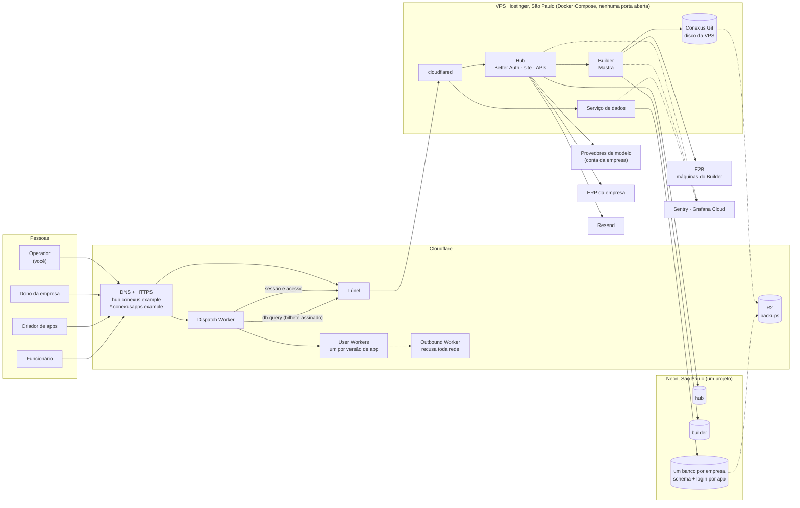
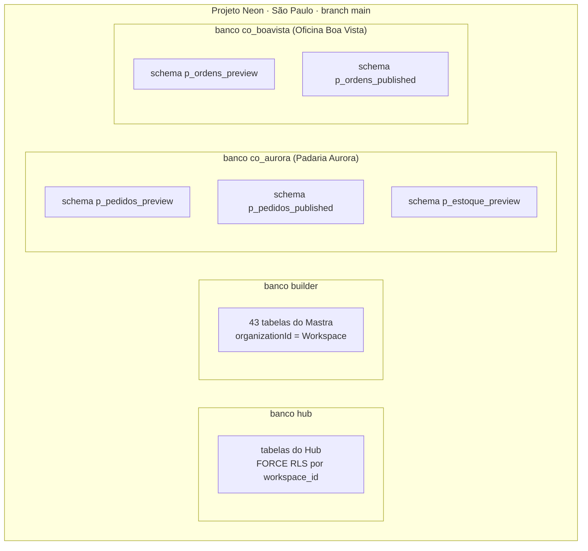
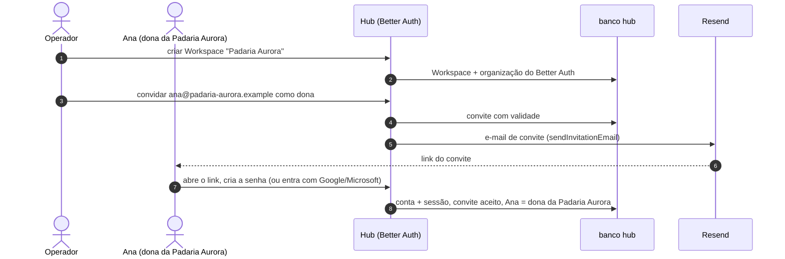
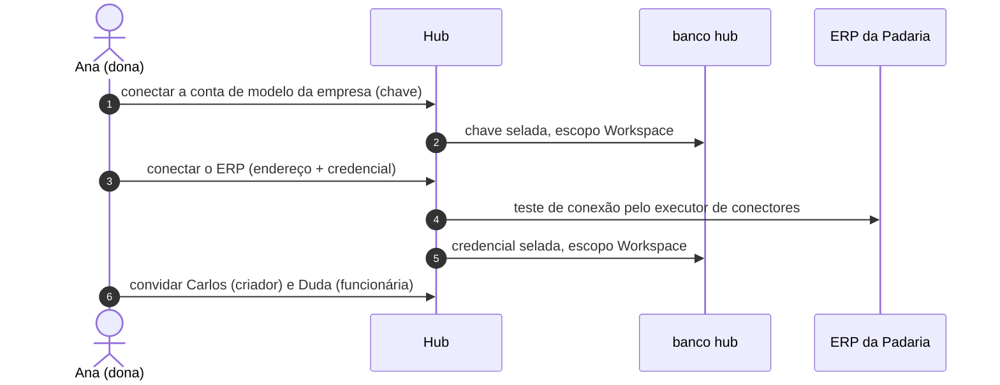
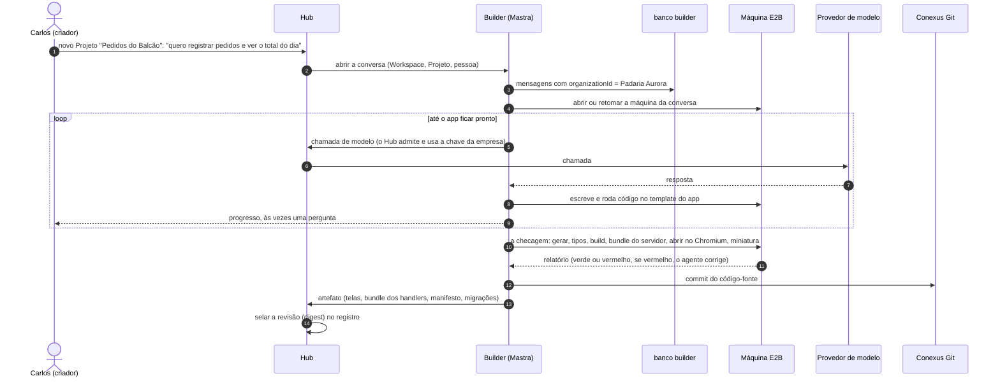
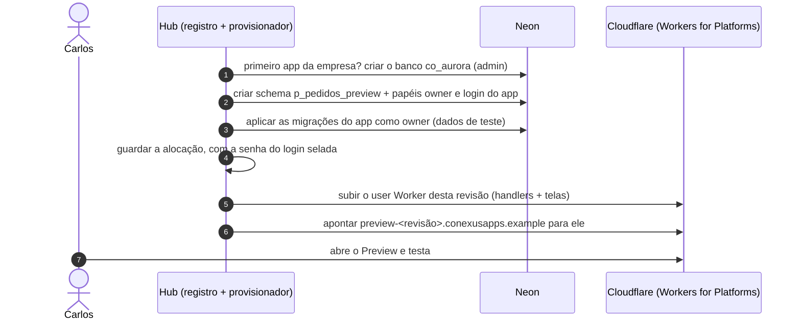
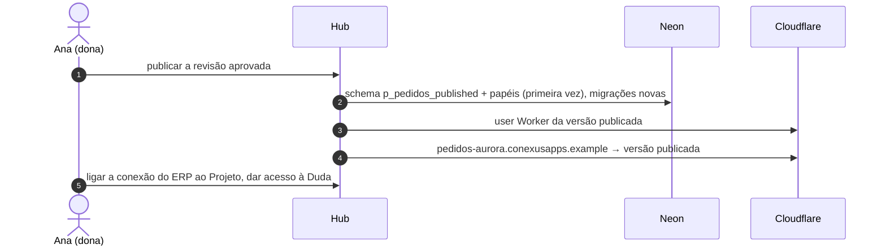
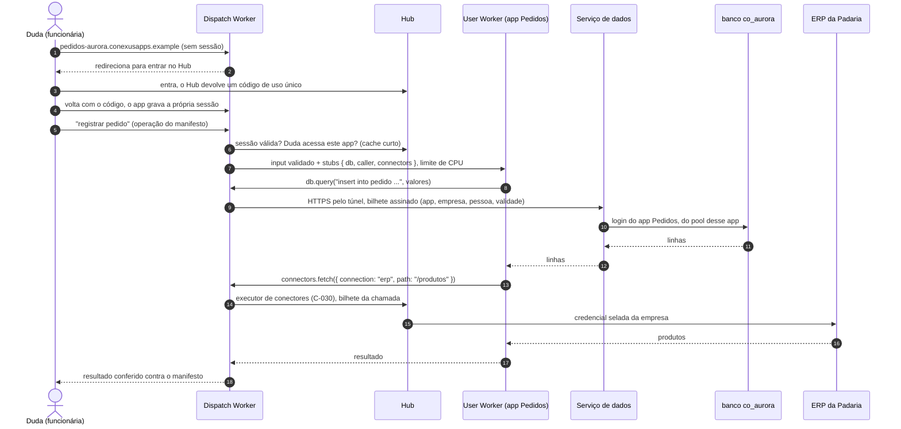

# Desenho-alvo da Conexus: arquitetura, dados, segurança e fluxos de ponta a ponta

**Data**: 2026-10-09
**Para**: o operador revisar antes da sessão de implementação
**Natureza**: pesquisa consolidada, não é autoridade de execução. Cada decisão aceita vai para o
guia dono ou para o [registro de decisões](../../decisions/index.md). Quando este desenho e um
estudo divergem, vale o estudo mais recente citado na linha.

**Estudos que este desenho junta**:
- [hosting](../hosting/study.md) e [tenancy](../hosting/tenancy.md);
- [banco de dados](../database/study.md);
- [Builder como serviço](../builder-service/study.md);
- [runtime dos apps](../app-runtime/study.md);
- [deployment](../deployment/study.md);
- [decisões abertas](open-decisions.md).

**Legenda de status**:
- ✅ decidido pelo operador;
- 🟡 recomendado, ainda sem resposta;
- ⏳ adiado para a sessão de implementação;
- 🔨 existe hoje no código;
- 🆕 a construir.

Os nomes de empresas, pessoas e domínios dos exemplos são inventados (`.example` é um domínio
reservado para exemplos).

---

## 1. Resumo em uma página

**O que é a Conexus neste desenho.** Uma instalação única na nuvem que atende várias empresas. Cada
empresa é um **Workspace**. Dentro dele, as pessoas conversam com o **Builder**, um agente feito com
Mastra, que escreve, testa e publica **apps** para a empresa. Cada app tem telas, funções de servidor
(*handlers*) e um banco próprio dentro do banco da empresa. Os funcionários usam os apps num
endereço próprio.

**As cinco partes e onde cada uma roda:**

| Parte | O que faz | Onde roda | Status |
| --- | --- | --- | --- |
| **Hub** | Login, empresas, pessoas, permissões, conexões com ERP, contas de modelo, o site da Conexus | VPS Hostinger em São Paulo, container | 🔨 existe; muda para o novo desenho |
| **Builder** | O agente que cria e altera apps (Mastra) | Mesma VPS, container próprio ou dentro do Hub (⏳ A7) | 🔨 existe dentro do Hub |
| **Serviço de dados** | Executa as consultas dos apps no banco da empresa, com o login de cada app | Mesma VPS, container | 🆕 (⏳ decisão 3 do runtime) |
| **Apps gerados** | Telas e handlers de cada app | Cloudflare Workers for Platforms, longe da VPS que guarda os segredos | 🆕 (✅ A1, reconfirmado) |
| **Bancos** | Banco do Hub, banco do Builder e um banco por empresa | Neon, região São Paulo | 🆕 (✅ B2) |

**Serviços de apoio:**
- **E2B:** máquinas onde o Builder escreve e testa o código.
- **Cloudflare:** DNS, HTTPS, túnel e armazenamento R2.
- **Resend:** e-mail.
- **Sentry e Grafana Cloud:** erros e logs.
- **GitHub Actions e GHCR:** build e imagens.

**Custo com 4 empresas** (§8 item por item; modelo em
[deployment §10](../deployment/study.md#10-draft-for-the-spec)):
- cerca de **R$200–225 por mês** nos primeiros meses, com o crédito do E2B e o Neon grátis;
- cerca de **R$250** depois, com o Neon grátis (exige o refactor que deixa o banco dormir);
- cerca de **R$350** com o Neon Launch;
- cerca de R$150–180 disso é Cloudflare, E2B e domínio, que custam o mesmo em qualquer opção.

**Três regras que valem para tudo:**
1. **Tudo que uma empresa configura pertence ao Workspace dela** (✅ C-024 emendada).
2. **Isolamento em camadas.** A checagem do Hub é a primeira parede, uma regra simples no banco
   (RLS) é a segunda, e bancos, schemas e logins separados são as outras (✅ direção 2).
3. **Protocolo padrão primeiro, porta só onde não há padrão, sempre com adaptador local** (✅
   direção 3). Trocar Hostinger, Neon ou R2 vira configuração, não código.

---

## 2. Vocabulário

| Termo | O que é aqui |
| --- | --- |
| **Workspace** | Uma empresa cliente. Tudo dela (pessoas, contas de modelo, conexões, apps) pertence a ele |
| **Projeto** | Um app em construção ou publicado, dentro de um Workspace |
| **Revisão** | Uma versão do app que passou na checagem e foi selada (tem um *digest*, uma impressão digital do conteúdo) |
| **Preview** | A revisão mais recente aberta para teste, com dados de teste |
| **Publicado** | A revisão que os funcionários usam, com dados reais |
| **Handler** | Uma função de servidor do app, chamada como `handler(input, { db, caller, connectors })` (`apps/hub/src/app-runner/worker.ts:165`) |
| **Dispatch Worker** | O programa da Conexus na Cloudflare que recebe toda chamada a um app e decide qual app e versão atendem |
| **User Worker** | O código de um app (uma versão) carregado na Cloudflare; roda isolado, sem rede |
| **Serviço de dados** | O "garçom" entre o app e o banco: recebe `db.query`, confere o bilhete assinado e executa com o login do app |
| **RLS** (*row-level security*) | Regra do PostgreSQL que filtra linhas por empresa, mesmo que o código esqueça o filtro |
| **Login por app** | Um usuário do PostgreSQL só daquele app, que só enxerga o schema dele |
| **Túnel** (Cloudflare Tunnel) | Conexão que sai da VPS para a Cloudflare; a VPS não abre nenhuma porta para a internet |
| **Branch** (Neon) | Uma cópia instantânea do banco, para testes ou para restaurar um momento passado |

---

## 3. O mapa geral

**Como ler o mapa:**
- Pessoas que usam o Hub entram por `hub.conexus.example`. O tráfego passa pelo túnel até a VPS.
- Funcionários que usam um app entram pelo endereço do app. Lá, o Dispatch Worker chama o código do
  app na própria Cloudflare.
- O app nunca fala com o banco nem com a internet. Ele pede ao Dispatch Worker, que leva o pedido ao
  serviço de dados (para dados) ou ao Hub (para o ERP).
- A VPS não guarda nada que não se recupere: os dados estão no Neon, e o Git tem cópia no R2.

---

## 4. Onde fica cada dado

| Dado | Onde | Quem lê e escreve | Isolamento entre empresas |
| --- | --- | --- | --- |
| Contas, sessões, convites (Better Auth) | banco `hub` | Hub | por Workspace (organização do Better Auth = Workspace) |
| Workspaces, membros, papéis, Projetos, acessos | banco `hub` | Hub (`hub_runtime`) | checagem do Hub + RLS por `workspace_id` |
| Conexões com ERP (credenciais **seladas**) | banco `hub` | Hub, só no executor de conectores (C-030) | checagem + RLS; a credencial nunca sai do Hub |
| Contas de modelo da empresa (chaves seladas) | banco `hub` | Hub, nas chamadas de modelo | checagem + RLS |
| Revisões seladas, ponteiro do Preview e do publicado | banco `hub` (registro) | Hub | checagem + RLS |
| Registro de alocação dos apps (banco, schema, logins, senhas seladas) | banco `hub` | Hub (provisionador); o serviço de dados só lê | checagem + RLS |
| Conversas, mensagens, memória, rastros (*spans*) do Builder | banco `builder` (Mastra, 43 tabelas) | Builder | `organizationId` = Workspace; *spans* só com metadados (✅ Builder 9.1, 9.2) |
| Código-fonte dos apps | Conexus Git, disco da VPS, cópia noturna no R2 | Builder | um repositório por Projeto |
| Código publicado dos apps | Cloudflare (um user Worker por versão) | Hub sobe; Cloudflare executa | um script por versão; o app não vê os outros |
| **Dados dos apps** | **um banco por empresa** no Neon; dentro dele, schema `p_<projeto>_preview` e `p_<projeto>_published` | serviço de dados, com o **login do próprio app** | bancos separados; `CONNECT` revogado; login por app |
| Dados do ERP | **no ERP** (lidos na hora, não copiados) | Hub, pelo executor de conectores | conexão do Workspace, ligada ao Projeto pelo dono |
| Segredos da plataforma | arquivos na VPS (`*_FILE`, modo 600); segredos do Dispatch Worker na Cloudflare | cada processo, só o seu | — |
| Logs e erros | Grafana Cloud, Sentry | — | sem conteúdo de empresa; só o que a tabela de redação permite |

**Como o projeto Neon fica por dentro** (exemplo com duas empresas):

**Os papéis (logins) do PostgreSQL:**

| Papel | Pode | Não pode | Quem usa |
| --- | --- | --- | --- |
| admin do provedor (o papel padrão do projeto no Neon) | criar bancos e papéis; no Neon e no Supabase também ignora RLS | — | só as migrações e o provisionador, **nunca o Hub em operação** (P4) |
| `hub_runtime` | ler e escrever as tabelas do Hub, sempre filtrado pela RLS | ser dono de tabela; ignorar RLS | Hub |
| `builder_runtime` | as tabelas do Mastra no banco `builder` | o banco `hub` e os bancos das empresas | Builder |
| `<app>_owner` (sem login) | ser dono do schema e das tabelas do app | entrar no banco | provisionador, nas migrações do app |
| `<app>_rt` (login do app) | ler e escrever só o schema do próprio app | ver outro app, virar outro papel, criar schema, abrir outro banco | serviço de dados |

A [sonda de provedor](../deployment/study.md#11-provider-independence-protocols-and-ports) prova cada
linha da coluna "não pode", com os dois tipos de admin.

---

## 5. Segurança em camadas

| O que precisa ficar separado | 1ª parede | 2ª parede | Outras paredes | Prova |
| --- | --- | --- | --- | --- |
| Dados de uma empresa no Hub, de outra empresa | checagem tipada do Hub (*admission*) | RLS: `workspace_id = nullif(current_setting('app.workspace_id', true), '')::uuid`, com `FORCE` | `hub_runtime` não é dono de nada | P1, P4, sonda |
| Dados dos apps de uma empresa, de outra empresa | bancos separados | `CONNECT` revogado de `PUBLIC` | login por app | P2, sonda |
| Um app, de outro app da mesma empresa | schema por app | login por app (D3) | **nunca** um login compartilhado que troca de papel (D2: o app A leu o app B) | D2, D3, P2 |
| Código gerado, da plataforma | isolamento da Cloudflare (isolate em sandbox) | sem rede: o outbound Worker recusa tudo | limite de CPU por chamada (`cpuMs`); só os *stubs* `db`, `caller`, `connectors`; nenhum segredo | runtime R1, R2; ⏳ prova na conta real |
| Builder, da plataforma | E2B, uma máquina por conversa | modelos chamados pelo Hub, que guarda as chaves | a checagem roda na máquina do E2B, não na VPS | Builder 9.4 |
| Internet, dos servidores | nenhuma porta aberta na VPS (túnel) | Cloudflare na frente (DDoS, HTTPS) | — | ⏳ |
| Internet, do banco | senha forte (entropia ≥ 60 bits exigida pelo Neon) e TLS | só o serviço de dados tem as senhas dos apps | restrição por IP **só no plano Scale** do Neon | ver §11 |
| Site da Conexus, dos apps | apps em **outro domínio** (`conexusapps.example`) | cookies do Hub não vão para os apps | — | 🟡 §9 |

**A regra de RLS precisa do `nullif`.** Numa conexão reaproveitada, como no pool do Hub, depois que
alguma transação definiu a empresa, o valor volta como texto vazio, não nulo. Sem o `nullif`, a
consulta dá erro em vez de devolver zero linhas (sonda do deployment).

---

## 6. Fluxos de ponta a ponta

### F1. O operador cria uma empresa e convida o dono

| Passo | O que muda em relação a hoje |
| --- | --- |
| Criar a empresa | 🔨 a criação de Workspace existe; 🟡 só o operador cria (A10) |
| Convite e login | 🆕 Better Auth substitui o Keycloak (✅ A2): convites, senhas e sessões no banco `hub`; SSO por empresa (OIDC e SAML) quando precisar |
| E-mail | 🆕 Resend no plano grátis (3.000 por mês) (🟡 B6) |

### F2. A dona configura a empresa

| Passo | O que muda |
| --- | --- |
| Conta de modelo da empresa | 🔨 existe para pessoas; a conta da empresa está em construção na wave 0017 com escopo de instalação; 🆕 passa a ter escopo de **Workspace** (✅ tenancy 9.2) |
| Conectar o ERP | 🔨 existe só para o administrador; 🟡 a dona conecta (A10). ERP sem endereço público: um túnel da Cloudflare rodando na empresa (🟡 B11) |
| Convidar pessoas | 🆕 pelo Better Auth, dentro do Workspace |

### F3. Carlos cria um app conversando com o Builder

| Passo | O que muda |
| --- | --- |
| Conversa, agente, máquina E2B | 🔨 existe (Mastra AgentController, E2B) |
| Onde ficam as mensagens | 🆕 banco `builder`, por `organizationId` = Workspace (✅ Builder 9.1). Hoje ficam no schema `factory` do banco do Hub |
| Chamadas de modelo | 🔨 já passam pelo Hub, que guarda as chaves (✅ Builder 9.4) |
| Checagem | 🔨 roda na máquina do E2B (`apps/hub/src/builder/check-delivery.ts`), não na VPS |
| Selar a revisão | 🔨 existe (`apps/hub/src/registry/seal.ts`) |
| E2B atrás de uma porta | 🆕 hoje 15 linhas em 3 arquivos usam o SDK do E2B direto; passam para a interface de sandbox do Mastra (deployment §11, V2) |
| Builder em processo próprio | ⏳ A7 |

### F4. A revisão vira Preview

| Passo | O que muda |
| --- | --- |
| Criar banco, schema e papéis | 🔨 a alocação existe (`apps/hub/src/app-runner/data-plane.ts`) para um cluster com certificado; 🆕 vira SQL simples com o admin do provedor (provado em P2 e na sonda) |
| Migrações do app | 🔨 existem pelo runner (`apps/hub/src/builder/application-build.ts`); 🆕 rodam pelo provisionador |
| Servir o Preview | 🔨 hoje é o Hub que serve (`apps/hub/src/hosting/`); 🆕 passa para a Cloudflare, um script por revisão (✅ A1) |

**Proposta para a sessão de implementação.** O provisionador fica do lado do Hub, nunca no serviço
de dados. Assim o processo que recebe o tráfego dos apps não guarda a senha do admin.

### F5. A dona publica o app e dá acesso

| Passo | O que muda |
| --- | --- |
| Publicar | 🆕 a publicação é o item Q5 do roadmap, ainda não construída |
| Acesso ao app | 🔨 existe (Q3) |
| Endereço próprio da empresa (por exemplo `pedidos.padaria-aurora.example`) | 🆕 depois, pelo Cloudflare for SaaS: 100 endereços grátis, depois US$0,10 cada |

### F6. Duda usa o app

**O que garante o isolamento:**
- **O código do app nunca vê senha, bilhete nem rede.** Ele só tem os *stubs*. O outbound Worker
  recusa qualquer outro endereço.
- **Só o serviço de dados tem as senhas dos apps.** Ele usa o login de um app só depois de conferir o
  bilhete daquele app.
- **O ERP só é lido se a dona ligou aquela conexão àquele Projeto.**

| Passo | O que muda |
| --- | --- |
| Login no endereço do app | 🆕 o login fica centralizado no Hub, com redirecionamento e código de uso único; o app guarda uma sessão só dele, porque está em outro domínio. ⏳ o detalhe fica para a implementação |
| Dispatch Worker, user Worker, outbound Worker | 🆕 (✅ A1) |
| Serviço de dados | 🆕 vem do *data plane* de hoje, sem o bubblewrap (⏳ decisão 3) |
| Executor de conectores | 🔨 existe (C-030) |

### F7. Carlos altera o app depois

Ele conversa de novo no mesmo Projeto e o fluxo é o mesmo de F3 e F4:
1. O agente faz uma nova revisão.
2. As migrações novas rodam no Preview.
3. A dona publica de novo (F5).
4. As migrações do publicado rodam antes de trocar a versão.

Hoje, um Projeto com app recusa editar uma migração que já foi aplicada, para não perder dados
(`apps/hub/src/builder/application-build.ts:34-38`). Isso continua.

### F8. Operação do dia a dia

| Rotina | Como | Status |
| --- | --- | --- |
| **Deploy** | 1. Um push na `main` faz o GitHub Actions gerar a imagem e publicá-la no GHCR. 2. A VPS baixa a imagem. 3. O container `migrate` aplica as migrações como admin. 4. Hub, Builder e serviço de dados reiniciam. | 🆕 (E8 = 0 hoje) |
| **Backup do banco** | Do Neon: no grátis volta até 6 horas; no Launch, até 7 dias. Mais um `pg_dump` noturno por empresa e dos bancos `hub` e `builder` para o R2 | 🆕 |
| **Backup do código** | Os repositórios do Conexus Git vão para o R2 toda noite | 🆕 |
| **Restaurar uma empresa** | 1. Cria-se um branch do Neon no momento desejado. 2. O banco daquela empresa é copiado de volta (procedimento P3). 3. As sessões são invalidadas (segurança §10). | 🆕 ensaio antes da primeira empresa, depois a cada trimestre |
| **Uma empresa sai** | 1. Apagar as linhas do Workspace no `hub`. 2. Apagar as do Mastra no `builder`, por `organizationId`. 3. `drop database` da empresa e dos seus papéis (provado em P3). 4. Apagar scripts e endereços na Cloudflare e os repositórios Git. | 🆕 |
| **Monitorar** | Erros no Sentry; logs e métricas no Grafana Cloud; teste de disponibilidade; alerta de uso do Neon perto das 100 horas do plano grátis | 🆕 |

---

## 7. Exemplo completo: duas empresas no mesmo dia

| | Padaria Aurora | Oficina Boa Vista |
| --- | --- | --- |
| Workspace | `aurora` (um uuid) | `boavista` (um uuid) |
| Dono | Ana | Bruno |
| Conta de modelo | chave da Padaria, selada no `hub` | chave da Oficina, selada no `hub` |
| ERP | conexão "erp", selada no `hub` | não tem |
| Apps | "Pedidos do Balcão" (publicado), "Estoque" (em Preview) | "Ordens de Serviço" (publicado) |
| Banco no Neon | `co_aurora` | `co_boavista` |
| Schemas | `p_pedidos_preview`, `p_pedidos_published`, `p_estoque_preview` | `p_ordens_preview`, `p_ordens_published` |
| Logins | um por schema, como `co_aurora_pedidos_published_rt` | `co_boavista_ordens_published_rt`, ... |
| Endereços | `pedidos-aurora.conexusapps.example` | `ordens-boavista.conexusapps.example` |
| Conversas do Builder | banco `builder`, `organizationId = aurora` | banco `builder`, `organizationId = boavista` |
| Código-fonte | Conexus Git: um repositório por Projeto | idem |

**O que Ana não consegue ver da Oficina, e por quê:**

| Tentativa | Quem barra |
| --- | --- |
| Abrir o Workspace da Oficina no Hub | checagem do Hub (Ana não é membro); se o código esquecer, a RLS devolve zero linhas |
| Ver a chave de modelo da Oficina | a mesma coisa, e a chave é selada |
| Fazer o app "Pedidos" ler `co_boavista` | o app não tem rede nem senha; o login de Pedidos não tem `CONNECT` em `co_boavista` |
| Fazer o app "Pedidos" ler o app "Estoque" da própria Padaria | o login de Pedidos não enxerga o schema de Estoque nem consegue virar o papel dele |
| Ver as conversas do Builder da Oficina | `organizationId` diferente; o Builder só abre conversas do Workspace da sessão |

---

## 8. Quanto custa

Modelo: `node docs/research/deployment/cost.mjs`. Os preços são de páginas dos fornecedores,
2026-10-09. Os valores em dólar foram convertidos a R$5,01, a PTAX de 2026-10-08.

### Item por item, com 4 empresas

| Item | Serviço e plano | Valor por mês | O que está incluso | Quando sobe |
| --- | --- | --- | --- | --- |
| Servidor (Hub, Builder, serviço de dados) | Hostinger VPS KVM 2, São Paulo | **R$70,99** no mês avulso (visto pelo operador); o plano de 12 meses fica mais barato (preço no checkout) | 2 vCPU, 8 GB, 100 GB NVMe, 8 TB de tráfego, backup semanal e 1 snapshot | KVM 4 (4 vCPU, 16 GB) se o Builder precisar de mais CPU |
| Banco de dados | Neon, plano Free | **R$0** | 100 horas de computação por projeto, 0,5–1 GB, restauração de 6 horas | ao passar para o Launch: cerca de **R$100** (US$0,106 por hora de computação, US$0,35 por GB e US$0,20 por GB de histórico), sem mensalidade mínima |
| Apps na nuvem | Cloudflare Workers for Platforms | **R$125** (US$25) | 20 milhões de chamadas, 60 milhões de ms de CPU, 1.000 scripts | US$0,30 por milhão de chamadas a mais; US$0,02 por script a mais |
| Plano base de Workers | Cloudflare Workers Paid | **R$25** (US$5), se o Workers for Platforms exigir (não verificado) | 10 milhões de chamadas; também libera Containers | — |
| DNS, HTTPS, túnel | Cloudflare | **R$0** | certificado grátis para o domínio e um nível de subdomínio; até 1.000 túneis | — |
| Proteção do serviço de dados | Cloudflare Access | **R$0** | até 50 usuários; tokens de serviço não contam | US$7 por usuário acima de 50 |
| Endereço próprio de empresa | Cloudflare for SaaS | **R$0** | 100 endereços | US$0,10 por endereço a mais |
| Backups e arquivos | Cloudflare R2 | **R$0** | 10 GB, sem custo de saída | US$0,015 por GB a mais |
| Máquinas do Builder | E2B Hobby | **R$0** até gastar o crédito único de US$100 (cerca de 750 horas); depois cerca de **R$27** (40 horas a US$0,13) | sessões de até 1 hora, 20 ao mesmo tempo | Pro: **R$750** (US$150) por mês mais o uso, quando precisar de sessões maiores ou mais simultâneas |
| E-mail | Resend Free | **R$0** | 3.000 e-mails por mês, 100 por dia | Pro US$20 (cerca de R$100) |
| Erros | Sentry Developer | **R$0** | 1 usuário, 5 mil erros por mês | Team US$26 (cerca de R$130) |
| Logs e métricas | Grafana Cloud Free | **R$0** | 10 mil séries, 50 GB de logs, 14 dias | — |
| Build e imagens | GitHub Actions + GHCR | **R$0** | grátis para repositório público | minutos pagos se o repositório for privado |
| Domínio principal | já registrado na Hostinger | já pago | — | — |
| Segundo domínio, para os apps (decisão 19) | `.com.br` no Registro.br | **cerca de R$3** (R$40 por ano) | — | — |
| Modelos de IA | conta de cada empresa (C-032) | **R$0** para a Conexus | — | — |

**Totais com 4 empresas:**
- **Primeiros meses** (crédito do E2B e Neon grátis): cerca de **R$200–225**.
- **Depois do crédito do E2B, com o Neon grátis** (exige o refactor): cerca de **R$250**.
- **Com o Neon Launch:** cerca de **R$350**.

### Com mais empresas

| Empresas | VPS Hostinger + Neon | Detalhe |
| --- | --- | --- |
| 4 | **cerca de R$350** (Neon Launch) ou **cerca de R$250** (Neon grátis, depois do refactor) | a tabela acima |
| 20 | cerca de R$590 | o Neon cresce com o uso; o E2B passa a pesar |
| 100 | cerca de R$2.700 (cerca de R$27 por empresa) | metade é E2B: o custo a gerenciar será o tempo de máquina do Builder |

**Atenção ao Neon grátis.** O Hub de hoje consulta o banco a cada 10 segundos, então o banco nunca
dorme e as 100 horas do plano grátis acabam por volta do dia 17. Depois disso o banco fica parado
até o mês seguinte. Até o refactor da trava, use o Launch quando as empresas entrarem (sem
mensalidade mínima).

---

## 9. Todas as decisões

| # | Decisão | Resposta | Status | Fonte |
| --- | --- | --- | --- | --- |
| 1 | Como várias empresas usam a Conexus | Uma instalação; Workspace = empresa | ✅ | tenancy 9.1, C-024 |
| 2 | O que pertence à empresa | Tudo que ela configura | ✅ | tenancy 9.2 |
| 3 | Nomes visíveis entre Projetos da mesma empresa | Aceito para a validação | ✅ | tenancy 9.4, C-037 |
| 4 | Unidade de dados dos apps | Um banco por empresa, um schema por app e ambiente | ✅ | banco 9.1 |
| 5 | Banco do Mastra | Banco `builder`, `organizationId` = Workspace | ✅ | Builder 9.1 |
| 6 | O que um *span* guarda | Só metadados | ✅ | Builder 9.2 |
| 7 | Como o Builder chama modelos | Pelo Hub | ✅ | Builder 9.4 |
| 8 | Onde roda o código gerado | Cloudflare Workers for Platforms; reconfirmado depois da escolha da VPS: o código gerado nunca roda na máquina que guarda os segredos | ✅ | runtime 9.1, §12 |
| 9 | Saída de emergência | Contrato portátil; executor isolated-vm testado | ✅ | runtime 9.2 |
| 10 | Login | Better Auth (SSO por empresa quando precisar) | ✅ | A2 |
| 11 | Camada de dados | Do zero, sem legado, antes da primeira empresa | ✅ | direção 1 |
| 12 | Isolamento | Checagem do Hub + RLS simples (com `nullif`) | ✅ | direção 2, A3 |
| 13 | Independência de provedor | Protocolo padrão primeiro; porta só onde não há padrão, com adaptador local | ✅ | direção 3 |
| 14 | Servidor | VPS Hostinger KVM 2 em São Paulo, um mês de teste e depois 12 meses | ✅ | B1, deployment 9.2 |
| 15 | Banco | Neon São Paulo, começando no grátis | ✅ | B2, deployment 9.1 |
| 16 | Bancos das empresas | No mesmo projeto Neon, por enquanto | 🟡 | B3, deployment 9.6 |
| 17 | Armazenamento de arquivos e backups | R2 | 🟡 | B4 |
| 18 | DNS, HTTPS, túnel | Cloudflare; domínio registrado na Hostinger, DNS na Cloudflare | 🟡 | B5 |
| 19 | **Formato dos endereços** | Hub em `hub.<domínio>`; apps num **segundo domínio** (`<app>-<empresa>.<domínio-dos-apps>`): isola os cookies e cabe no certificado grátis, que cobre só um nível de subdomínio | 🟡 novo | hosting 9.6 |
| 20 | E-mail | Resend grátis | 🟡 | B6 |
| 21 | Segredos | Arquivos na VPS (modo 600, convenção `*_FILE`), colocados pelo deploy; a Hostinger não tem cofre de segredos | 🟡 | B7 (ajustado à Hostinger) |
| 22 | Build e deploy | GitHub Actions + GHCR | 🟡 | B8 |
| 23 | Observabilidade | Sentry + Grafana Cloud grátis | 🟡 | B9 |
| 24 | Máquinas do Builder | E2B | 🟡 | B10 |
| 25 | ERP sem endereço público | Túnel da Cloudflare rodando na empresa | 🟡 | B11 |
| 26 | Onde fica o Conexus Git | Disco da VPS, cópia no R2 | 🟡 | A6 |
| 27 | Builder em processo próprio | — | ⏳ | A7 |
| 28 | Tarefas, agendamentos, automações | Mastra sobre PostgreSQL, quando chegar a etapa de automações | 🟡 | A8 |
| 29 | Dados do ERP | Lidos na hora, sem cópia | 🟡 | A9 |
| 30 | Quem cria empresa; quem conecta o ERP | O operador cria; a dona conecta | 🟡 | A10 |
| 31 | Como uma empresa entra | Por convite do operador | 🟡 | A11 |
| 32 | Serviço de dados ao lado do banco | — | ⏳ | runtime 9.3 |
| 33 | Processos sem estado (trava por linha, tarefas, sessões do Builder recuperáveis) | — | ⏳ | deployment 9.4 |
| 34 | Tudo na Cloudflare depois (Containers) | — | ⏳ | deployment 9.5 |
| 35 | Créditos (AWS Activate, Cloudflare for Startups) | Pedir; o plano funciona sem eles | 🟡 | deployment 9.7 |

---

## 10. O que muda no código (mapa para a sessão de implementação)

**Sai:**
- o runner com bubblewrap, o supervisor, o relay por chamada e os scripts de certificado
  (`apps/hub/src/app-runner/`, menos o planejador de migrações; `scripts/confine-application-cluster.mjs`);
- o Hub servindo apps e Previews (`apps/hub/src/hosting/`);
- o Keycloak e seus scripts (`infra/keycloak/`), o `openid-client` e a criação de usuário à mão;
- a cadeia de 76 migrações, trocada por uma *baseline* nova;
- a máquina antiga de RLS: 50 políticas, papéis auxiliares, troca de papel por transação;
- as units do systemd do piloto.

**Entra ou muda:**
1. **A imagem única** com modos `hub`, `builder`, `data`, `migrate`, o Compose e a configuração do
   `cloudflared`.
2. **Better Auth** no Hub: organizações = Workspaces, convites, sessões, SSO depois.
3. **Escopo de Workspace** em tudo que a empresa configura (inclui a wave 0017).
4. **A baseline nova** com três papéis, a regra de RLS com `nullif` e `FORCE`.
5. **A trava por linha com validade** no lugar da trava de sessão (P5–P7), e as tarefas fora dos
   timers do processo.
6. **As sessões do Builder recuperáveis** depois de reiniciar (o Mastra Factory faz assim).
7. **O banco `builder`** separado e o expurgo por `organizationId`.
8. **O E2B atrás da interface de sandbox do Mastra.**
9. **O provisionador** com SQL simples, e o **serviço de dados** a partir do *data plane*.
10. **O Dispatch Worker**, o envio dos user Workers, o outbound Worker e o login nos endereços dos
    apps.
11. **Endereços vindos da configuração** (hoje há quatro constantes `conexus.localhost`).
12. **O workflow de deploy**, os backups no R2 e o ensaio de restauração.

**Conflitos com waves abertas, para resolver antes:**
- **Spec 0017:** o escopo de instalação passa a ser de Workspace.
- **Spec 0018:** remove toda a RLS, o que vai contra a direção 2. A decisão dela usa o número C-039,
  que a `main` já usa.

---

## 11. O que merece questionamento

Separei o que foi demonstrado do que é risco.

**Demonstrado:**
- **A trava atual do Hub não funciona em banco gerenciado.** Um reinício de manutenção derruba o
  Hub, e atrás de um pool dois Hubs "seguram" a trava ao mesmo tempo (P5, P6). A trava por linha
  resolve (P7).
- **No Neon e no Supabase, o admin ignora a RLS** (P4). O Hub nunca pode rodar como admin.
- **A RLS sem `nullif` dá erro em conexão reaproveitada** (sonda).
- **O banco padrão `postgres` aceita o login de qualquer app** (sonda). O risco é baixo, porque só o
  serviço de dados tem as senhas.

**Riscos e limites:**
- **O banco no Neon fica acessível pela internet** nos planos Free e Launch. A proteção é senha forte
  e TLS; a restrição por IP só existe no plano Scale. Se a VPS for invadida, todas as senhas de apps
  estão nela. Hospedar o banco na própria VPS (T1h) deixaria o banco fechado, ao custo de cuidar dos
  backups.
- **Uma VPS só é ponto único de falha para o Hub e o Builder.** Os dados ficam a salvo no Neon, mas
  voltar ao ar exige uma VPS nova, a imagem e a restauração do Git pelo R2: horas, não minutos.
  Aceitável com 4 empresas.
- **O Git do Builder no disco da VPS, com cópia noturna,** pode perder até um dia de código-fonte
  numa pane, até A6 mudar.
- **Deploys derrubam as conversas do Builder em andamento,** até o item 6 da seção 10.
- **Workers for Platforms prende à Cloudflare.** A saída é o executor isolated-vm testado.
- **LGPD:** os dados das empresas ficam em São Paulo, mas E2B, provedores de modelo, Resend e
  Cloudflare processam dados fora do Brasil. Para isso o art. 33 pede uma base, como as cláusulas
  padrão da Resolução CD/ANPD 19/2024. Isso é leitura do estudo, não parecer jurídico.
- **O R2 não tem localização na América do Sul** (não verificado neste estudo), então os backups
  noturnos ficariam fora do Brasil. A alternativa é um armazenamento S3 em São Paulo; a regra de
  independência deixa a troca simples.

**Não medido ainda:**
- a latência VPS ↔ Neon e Cloudflare ↔ VPS;
- Workers for Platforms e o túnel numa conta real;
- uma restauração de verdade;
- o uso real de horas do Neon.

---

## 12. Próximos passos

1. **Revisão final deste desenho** com o operador.
2. **As respostas pendentes (🟡):** em especial o formato dos endereços (19), já que define o segundo
   domínio.
3. **A sessão de implementação:** os itens ⏳ (A7, serviço de dados, processos sem estado) e a ordem
   das mudanças da seção 10.
4. **Levar os documentos para o repositório "probe factory"**, que precisa do nome exato
   (dono/repositório).
