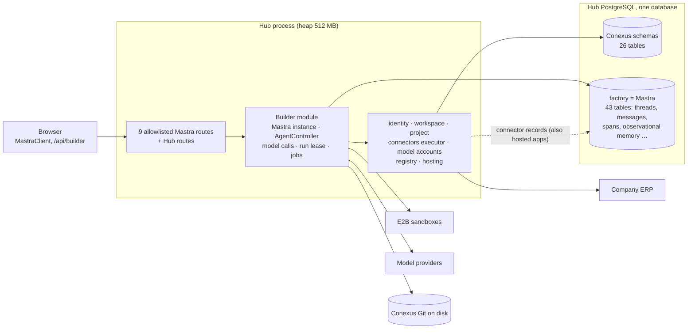
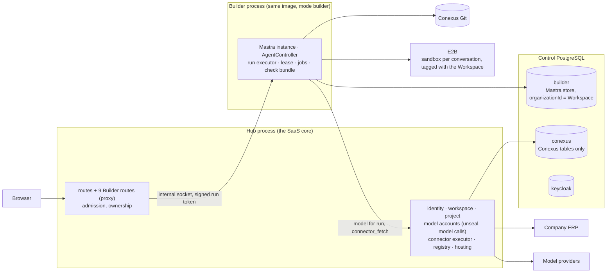

# Study: the Builder as its own service, and where Mastra's data belongs

**Date**: 2026-10-09
**Base**: `main` at `729bdc5`, and `wave/company-model-accounts-spec` at `7a202a3` (the most advanced
wave branch: specs 0017, 0018, 0019 and 0022 in it).
**Earlier studies used**:
- [hosting](../hosting/study.md) and its [tenancy part](../hosting/tenancy.md): one validation
  installation, a Workspace per company, everything a company configures bound to its Workspace;
- [database](../database/study.md): a database per company in the Applications cluster.

This study corrects the database study's section 9, decision 6. That decision placed company
knowledge "in the same PostgreSQL" without asking which database owns Mastra's data. This study
answers it.

Research, not execution authority. Decisions go to the operator (section 9).

## 1. Short answer

**What the operator suspected, and what the code shows.** The operator suspected that Mastra keeping
its data in the Hub is wrong. The code shows something narrower and more serious.
- **Where Mastra writes.** Mastra writes 43 tables into the Hub database's `factory` schema (B1).
  The Hub's own tables number 26.
- **What sits there.** The stored messages keep the raw `connector_fetch` results, which are the
  company's ERP rows. Spans keep prompts, tool input and output and source text, up to 32 KB per
  string, for 30 days. A provider error stored in a turn can echo a model account's key, which is
  stripped only when served.
- **What is missing.** Nothing in Mastra's data carries a Workspace id: the resource is `project:<id>`.
- **Whose data it holds.** The connector calls of hosted apps are recorded in the Builder's Mastra
  store too.

**The premise only half holds.**
- **Mastra's own product does the same.** Mastra's Factory keeps every organization's threads in one
  shared PostgreSQL, separated by `org_id`, with the agent in the same server process.
- **Dify does the same.** It keeps the durable agent session in its main database with a
  `tenant_id`.
- **Per-company storage is not native.** Installed Mastra cannot route storage per company: the
  controller's thread queries, thread state and workflows use the one instance store.

So a Mastra database per company would fight the framework.

**What is wrong is ownership, scoping and hygiene:**
- Mastra's tables share the Hub's control database.
- They carry no company.
- They keep raw company data and possible key echoes longer and wider than needed.
- They also hold the hosted apps' connector records.

**The references split the agent from the API the way the roadmap planned.**
- Dify runs its agent loop in an `agent_backend` service. The service calls the main API back for
  every model call, so company credentials never leave the API.
- Mastra's server supports the remote shape natively:
  - controller routes over HTTP and SSE;
  - `client-js`;
  - token auth.

**What Conexus should do: decide the data placement now, before the first company's data, and split
the process right after, with the same image.**
1. Mastra's store goes into its own database in the control cluster, owned by the Builder.
2. Every Mastra record carries the Workspace through Mastra's own `organizationId` and the
   resource id.
3. Spans keep metadata, not payloads. Raw connector results and key echoes are not persisted, and
   hosted apps' connector records leave the Builder's store.
4. The Builder runs as its own process. It reaches model calls and connector reads through the Hub,
   so the Hub keeps every company credential (C-032).

## 2. Today (census)

Command: `bash docs/research/builder-service/census.sh` (static) and
`bash docs/research/builder-service/spike.sh` (B1). On the wave branch:

| Mechanism | Count | Where |
| --- | --- | --- |
| Builder source | 85 files, 8,566 lines | `apps/hub/src/builder` |
| Hub modules the Builder imports (public interfaces) | 5 modules: identity-access 12, registry 5, app-runner 4, project 3, project-context 1 | census C2 |
| Other modules that import the Builder | 2 files, type-only, through `builder/public.ts` | `apps/hub/src/project/deletion.ts`, `apps/hub/src/project/store.ts` |
| Direct SQL on `builder` tables from other modules | 3 places | `identity-access/admission.ts:364,377`; `registry/served.ts:36`; `registry/retain.ts:23` (0022 findings 0005, 0006) |
| Mastra instance, store, controller | 1 each | `builder/module.ts:121`, `builder/storage.ts:16` (`schemaName: 'factory'`), `builder/harness/controller.ts:223`, `:248` |
| Tables Mastra creates in the Hub database | **43** | spike B1 |
| Builder jobs in the Hub process | 4 (`run-lease` 10 s, `span-prune` daily, `idle-conversations` 1 min, `idle-machines` 1 h) | `builder/module.ts:197-200` |
| Conexus-owned Builder tables | 6 (`builder_run`, `builder_run_model_account`, `conversation_session`, `factory_binding`, `project_repository`, `project_working_state`), all keyed by Project, none by Workspace | census C7 |
| Host-local Builder inputs | 8 (`CONEXUS_GIT_ROOT`, `CONEXUS_COMPILE_ROOT`, `CONEXUS_CLIPROXY_BIN`, the E2B key file …) | census C8 |
| Mastra resource id | `project:<projectId>`; thread = conversation | `builder/conversations.ts:10`, `builder/conversation.ts:21,113` |
| Workspace id in Builder or Mastra data | 0 | `grep -rni "workspaceId\|workspace_id" apps/hub/src/builder` |
| Session routes the Hub serves | 9, allowlisted, SSE stream | `builder/mastra-session-routes.ts:48-58` |

### How it works now

**What the Mastra store holds** (census of the Builder):
- **Messages:** prompts, assistant text, and raw tool arguments and results. That includes workspace
  file reads, which are source code, and raw `connector_fetch` vendor JSON.
  - [Boundary item 12](../../reference/mastra/boundary.md#12-keeping-vendor-values-out-of-the-browser):
    "The thread's stored messages keep the raw arguments and result beside the transformed copies in
    their metadata, and a later turn of the conversation receives the raw result from them." That is
    upstream proposal U9.
  - A failed turn's provider error "can echo the account key". It is stripped only when served
    (`builder/mastra-session-routes.ts:122-136`).
- **Observational memory:** model-written summaries of those messages, per thread.
- **Spans:** tool input and output, up to `maxStringLength: 32_768` (`builder/observability.ts:73-89`).
  "Spans hold prompts, tool I/O and source text" (`builder/storage.ts:6`), kept 30 days (C-038).
  - Every connector call, hosted apps' included, is recorded here (C-029; `platform/config.ts:234-236`).
- **Scores and workflow snapshots:** the check gate's scores and the agentic loop's snapshots.
- **Not stored:** controller sessions live in memory only (`builder/module.ts:184-185`).

**Gotchas:**
- **The `recall` tool reads across conversations.** It reads raw messages of every conversation in
  the same Project (`builder/memory.ts:32`), so a conversation is not private (C-036, not built).
- **A stale plan.** `storage.ts:12-13` still promises a "slice 7" that moves the store to schema
  `mastra`; no spec owns it.
- **A stale name.** Boundary item 12 cites `registerFactoryMastraRoutes`. The function is
  `registerBuilderSessionRoutes` (`mastra-session-routes.ts:387`).

## 3. Why it is so

| Source | What it decided | What it was solving |
| --- | --- | --- |
| C-032 | The Builder is a Conexus harness on Mastra's engine; model calls run in the Hub; the sandbox holds no secret | Prompt, credentials and source custody stay Conexus's |
| C-020 | A Mastra thread owns the conversation; Conexus keeps no conversation store | One owner per concept ([architecture §5](../../reference/architecture.md#one-owner-per-concept)) |
| C-029 | Every connector call is recorded through Mastra observability | Diagnosis needs a record; content capture is not built |
| C-038 | A deleted Project's prompts and source stay in spans up to 30 days | Accepted for the pilot |
| [Database §1](../../reference/database.md#1-stores) | Mastra's storage lives in `factory`, owned by `hub_factory`; Conexus code must not write it | Mastra migrates itself; Conexus never mirrors it |
| [Architecture §11](../../reference/architecture.md#11-risks-and-technical-debt) | "Model accounts and the Mastra instance live in `builder`, not in the core" | Hub base, after S1 |
| [Roadmap](../../roadmap.md#order-of-work-to-q5) | "the Builder block: the move out of the Hub process together with Hub composition", after Q5 | Q5 first |
| Spec 0022 (wave) | Module boundaries; "changes no product behavior"; nothing on moving the Builder out | Clean interfaces first |

## 4. References

### Sources and versions

| Reference | Version | What we read |
| --- | --- | --- |
| Mastra (installed) | `@mastra/core` 1.71.0, `@mastra/pg` 1.27.1, `@mastra/memory` 1.32.1, `@mastra/server`, `@mastra/client-js` 1.50.0 | embedded docs `dist/docs/references/*.md` and types |
| Mastra Factory, Mastra Code | `mastra-ai/mastra` at `0b73cdf9`, `mastracode/` | `factory/src`, `web/src/mastra/index.ts`, `sdk/src/index.ts`, `factory-ui` |
| Dify | `langgenius/dify` at `1a817b99` | `docker/docker-compose-template.yaml`, `api/`, `dify-agent/` |
| OpenHands | `All-Hands-AI/openhands` at `9cf01bb5` | only the "Agent Canvas" front end and launcher are in this repository; the agent server lives in another (`AGENTS.md:31`) |

### The questions

1. Does the agent loop run in the API process or in its own service, and how do they talk?
2. Where does the agent's durable data live, and does it carry the tenant?
3. Who holds model credentials, and which process calls the model?
4. What do traces keep, and where?
5. How does a session survive a restart, and can the agent scale?
6. How is a tenant's data deleted or exported?

### Mastra, installed

1. **Remote use is native.**
   - "A browser UI runs in a different process, so it reaches the same session over the
     controller's HTTP routes" (`core/dist/docs/references/docs-harness-agent-controller.md:427`).
   - Routes `/agent-controller/:controllerId/sessions/:resourceId/{messages,abort,stream,…}`, with
     `streamFormat: "sse"` (`server/dist/server/handlers/agent-controller.js:476-479`).
   - `client.getAgentController(id).session(resourceId, scope)`
     (`client-js/dist/docs/references/reference-client-js-agent-controller.md:74-102`).
   - `SimpleAuth` for "Internal services with static tokens" (`docs-auth-simple-auth.md:9-14`).
   - The controller routes take `resourceId` from the path and do not check it against the caller
     (`agent-controller.js:52-63`, `:1096-1102`). The caller must enforce ownership, as the Hub's
     allowlist does today.
2. **One store per instance.**
   - Memory's only boundary is `resourceId`: "A thread belongs to exactly one `resourceId`"
     (`docs-memory-multi-user-threads.md:19`).
   - A reserved `organizationId` request-context key drives three things: the knowledge `org:` rung
     (`memory/dist/src-DsewkOlu.js:15822-15832`), trace query scope
     (`server/dist/observability-new-endpoints-DqS6dcR5.js:964-976`) and scoped deletes.
   - `MastraCompositeStore` routes by domain, not by tenant (`reference-storage-composite.md:189-197`).
   - The controller's thread queries and `threadState` use the single instance store
     (`core/dist/agent-controller-0NjSdCnl.js:5705-5710`; `core/dist/agent-BOxKOk3n.js:38319`).
3. **Credentials:** not Mastra's concern; the model is resolved per request (Conexus's
   `model-routing.ts`).
4. **Traces.**
   - Spans carry `organizationId`, `resourceId` and `threadId` (`core/dist/storage/constants.d.ts:50`).
   - `PostgresStoreVNext` takes its own observability connection and "will not implicitly share the
     primary connection" (`pg/dist/storage/index.d.ts:104,144,165`).
5. **Restart and scale.**
   - "A Session is live state … pending approvals, and active runs don't automatically survive
     process recreation" (`docs-harness-agent-controller.md:98`).
   - Cross-process signals need Redis or Google Pub/Sub (`docs-server-pubsub.md:43-56`).
   - "Mastra doesn't provide a distributed lease or lock yet" (`docs-harness-durable-agents.md:320`).
6. **Deletion:** scoped deletes on PostgreSQL vNext observability
   (`reference-observability-tracing-interfaces.md:38-50`). No tenant purge.

### Mastra Factory (Mastra's own multi-user product)

1. **One server process.** It hosts the controller, the API and the SPA
   (`mastracode/sdk/src/index.ts:1948-1950`, `:2043`;
   `mastracode/mastra-factory/template/README.md:27`: "One server serves both the Factory UI and
   API"). The browser uses `client-js` over SSE.
2. **One shared database.**
   - "one shared DB (and pg pool) for all users, separated by `resourceId` scoping"
     (`mastracode/web/src/mastra/index.ts:406-409`).
   - App tables carry `org_id`.
   - The harness domain stays in memory (`sdk/src/index.ts:697-707`).
3. **Credentials** live in `model_provider_credentials`, keyed by `org_id` and an optional `user_id`,
   encrypted with AES-256-GCM, and never fall back to the server's environment
   (`factory/src/storage/domains/credentials/base.ts:96-117`;
   `routes/tenant-credentials.ts:41`, `allowEnvironmentFallback = false`).
4. **Traces never go to the main database.**
   - They go to Mastra's platform exporter, or to a local DuckDB on opt-in
     (`sdk/src/index.ts:755-762`).
   - Span context is cut to an allowlist of `requestContextKeys` plus `SensitiveDataFilter`
     (`:729-753`, `:764`).
5. **Restart and scale.**
   - Several replicas need `REDIS_URL` for pubsub and leases (`web/src/mastra/index.ts:94-108`).
   - Runs keep an owner heartbeat with a 30 s staleness limit (`factory/src/session/run-audit.ts:23-46`).
   - Sessions are rebuilt and repaired after a restart (`factory/src/factory.ts:1017-1024`).
6. **Deletion:** per session; sandboxes are retired on delete (`sandbox/session-retirement.ts:39-43`).

### Dify

1. **The agent loop runs in its own service, `agent_backend`.**
   - "…calling the dify-agent backend rather than an in-process LLM/ReAct loop"
     (`api/core/app/apps/agent_app/app_generator.py:5-7`).
   - The API calls `POST /runs` and reads SSE (`dify-agent/src/dify_agent/server/routes/runs.py:44`, `:96`).
2. **Durable sessions stay in the main database.**
   - The agent service's own store is short-lived Redis, two hours (`dify-agent/.../server/settings.py:44`).
   - The durable session is `agent_workspace_bindings.session_snapshot`, with `tenant_id`
     (`api/models/agent.py:519`, `:529`).
3. **Model calls go back through the API.**
   - `url = f"{self.inner_api_url}/inner/api/agent/llm/invoke"` (`dify-agent/.../adapters/llm/provider.py:123`).
   - The API resolves credentials per tenant and re-checks the app's tenant on every call
     (`api/services/agent_llm_inner_service.py:57`, `:123`).
   - Tenant credentials are encrypted with a per-tenant RSA key (`api/libs/rsa.py:37`).
4. **Traces:** not studied.
5. **Restart and scale.**
   - "If the process crashes, currently active runs are lost until an external operator marks or
     retries them" (`dify-agent/.../runtime/run_scheduler.py:1-8`).
   - Events replay with `Last-Event-ID` (`runs.py:100-106`).
   - One E2B sandbox per binding, tagged `dify.tenant_id`, paused between runs
     (`runtime_backend/e2b.py:259-267`).
6. **Deletion:** per app, cascading to conversations and messages
   (`api/tasks/remove_app_and_related_data_task.py:61-86`). No whole-tenant purge.

### OpenHands (front end and launcher only)

1. **Topology.** An all-in-one image with an agent server, an automation service and an ingress
   (`docker/entrypoint.sh:306`, `:350`, `:412`). REST plus a WebSocket per conversation.
2. **State.** Conversation files on one disk, with no tenant (`helm/agent-canvas/values.yaml:94-97`).
5. **Scale.** "keep this at 1" (`values.yaml:6-10`). Recovery is an event log plus `after_seq`.
- The rest is in the agent server's repository, not read.

### Comparison

| Question | Mastra Factory | Dify | OpenHands | Conexus today |
| --- | --- | --- | --- | --- |
| 1 Agent process | same server as the API | **own service** (`agent_backend`) | own server in one image | inside the Hub |
| 2 Durable agent data | one shared DB, `org_id` | main DB, `tenant_id` | disk, no tenant | Hub DB `factory`, **no Workspace** |
| 3 Model credentials | encrypted table per org/user | per-tenant RSA, **calls return to the API** | one installation key | sealed per row (0076), unsealed in the Hub process |
| 4 Traces | **never in the main DB**; allowlisted context, sensitive filter | — | — | in the Hub DB, 32 KB payloads, 30 days |
| 5 Restart/scale | replicas with Redis, leases, heartbeat | runs lost on crash; replay by event id | 1 replica | run lease with heartbeat, 30 s takeover |
| 6 Tenant purge | none | none (per app) | none (per conversation) | none |

**Where all agree:**
- Durable agent data lives in the platform's main store, one database for every tenant, separated by
  a tenant key in the rows.
- No reference keeps agent data per tenant database.

**Where they differ, and why:**
- **Process.** Dify splits the agent loop out and calls back for models. Mastra keeps one process
  and scales replicas.
- **Traces.** Mastra keeps traces out of the main database and filters them. Conexus does neither.

### What we copy and what we adapt

| Mechanism | Copy from | Kept as is | Adapted, and why |
| --- | --- | --- | --- |
| The agent loop in its own service, driven over HTTP and SSE | Dify `agent_app/app_generator.py:5-7`; Mastra `docs-harness-agent-controller.md:427` | Mastra's own controller routes and `client-js` | The same image in a `builder` mode; the Hub keeps the allowlist and ownership checks in front |
| Model calls return to the platform, which holds credentials | Dify `adapters/llm/provider.py:123`, `agent_llm_inner_service.py:57,123` | credentials never leave the Hub | The Builder resolves a run's model through a Hub call that admits the run (`admitRun`) and returns a model handle, so C-032 stays true |
| A tenant key on every agent record | Mastra Factory `web/src/mastra/index.ts:406-409`; Mastra's reserved `organizationId` | Mastra's native key, no Conexus column in Mastra tables | `organizationId` = Workspace id, set server-side; the resource id gains the Workspace |
| Traces out of the main store, with an allowlist and a sensitive filter | Mastra Factory `sdk/src/index.ts:729-764` | `requestContextKeys` allowlist, `SensitiveDataFilter` | Spans to their own database (`PostgresStoreVNext` observability) with retention; payloads not kept |
| A durable owner heartbeat and takeover | Mastra Factory `run-audit.ts:23-46`; Conexus `run-lease.ts` | Conexus's existing lease | Already built |

## 5. The premise

- **As it arrived**: Mastra storing its data in the Hub "would not be correct". The roadmap's Builder
  split should be considered now that the cloud architecture is being designed.
- **Why**:
  1. Is Mastra in the Hub's database wrong in itself? No. Mastra's own product and Dify keep agent
     data in the platform's main database. Mastra cannot store per company natively.
  2. What is wrong, then? Four things:
     - Mastra's 43 tables share the database that holds Conexus's control data, under no owner that
       could leave with the Builder.
     - They carry no company.
     - They keep raw ERP rows, source text and possible key echoes, in messages and in 30-day
       spans.
     - They hold the hosted apps' connector records, which are not the Builder's.
  3. Why does it matter now? The baseline rule ([database §2](../../reference/database.md#2-migrations)):
     data placement is cheap to change before the first company's data and costly afterwards. A
     process split can follow at any time if the data already sits apart.
  4. Is the split worth it? It isolates the Hub, the SaaS core, from the agent's heap and crashes.
     It is the native shape (Mastra routes, Dify's service), and the Builder's interfaces are already
     narrow (2 importers, 5 public dependencies).
- **Root cause**: the Builder's data and the Hub's data were placed by process, not by owner. The
  Builder lived in the Hub, so its framework's store went into the Hub's database. Nothing tied that
  store to the company it holds.
- **The premise held / fell**: it held on the split and on "not like this". It fell on "Mastra's data
  must leave the platform's database per company"; the references and the framework say keep it
  shared, scoped and minimal.

## 6. Proved and not proved

| Claim | How it was tested | Result |
| --- | --- | --- |
| B1. The Builder's Mastra store creates 43 tables in the Hub database | `PostgresStore({ schemaName: 'factory' }).init()` on an empty PostgreSQL 17.10 (`spike.sh`) | 43 tables, including `mastra_messages`, `mastra_ai_spans`, `mastra_observational_memory`, `mastra_knowledge_*`, `mastra_schedules` |
| Raw tool results stay in stored messages | `tests/implementation/connector-builder-tool.test.mjs`, cited by [boundary item 12](../../reference/mastra/boundary.md#12-keeping-vendor-values-out-of-the-browser) | Recorded there; not rerun in this study |
| Workspace absent from Builder and Mastra data | `grep -rni "workspaceId\|workspace_id" apps/hub/src/builder` on the wave | 0 matches |
| The Builder's interfaces are narrow | `census.sh` C2, C3 | 5 public dependencies; 2 type-only importers |

**Not verified:**
- a Mastra controller driven from a separate process through the Hub;
- `organizationId` scoping on threads and messages (Mastra documents it for knowledge, traces and
  datasets, not for memory);
- `PostgresStoreVNext` observability in its own database;
- the memory and latency of a Builder process;
- a Workspace purge across threads, spans and sandboxes.

## 7. Findings against the guides

| Finding | Guide section | Where |
| --- | --- | --- |
| Company content (ERP rows, source) persisted raw in messages and 30-day spans | [Security §7](../../reference/security-and-authority.md#7-data-protection-and-egress); C-038 | `builder/observability.ts:73-89`; boundary item 12 |
| A provider error that may echo a key is stored and stripped only when served | [Security](../../reference/security-and-authority.md) (a credential never shows) | `builder/mastra-session-routes.ts:122-136` |
| No Workspace on Mastra data, now that a Workspace is a company | C-024 as amended on 2026-10-09 | `builder/conversations.ts:10` |
| Hosted apps' connector records live in the Builder's store | [Architecture §5](../../reference/architecture.md#one-owner-per-concept) (one owner per concept) | `platform/config.ts:234-236` |
| Mastra's store has no owner that can leave with the Builder | [Architecture §11](../../reference/architecture.md#11-risks-and-technical-debt) ("the Mastra instance lives in `builder`, not in the core") | `builder/storage.ts:16` |

## 8. What the wave wants

**Now, before the first company's data** (data placement):
1. **Mastra's store in its own database**, `builder`, in the control cluster, owned by a Builder
   role. It is dropped from the Hub database's baseline. The Hub database keeps only Conexus's
   tables.
2. **The Workspace on every Mastra record.**
   - `organizationId` = Workspace id, set server-side.
   - A resource id that carries both, `workspace:<w>:project:
`.
   - The hosted apps' connector records move to the Hub's telemetry, out of the Builder's store
     (C-029 names its store).
3. **Spans without payloads.**
   - A `requestContextKeys` allowlist and `SensitiveDataFilter`, as Mastra's Factory does.
   - Tool input and output not kept, or kept in their own observability database with a short
     retention.
   - A provider error stripped before it is persisted.
4. **A Workspace purge** that removes its threads, messages, observational memory, spans and
   sandboxes, tested with two companies.

**Then, the process split** (the roadmap's Builder block, moved before Q5 if the operator agrees):

5. **The same image in a `builder` mode.**
   - It holds the Mastra instance, the controller, E2B, the run executor and lease, the check
     bundle and the Builder's jobs.
   - It listens only on an internal socket or network.
6. **The Hub in front.** The 9 allowlisted routes are proxied to the Builder with the same ownership
   checks. The browser never reaches the Builder directly.
7. **Model calls and connector reads through the Hub.**
   - The Builder asks the Hub for a run's model (admission plus unseal stay in the Hub), and for
     `connector_fetch` through the one executor (C-030).
   - Its calls carry a signed token scoped to the run, its Project and its Workspace, not one shared
     secret.
8. **One Builder process at first.** Sessions are in memory. The existing lease already lets a
   second owner take over a stale run; replicas wait for a measured need.

**Stays out:**
- a Mastra database per company;
- Redis;
- several Builder replicas;
- moving the Conexus Git root out of the Builder (it moves with it);
- content capture (C-029).

**Done when:**
- The Hub database's catalog holds no `mastra_*` table.
- A query on the `builder` database for one Workspace returns only its records, and a purge leaves
  none.
- A span of a `connector_fetch` call holds no row of vendor data.
- Killing the Builder process leaves the Hub's screens, sign-in and apps serving. A run in flight
  ends `INTERRUPTED` and is retried as today.
- The Hub process's heap stays flat while a Builder turn runs.

**Lane**: `lane:qualification` (secret custody, data placement, a process boundary).

## 9. Decisions for the operator

1. **Where Mastra's data lives.**
   - Options:
     - A: as today, schema `factory` of the Hub database.
     - B: **its own database `builder` in the control cluster**, owned by the Builder.
     - C: a Mastra store per company.
   - Recommendation: **B**.
     - C is not native: the controller's thread queries, thread state and workflows use one
       instance store.
     - B gives the Builder an owner that can leave with it, for one database.
   - **Answer** (2026-10-09): B.
2. **What a span keeps.**
   - Options:
     - A: payloads, as today, 30 days.
     - B: **metadata only** (timings, ids, status) with an allowlist and the sensitive filter.
     - C: payloads in a separate observability database with a short retention.
   - Recommendation: **B**, with C only for a time-boxed diagnosis an administrator turns on (C-029's
     "content capture … for a limited time").
   - **Answer** (2026-10-09): B.
3. **When the Builder leaves the Hub process.**
   - Options:
     - A: after the Q5 verdict (roadmap).
     - B: **in the hosting wave**, since that wave already builds the image with modes.
   - Recommendation: **B for the data placement (decisions 1 and 2), A or B for the process**. The
     process split costs one mode and one proxy, but it moves the place where model calls run.
   - **Answer** (2026-10-09): handed to the operator's architecture session, which owns the cloud
     design and the sequence. Implementation is not in this study.
4. **How the Builder reaches models.**
   - Options:
     - A: **through the Hub**, which admits the run, unseals and calls the provider.
     - B: the Builder unseals per run with a key the Hub hands it.
   - Recommendation: **A**, to keep C-032 ("model calls run in the Hub") and Dify's precedent.
   - **Answer** (2026-10-09): A.

## 10. Draft for the spec

**Where each thing lives.**

| Thing | Where |
| --- | --- |
| Builder mode and its composition | `apps/hub/src/builder/module.ts` composed by a `builder` entry in the image (hosting study) |
| Mastra store's database and role | `apps/hub/src/builder/storage.ts`; role register; the control cluster's provisioning |
| `organizationId` and resource id | `apps/hub/src/builder/conversations.ts`, `runtime.ts`, `mastra-session-routes.ts` |
| Span allowlist and filter | `apps/hub/src/builder/observability.ts` |
| Model and connector calls back to the Hub | `apps/hub/src/builder/model-routing.ts`, `apps/hub/src/connectors/builder-tool.ts`, a new internal route set on the Hub |
| Workspace purge | the Project deletion path (`apps/hub/src/project/deletion.ts`), extended to a Workspace |

**Cut list:**
- `factory` in the Hub database;
- hosted apps' connector records in the Builder's store;
- payloads in spans;
- the stale "slice 7" comment and the stale function name in boundary item 12.

**Does not enter:**
- a Mastra store per company;
- Redis;
- Builder replicas;
- a Mastra fork or patch.
