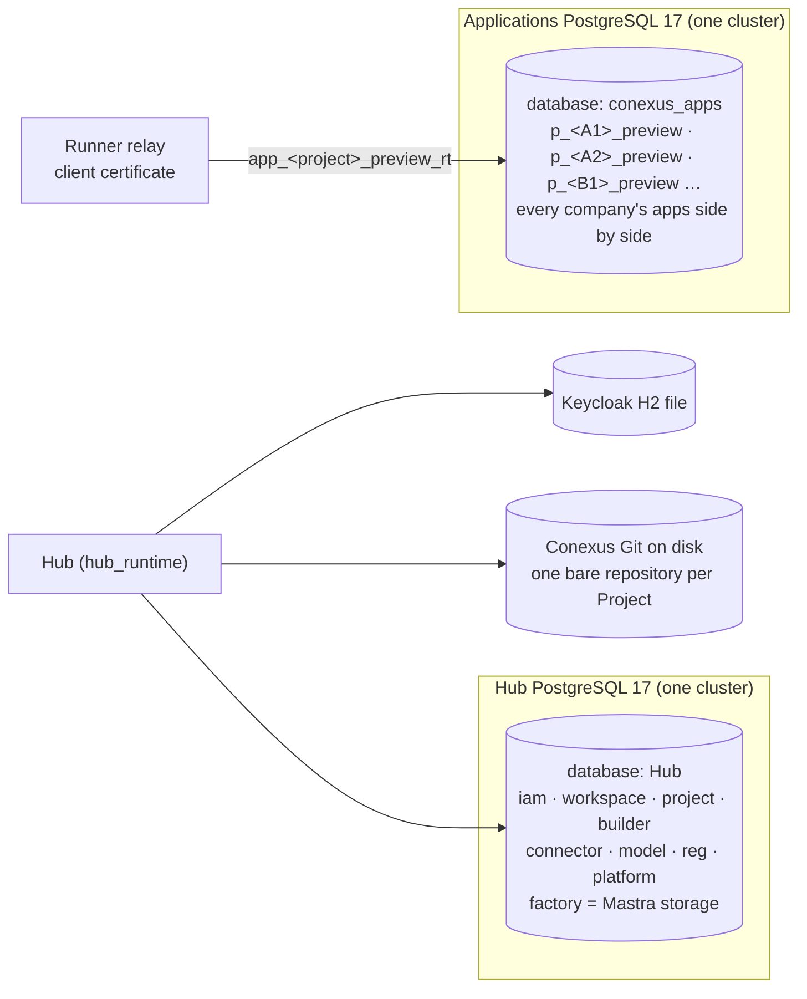
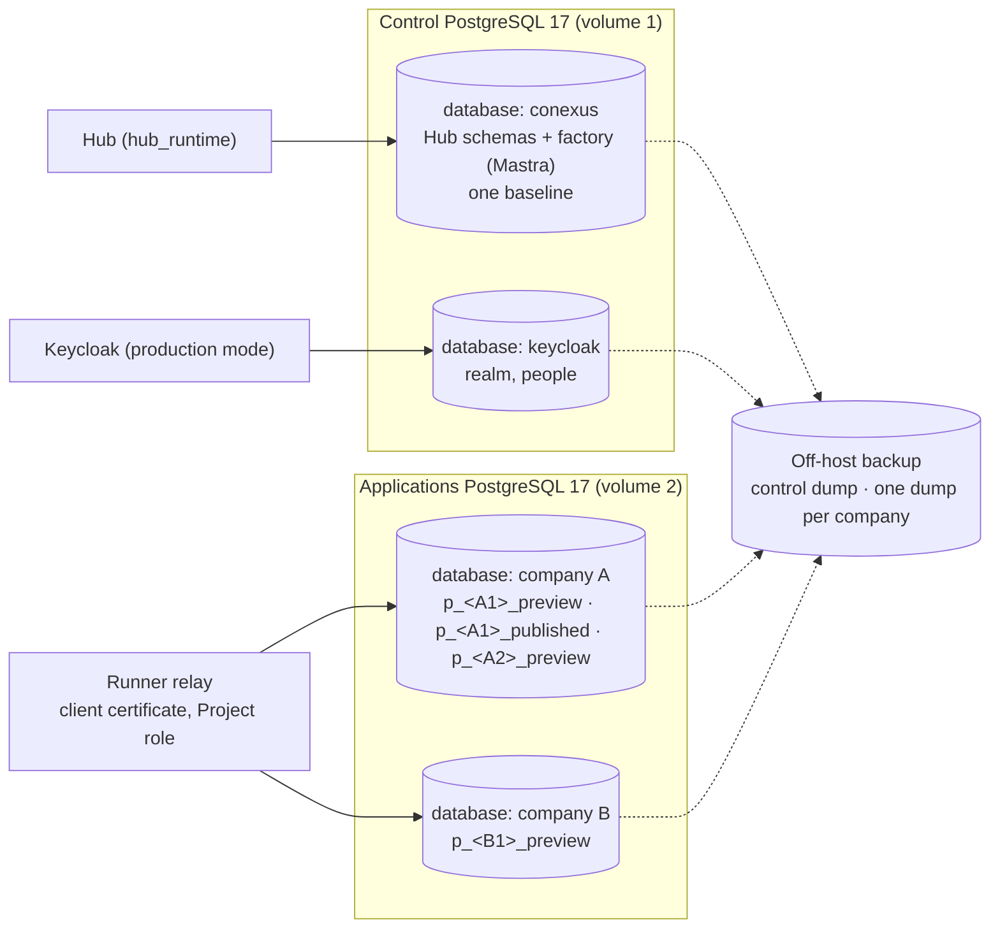

# Study: the database architecture, simpler and cheaper for several companies

**Date**: 2026-10-09
**Base**: `main` at `729bdc5`, and `wave/company-model-accounts-spec` at `7a202a3`, the most advanced
wave branch. It carries the Hub migrations `0071` to `0076`, including spec 0018's `0072` to `0074`.
**Earlier studies used**:
- [the hosting study](../hosting/study.md) and its [tenancy part](../hosting/tenancy.md), whose
  decisions this study takes as given: a validation installation, a Workspace per company,
  everything a company configures bound to its Workspace;
- [Mitra](../mitra/index.md).

This study corrects the reading of Mitra's "a MySQL database per project". In MySQL, a database and a
schema are the same object, a directory of tables. So Mitra's unit of app data costs what a
PostgreSQL **schema** costs, which is what Conexus already allocates per Project. It does not cost
what a PostgreSQL database costs (S9).

Research, not execution authority. Decisions go to the operator (section 9).

## 1. Short answer

**Mostly done.** The Hub's database is already being simplified by the waves in flight. On the most
advanced branch, the Hub catalog has 26 tables, 0 row policies, 1 function and 3 roles. On `main` it
has 50 policies on 26 tables, 4 functions and 7 roles (S0).

**Still heavy.** Three things remain that cost resources or make the system hard to run with
several companies:
- a 76-file, 11,889-line migration chain;
- one shared Applications database where every company's app tables sit side by side, their names
  visible to every handler (C-037);
- a Keycloak on a development file database.

**What the references do.**
- Platforms whose users create their own tables (Baserow, Twenty, NocoDB, ToolJet, Windmill) keep a
  company's tables in a schema or a prefix of one shared database.
- Each of them separates companies in application code. All except NocoDB depend on Redis for jobs.
- Baserow and Twenty name the real limit: the number of tables per database, and upgrades that loop
  over every company.
- Mitra's database per project is, in PostgreSQL terms, a schema per project.

**What the wave should do.**
1. Keep two PostgreSQL clusters.
2. Put Keycloak's database in the control cluster.
3. In the Applications cluster, give **each company its own database**, with a schema per Project
   inside it.
4. Replace the migration chain with one baseline **before the first company's data**.
5. Keep jobs, schedules, knowledge and vectors in PostgreSQL through Mastra's native storage.

A database per company costs 7.3 MB, and each app inside it about 0.07 MB (S9). PostgreSQL then hides
one company's table names from another company's apps (S10). The company also becomes the unit of
backup, export, deletion and of a later move to its own cluster or to Neon.

## 2. Today (census)

Command:
- `bash docs/research/database/census.sh`: the static census, run on each checkout;
- `bash docs/research/database/spike.sh`: S0, the catalog of a migrated database.

| Mechanism | `main` (`729bdc5`) | wave (`7a202a3`) | Where |
| --- | --- | --- | --- |
| Hub tables | 27 | 26 | S0 |
| Row policies / tables with row security | 50 / 26 | 0 / 0 | S0; spec 0018 AC-7 |
| SQL functions in Conexus schemas | 4 | 1 (`iam.lock_administrators`, definer) | S0 |
| Hub roles | 7 | 3 (`hub_runtime`, `hub_factory`, `conexus_owner`) | S0; `contracts/technical/hub-database-roles.json` |
| Empty Hub database | 11 MB | 11 MB | S0 |
| Hub migrations | 70 files | 76 files, 11,889 lines | census S1 |
| Database machinery scripts | | 14 files, 1,913 lines | census M1 |
| Generated database registers | | 3 files, 859 lines | census M2 |
| Hub data layer and Applications data plane | | `db.ts`, `data-plane.ts`, `pg-relay.ts`: 902 lines | census M3 |
| Unit of app data | a schema `p_<project>_preview` and two roles `app_<project>_preview_rt` / `_mig` | same | `apps/hub/src/app-runner/data-plane.ts:39-41` |
| Applications databases | one, named by `CONEXUS_APP_DB_NAME` | same | `apps/hub/src/app-runner/main.ts:41` |
| Project role login | certificate only, one `hostssl` line per database | same | `scripts/confine-application-cluster.mjs:89` |
| Mastra storage | `PostgresStore` in schema `factory`, span retention, native `prune()` | same | `apps/hub/src/builder/storage.ts:16`, `:26` |
| Keycloak storage | H2 file in the container (`start-dev`) | same | `infra/keycloak/provision.sh:67`, `export-realm.sh:34` |
| PostgreSQL image | `postgres:17.10-bookworm`, pinned 5 times; extensions `pgcrypto`, `pg_trgm`, `unaccent`, `pg_stat_statements`, no `vector`, `pg_cron` or `pgmq` | same | census X3; S0 container |

### How it works now

**Overview.**
- **Hub data.** The Hub reads and writes its own schemas as `hub_runtime`, with typed admission
  proofs (spec 0018) and no row policies. Mastra creates and migrates its own tables in `factory` as
  `hub_factory`.
- **App data.** A Project's data lives in a schema of the one Applications database. The runner
  provisions the schema and its role pair, applies the Project's forward SQL migrations with a
  ledger table, and serves handlers through a relay that logs in with a client certificate.
- **Backups.** One `pg_dump` per cluster (#576 added the Applications data and roles).

**Key concepts.**
- An **owner role** owns the Hub objects.
- **Registers** (`contracts/technical/hub-*.json`) pin the catalog, and a **checker** compares the
  migrated catalog with the snapshot.
- **Project roles** are cluster-global, named from the Project id, and admitted by certificate.

**Gotchas.**
- The applied chain can be replaced by a baseline only while no installation holds company data
  ([database §2](../../reference/database.md#2-migrations), "Until an installation holds company
  data, a reset of the local databases **may** replace the chain with one baseline. After that, the
  baseline **must not** change"). Validating companies are company data, so **the window closes at
  the first company**.
- Every name in `conexus_apps` is visible to every Project role: the schema, table and column names,
  never the rows (C-037). With a Workspace per company, that includes other companies.

## 3. Why it is so

| Source | What it decided | What it was solving |
| --- | --- | --- |
| Q2, 2026-09-23 ([roadmap](../../roadmap.md#finished)) | Parameterized SQL through `pg`; no Kysely, no Data API | A small data model, read and reviewed as SQL |
| [Database §1](../../reference/database.md#1-stores) | Two clusters; Mastra in `factory`; one schema per Project and environment; certificate login | Separate failure; generated code never reaches Conexus data |
| C-028, C-033 | A managed app platform; one fixed stack; migrations in the Project's repository | No backend per Project; the Project's source is its truth |
| C-037 | Project names visible across Projects in the shared cluster | Accepted for the pilot; reopened by "the cluster serves more than one installation". Re-accepted 2026-10-09 for a validation installation until this study |
| Spec 0018 ([`wave/authorization-model`](../hosting/tenancy.md#11-correction-row-security-leaves-with-spec-0018)) | No Hub row policies; one runtime role; typed admission | The role-switch and policy machinery doubled the authority model |
| Spec 0017 (`wave/company-model-accounts-spec`, `0071`, `0075`, `0076`) | Model accounts `personal` or `installation`; secrets sealed per row | Company accounts; secret custody. Its `installation` scope becomes the Workspace (tenancy decision 2) |
| Roadmap, S1 closure | "one migration baseline replaces the old chain" | The chain's length |

## 4. References

### Sources and versions

| Reference | Version | What we read |
| --- | --- | --- |
| Baserow | `bram2w/baserow` at `ae95e512` | `backend/src/baserow/contrib/database`, `core`, settings, backup |
| Twenty | `twentyhq/twenty` at `97214317` | `packages/twenty-server/src/engine` (workspace datasource, migrations, ORM, cache), commands, docker |
| NocoDB | `nocodb/nocodb` at `45506cb9` | `packages/nocodb/src` (bases, sources, sql clients, connection manager, jobs) |
| Windmill, ToolJet, Budibase | as in [the hosting study](../hosting/study.md#sources-and-versions) | their data and tenancy code |
| Mitra | `mitra-sdk` 1.0.65, `mitra-interactions-sdk` 1.0.70, and the evidence in [`../mitra/`](../mitra/index.md) | data API, migrations, observations |
| Mastra | `@mastra/core` 1.71.0, `@mastra/pg` 1.27.1, installed | storage tables, retention, schedules |

### The questions

1. Where does a user's or app's own data live: shared tables, a schema, a database, an external
   database?
2. How do schema changes reach it, and how are they recorded?
3. How are companies kept apart in the data?
4. What limits did the reference meet, and where does the code say so?
5. How are platform metadata and user data separated?
6. What is the unit of backup, export and deletion?
7. What runs jobs and schedules, and on what store?

### Baserow

1. **One real table per user table**, `database_table_<id>`, all in schema `public` of the one
   database (`contrib/database/table/constants.py:2`, `table/models.py:1009-1010`). Columns are
   `field_<id>` (`fields/models.py:228`).
2. **DDL at request time through Django's schema editor**: `schema_editor.create_model(model)`
   (`table/handler.py:489-492`), `add_field` (`fields/handler.py:409`).
   - Metadata row locks are taken with `NOWAIT` and answer 409 (`fields/handler.py:259-260`).
   - Drops wait 72 hours in the trash.
3. **Application checks only**: `check_permissions(… workspace=table.database.workspace …)`
   (`api/rows/views.py:397-401`), one login (`config/settings/base.py:248`). No role or policy exists.
4. **The limit is the number of tables.** "if the total number of tables in the database is very
   high (i.e. 5,000-10,000), it's possible to exceed … `max_locks_per_transaction`"
   (`docs/technical/postgresql-locks.md:8-9`). So `pg_dump` runs 60 tables at a time
   (`core/management/backup/backup_runner.py:57`), and duplication takes one transaction per
   application (`core/job_types.py:225-227`).
5. **Same database.** A `USER_TABLE_DATABASE` setting exists but nothing reads it
   (`config/settings/base.py:384-387`).
6. **Logical export per application and per workspace** (`core/import_export/handler.py:463`).
   Snapshots are hidden copies of the application.
7. **Celery on Redis** (`config/settings/base.py:184`), with a beat scheduler. The compose file
   runs `pgvector/pgvector:pg15`.

### Twenty

1. **A schema per workspace**, `workspace_<base36(uuid)>`
   (`engine/workspace-datasource/utils/get-workspace-schema-name.util.ts:4`), in the same database
   as schema `core`.
2. **Migrations computed from metadata, never stored.**
   - Metadata and DDL commit in one transaction with `SET LOCAL lock_timeout = '8s'`
     (`workspace-migration-runner.service.ts:362`, `:378`, `:440`).
   - Index builds are deferred to a persisted `CONCURRENTLY` queue
     (`deferred-workspace-migration-action.entity.ts:18`).
   - A `metadataVersion` counter invalidates caches.
3. **Application only.** One pool for every workspace
   (`engine/twenty-orm/datasource/workspace-data-source.service.ts:57-58`), the workspace in
   AsyncLocalStorage, schema-qualified SQL. No role, policy or `search_path` exists.
4. **Upgrades loop over every workspace in sequence.**
   - "Workspace commands are executed sequentially across all active/suspended workspaces"
     (`packages/twenty-server/docs/UPGRADE_COMMANDS.md:147`).
   - A per-workspace progress table (`upgrade-migration.entity.ts:16`) lets an upgrade resume.
   - A flag freezes DDL during hot upgrades (`config-variables.ts:120`).
   - The metadata cache is capped by memory (`workspace-cache.service.ts:67-68`).
   - A data-source URL per workspace is deprecated (`data-source.entity.ts:15-16`).
5. **`core` and the workspace schemas share one database,** which is what lets metadata and DDL
   commit together.
6. **Export per workspace** as SQL (`workspace:export`, `workspace-export.command.ts:14-15`).
   Deletion drops the schema (`workspace-schema.service.ts:56`). There is no backup per workspace.
7. **BullMQ on Redis**, with crons as job schedulers (`drivers/bullmq.driver.ts:377`) and a separate
   worker process.

### NocoDB

1. **A schema per base**, named by the base id, on PostgreSQL (`services/bases.service.ts:268-278`).
   - On SQLite there is a file per base (`:286-318`).
   - Otherwise tables carry a prefix in the meta database (`:263`, `tables.service.ts:987-989`).
   - It falls back to a prefix when the role cannot create schemas
     (`helpers/initBaseBehaviour.ts:17`, `:69`).
2. **DDL through dialect clients** (`db/sql-client/lib/pg/PgClient.ts:3162-3163`). Metadata is
   written after the DDL, outside its transaction (`models/Model.ts:317-320`).
3. **Application filters** on `fk_workspace_id` and `base_id` (`meta/meta.service.ts:306`, `:313`).
   Per-workspace PostgreSQL credentials ("Data Reflection") exist only in the paid edition
   (`models/DataReflection.ts:160`).
4. **One pool shared by every schema-per-base base** (`utils/nc-config/constants.ts:29`, max 10).
   Sources get an LRU of pools (`NcConnectionMgrv2.ts:16-17`). Deleting a base drops no schema.
5. **The meta database holds the bases' schemas** in the community edition
   (`NcConnectionMgrv2.ts:193`).
6. **Duplicate is JSON plus CSV streaming.** There is no database backup.
7. **An in-process queue** with concurrency 2 (`fallback/fallback-queue.service.ts:29`). Bull on
   Redis exists, unwired.

### Windmill, ToolJet, Budibase (from the hosting study)

| | Windmill | ToolJet | Budibase |
| --- | --- | --- | --- |
| 1 | platform database; optional database per workspace on its own cluster, refused on its cloud (`workspaces.rs:1633`) | separate `TOOLJET_DB`, schema and role per workspace, dropped on its cloud for PostgREST's sake (`tooljet_db.helper.ts:77-81`) | CouchDB database per app, dev and prod |
| 3 | application filter on `workspace_id` | application filter | database per app |
| 7 | **PostgreSQL queue**, `FOR UPDATE SKIP LOCKED` (`worker.rs:858-864`) | BullMQ on Redis | Bull on Redis |

### Mitra

1. **One MySQL database per project, MySQL 8.3, created with the project.** The probe saw "MySQL
   **8.3.0**" (`full-study.md:1785`). Mitra's article says "schema MySQL independente por projeto" in
   a "container Docker dedicado por projeto" (`influence-on-conexus.md:2359-2360`). The container is
   claimed by the article only.
2. **The agent changes the database first; the migration file is written after the turn.** "o
   sistema materializa e commita as migrations sozinho, DEPOIS do turno"
   (`influence-on-conexus.md:304-305`). `reconcileMigrations` moves the outbox into the repository
   (`mitra-sdk/dist/index.d.ts:203-221`).
3. **Platform API with a token; parameters interpolated into SQL.** "um apóstrofo… quebra o SQL"
   (`evidence/observation-log.md:1607-1608`). Platform tables `INT_*` and a `db_action_log` with
   before and after values live inside each project database.
4. **A silent 2,000-row cap on queries** (`evidence/observation-log.md:3154-3155`). Imports of
   5,000 products took 338 s.
5. **The ERP is mirrored into the project database** by a JavaScript function on a 30-minute cron,
   with `ON DUPLICATE KEY UPDATE` in batches of 400 (`influence-on-conexus.md:1309`, `:1314`).
6. **No backup or export API** in either SDK. Files go to S3 under a per-tenant prefix, private by
   default since 1.0.70.

### Mastra (the store Conexus already has)

- `@mastra/core` 1.71.0 names some 40 storage tables. Among them: `mastra_schedules`,
  `mastra_schedule_triggers`, `mastra_background_tasks`, `mastra_knowledge_*`,
  `mastra_notifications`, `mastra_threads`, `mastra_messages`, `mastra_ai_spans` (installed
  `@mastra/core/dist/storage`).
- A workflow with a `schedule` field is fired by Mastra's scheduler on its cron. The workflow is
  then promoted to the evented engine, which "require[s] a storage adapter with concurrent-update
  support" (`dist/docs/references/docs-workflows-scheduled-workflows.md`). `@mastra/pg` has it:
  `supportsConcurrentUpdates() { return true; }` (`@mastra/pg/dist/index.js:22607`).
- Retention is native: `prune()` deletes growth tables in bounded batches. On PostgreSQL, "vNext
  observability drops expired partitions or chunks" (`dist/docs/references/reference-storage-retention.md`).
  The Hub already uses it (`apps/hub/src/builder/storage.ts:26`).

### Market technologies

From a web scan of 2026-10-09: vendor and third-party pages, npm versions, and the Mastra documentation installed in
`node_modules`. Vendor pages could not be fetched from this environment, so prices and limits are
**not verified**. Each verdict is judged against the conditions this study works under:
- one small VM;
- `pg` with no ORM;
- the relay and the Project role pair;
- typed admission in the Hub.

| Technology | What it would replace | Verdict |
| --- | --- | --- |
| Neon (database per tenant through an API, branches, scale to zero) | Applications provisioning; branches for Previews | **Study** when Conexus runs on more than one VM or as a hosted offer. A database per company maps to a Neon project one to one. The certificate rule and the superuser-only grants (D4 of the hosting study) block it today |
| Nile, Turso/libSQL, Cloudflare D1, Prisma Postgres, Supabase, Xata, PlanetScale, SQLite with Litestream | the Applications cluster, or the isolation | **Reject**: a second engine or dialect, a hosted-only service, a second auth and data API (Supabase), or a Workers runtime (D1) |
| PGlite (PostgreSQL in WASM, 0.5.x) | throwaway databases to check a generated migration | **Study** at the Builder check: a migration could be tried in process before the runner |
| Shared tables with a tenant column and RLS (AWS "pool" model) | the unit of app data | **Reject** for apps: generated apps have different tables, which fits AWS's "bridge" model (a schema or database per tenant) |
| A database per company, a schema per app | — | **Adopt** (this study). Revoke `CONNECT` and `TEMP` from `PUBLIC` on each company database (a new database grants both by default). Watch `max_locks_per_transaction` once a company has thousands of tables |
| One relay login per company database with `SET LOCAL ROLE <app role>` (the scan's suggestion, to keep pools flat) | the Project role login | **Reject**: the handler speaks SQL through the relay, so a session that may switch roles lets a handler switch to another app's role. Keep one login per Project role |
| Citus schema-based sharding (12 and later) | one Applications node | **Study** when the Applications cluster outgrows one node. A schema per app maps to it one to one |
| PgBouncer 1.25 | direct connections | **Study** when connections are the bottleneck. Transaction mode loses session state, which the Hub's instance lock needs |
| pg-boss 12 (jobs on `SKIP LOCKED`, no extension) | jobs Mastra's background tasks do not cover | **Study** at the jobs milestone, only for what Mastra lacks |
| pgmq, graphile-worker, pg_cron | jobs | **Reject**: an extension, `LISTEN/NOTIFY` on session connections, or SQL-only jobs |
| pgvector 0.8 (image `pgvector/pgvector:pg17` or the PGDG package) with Mastra `PgVector` in the same database | a vector database | **Study** at company knowledge, then adopt. `PgVector` takes `disableInit` for a runtime role without DDL |
| pg_duckdb, DuckDB | analytics over ERP extracts | **Study** at analytics; prefer DuckDB inside a sandboxed handler |
| pg_partman, TimescaleDB | retention | **Reject** for now: Mastra's `prune()` covers its tables; Timescale's features are not open source |
| Logical replication, Debezium, ElectricSQL, Zero, PowerSync | sync | **Reject**: the ERP is not PostgreSQL, and a stalled slot fills a small disk |
| PostgREST, pg_graphql | an app data API | **Reject**: it would bypass the relay and the Hub's admission |
| dbmate, Atlas, graphile-migrate | the Hub migration runner | **Reject**: the runner is 280 lines and pins each file and the catalog; the hard part is roles and the relay |
| Mastra `PostgresStoreVNext` observability in a separate database (append-only, day partitions, prune drops partitions) | spans in `factory` | **Study** when trace volume grows; plain PostgreSQL "can handle low trace volumes" |
| Mastra schedules and background tasks (`mastra.schedules` arrived in core 1.50.0 and is beta) | in-process timers for future automations | **Study** at the automations milestone, because the API is beta. Its store already supports it |

The latest Mastra releases are core 1.75.0 and pg 1.30.0, from 2026-10-07. Conexus pins 1.71.0
and 1.27.1.

### Comparison

| Question | Baserow | Twenty | NocoDB | Windmill | ToolJet | Mitra | Conexus today |
| --- | --- | --- | --- | --- | --- | --- | --- |
| 1 Unit of user data | table in `public` | schema per workspace | schema per base | platform DB (+ optional DB) | schema per workspace (self-host) | MySQL database = schema per project | schema per Project in one shared database |
| 2 DDL | at request time | computed from metadata, one transaction | dialect client, metadata after | — | — | applied first, recorded after | forward SQL in the Project's repository, the migration is the gate |
| 3 Company apart by | app code | app code | app code (roles in paid edition) | app code | app code + role per workspace | platform API | app code (0018) + a role pair per Project |
| 4 Limit met | tables per database | upgrades × workspaces | pools | — | schemas in PostgREST | row cap, slow imports | (not yet) |
| 5 Metadata vs data | same database | same database | same database | same | separate databases | per-project database holds platform tables | separate clusters |
| 6 Export unit | application / workspace | workspace | base | — | — | none | cluster dump |
| 7 Jobs | Celery + Redis | BullMQ + Redis | in process | **Postgres queue** | BullMQ + Redis | cron on functions | in-process timers; **Mastra schedules available** |

**Where all agree:**
- The cheap unit of user data is a schema or a prefix inside a shared database, never a database
  per app.
- Every reference separates companies in application code.

**Where they differ, and why:**
- **Scale.** The ones that met scale (Baserow, Twenty, ToolJet's cloud) hit the count of tables or
  schemas in one database, or the cost of upgrading every company in turn.
- **A second store.** Only Windmill keeps jobs in PostgreSQL; the rest add Redis.
- **Conexus's position.** Conexus is already ahead on two points: a role pair per Project, and
  migrations that gate. It is behind on one: every company's names in one database.

### What we copy and what we adapt

| Mechanism | Copy from | Kept as is | Adapted, and why |
| --- | --- | --- | --- |
| A company's tables in their own namespace, named by id, never by a title | Twenty `get-workspace-schema-name.util.ts:4`; NocoDB `bases.service.ts:268-278` | ids, not titles | **A database per company**, not a schema per company. A database is PostgreSQL's wall for names (S10), and a schema per Project inside it keeps the role pair |
| One transaction for a migration and its record, with a short `lock_timeout` | Twenty `workspace-migration-runner.service.ts:362-440` | | Conexus's runner already applies a batch and its ledger in one transaction ([database §2](../../reference/database.md#2-migrations)); add `SET LOCAL lock_timeout` |
| Batch work one company at a time, resumable | Baserow `backup_runner.py:57`; Twenty `upgrade-migration.entity.ts:16` | | Applications migrations and backups loop over company databases, each in its own transaction, so no run holds every lock at once |
| Export, delete and back up a company as one unit | Twenty `workspace:export`, `dropSchema` | | `pg_dump -d <company database>` and `DROP DATABASE`, both native |
| Jobs and schedules in PostgreSQL, no Redis | Windmill `worker.rs:858-864`; Mastra schedules (installed) | | Native first: Mastra's scheduler and background tasks on the existing `PostgresStore`, when automations arrive |
| A row cap that tells the caller it cut | the absence in Mitra (`observation-log.md:3154`) | | Every list returns a continuation token (#547), never a silent cap |

## 5. The premise

- **As it arrived**: the database architecture was shaped by the laptop and "can probably improve a
  lot". Mitra seems to make a MySQL database per app; maybe Conexus should too.
- **Why**:
  1. Is the Hub database heavy? It was. The waves already take it from 50 policies and 7 roles to 0
     and 3 (S0). What remains heavy is the migration chain (11,889 lines), which a baseline removes.
  2. Is the app-data unit wrong? No. A schema per Project costs about 0.07 MB (S9), and it is
     Mitra's unit in PostgreSQL terms. A database per app would cost about 7.4 MB each, about 100
     times the disk per app, and about 55 times the creation time. No reference does it.
  3. What does several companies change? The unit above the app. Today every company's app names
     sit in one database (C-037), one dump holds every company, and nothing deletes or exports one
     company.
  4. Is there a cheaper engine? For one small VM, no. PostgreSQL already covers relational data,
     Mastra's store, jobs, schedules and, with `pgvector`, vectors. Every reference that left
     PostgreSQL for jobs added Redis.
- **Root cause**: the data layout has no company level. The Applications cluster was sized for one
  company, so every per-company need (privacy of names, export, deletion, backup, a later move)
  must be built by hand.
- **The premise held / fell**: it fell on Mitra (Conexus already has Mitra's unit). It held on
  simplification, but the gain is in layout and operations, not in a new engine.

## 6. Proved and not proved

Spikes: `bash docs/research/database/spike.sh [apps]`, on PostgreSQL 17.10.

| Claim | How it was tested | Result |
| --- | --- | --- |
| S0. The waves remove the Hub's row security and most of its roles | Migrated `main` and `wave/company-model-accounts-spec` | `main`: 27 tables, 50 policies, 26 tables with row security, 4 functions, 7 roles. Wave: 26, 0, 0, 1, 3. Both 11 MB empty |
| S9. A schema per app is the cheap unit; a database per app is not | 100 small apps (2 tables, a key, an index) as schemas in one database, and as 100 databases | Empty database: 7.3 MB. 100 schemas: 14.0 MB in total, created in about 0.6 s. 100 databases: 739.6 MB, created in about 33.5 s |
| S10. A database per company hides one company's names from another | Two company databases; a role with `CONNECT` on A only | It lists A's tables only (both of A's Projects). Connecting to B: `permission denied for database "company_b"`. Database names stay visible cluster-wide |
| Idle cost of a second PostgreSQL cluster | Hub PostgreSQL at rest (hosting study S6) | 52 MiB |
| Mastra's PostgreSQL store supports scheduled (evented) workflows | Read the installed adapter | `supportsConcurrentUpdates()` returns `true` (`@mastra/pg/dist/index.js:22607`). Not run |

**Not verified:**
- a regular-expression database field in `pg_hba.conf` for the certificate login per company
  database (PostgreSQL 16 and later document it);
- `max_locks_per_transaction` with thousands of Projects in one company database;
- Keycloak in production mode on PostgreSQL, and its memory;
- Mastra's scheduler under load;
- every vendor figure in section 4.

## 7. Findings against the guides

| Finding | Guide section | Where |
| --- | --- | --- |
| Every company's app names sit in one database | C-037; [security](../../reference/security-and-authority.md) | `apps/hub/src/app-runner/main.ts:41` (one `CONEXUS_APP_DB_NAME`) |
| The baseline window closes at the first company's data | [Database §2](../../reference/database.md#2-migrations) | 76 files, census S1 |
| Keycloak's identity data in a development H2 file, exported by copying the file | [Backup](../../reference/backup.md#back-up) | `infra/keycloak/provision.sh:67`, `export-realm.sh:34` |
| Two clusters on one VM disk do not fail apart: a full disk stops both | [Architecture §10.2](../../reference/architecture.md#102-quality-scenarios) ("The Applications cluster fills up → the Hub keeps serving") | deployment, not code |
| No company can be exported, deleted or restored alone | [Backup](../../reference/backup.md) | `scripts/conexus-backup.sh` dumps whole clusters |

## 8. What the wave wants

- **Wants**:
  1. **A database per company in the Applications cluster.**
     - It is named from the Workspace id, and a schema per Project and environment lives inside it.
     - The runner allocates the company database on the company's first Project and keeps the role
       pair per Project. The certificate login gets one `pg_hba` rule for every company database.
     - Backup, export and deletion run per company database, one transaction each.
  2. **Keycloak in production mode** on its own database in the control cluster. The realm export
     becomes a `pg_dump`.
  3. **One baseline** replaces the Hub chain before the first company's data, as the guide allows
     only now. The S1 closure already plans it.
  4. **Two volumes:** the Applications cluster on its own disk or volume, so a full Applications
     disk leaves the Hub serving.
  5. **Short locks:** `SET LOCAL lock_timeout` on Applications migrations, and one company at a
     time in every loop over companies.
  6. **A closed company database:** `REVOKE CONNECT, TEMP ON DATABASE … FROM PUBLIC` when it is
     created, so only that company's Project roles may connect.
- **Stays out**:
  - Neon, Supabase or any managed engine (the hosting study's S2 and S3 refuse the Hub chain there;
    the certificate rule refuses the Applications cluster);
  - Redis, a queue service, an ORM or a migration tool;
  - an ERP mirror;
  - file storage;
  - `pgvector` until company knowledge has a consumer.
- **Done when**:
  - `bash docs/research/database/spike.sh` shows S10's refusal between two companies created through
    the product, not by hand.
  - A company's database is exported with one `pg_dump`, restored into a fresh cluster, and its apps
    serve.
  - Deleting a company drops its database and its roles, and no role or schema of it remains.
  - `ls apps/hub/migrations` lists one baseline (plus migrations written after it), and CI's
    catalog snapshot is unchanged by the reset.
  - Filling the Applications volume leaves the Hub's screens serving.
- **Lane**: `lane:qualification` (database privilege and a migration baseline).

## 9. Decisions for the operator

1. **The unit of app data, now that a Workspace is a company.**
   - Options:
     - A: one Applications database, a schema per Project (today).
     - B: **a database per company**, a schema per Project inside.
     - C: a database per Project (a literal copy of Mitra).
   - Recommendation: **B**.
     - S9: C costs about 7.4 MB per app against 0.07 MB (about 100 times the disk per app) and
       about 55 times the creation time. No reference does it.
     - S10: B gives each company PostgreSQL's wall for names, export, deletion and a later move, for
       7.3 MB per company.
   - **Answer**: pending.
2. **Cluster topology on one VM.**
   - Options:
     - A: two clusters (control: Hub and Keycloak; Applications), each on its own volume.
     - B: one cluster with every database.
   - Recommendation: **A**. It costs 52 MiB, and it keeps [architecture §10.2](../../reference/architecture.md#102-quality-scenarios)'s
     scenario true.
   - **Answer**: pending.
3. **Keycloak's store.**
   - Options:
     - A: its own database in the control cluster.
     - B: its own PostgreSQL container.
     - C: H2 (development only).
   - Recommendation: **A**.
   - **Answer**: pending.
4. **When the baseline is cut.** Recommendation: **before the first validating company**, because the
   guide forbids it afterwards.
   **Answer**: pending.
5. **ERP data.**
   - Options:
     - A: read through the connector, as today.
     - B: a mirror table per app, as Mitra does.
   - Recommendation: **A now**.
     - A mirror enters only when an app needs history or aggregation the ERP cannot answer.
     - It would then live in the company's database, with the cursor discipline Mitra's study
       recorded.
   - **Answer**: pending.
6. **Automations, agents and company knowledge.** Recommendation: **Mastra's native storage in the
   same PostgreSQL** (schedules, background tasks, knowledge, `PgVector`). Change the image to
   `pgvector/pgvector` when knowledge has its first consumer. No Redis, no queue service.
   **Answer**: pending.

## 10. Draft for the spec

**Data shape.**
- **The allocation** gains the company database: `{ projectId, database, schema, runtimeRole,
  migrationRole }`. The database is derived from the Workspace id as the schema is from the Project
  id, and stored nowhere a handler could influence.
- **The provisioner** creates the company database on first use. It grants `CONNECT` on it only to
  that company's Project roles, and drops it with the company.
- **The `pg_hba` block** admits Project role names to company database names by pattern. One rule
  covers every company.

**Where each thing lives.**

| Thing | Where |
| --- | --- |
| Company database allocation and naming | `apps/hub/src/app-runner/data-plane.ts` |
| Certificate rule for company databases | `scripts/confine-application-cluster.mjs` |
| Per-company backup, export and restore | `scripts/conexus-backup.sh`, `scripts/conexus-restore-check.sh` |
| Keycloak production database | `infra/keycloak/`, the hosting wave's Compose file |
| Baseline | `apps/hub/migrations/0001_baseline.sql`, `scripts/generate-hub-baseline.mjs` (exists) |

**Cut list:**
- the single `CONEXUS_APP_DB_NAME`;
- the H2 export path for an installation;
- the 76-file chain.

**Does not enter:**
- a tenant column on app tables;
- a database per Project;
- Redis;
- an ORM;
- a managed engine;
- file storage;
- an ERP mirror.
