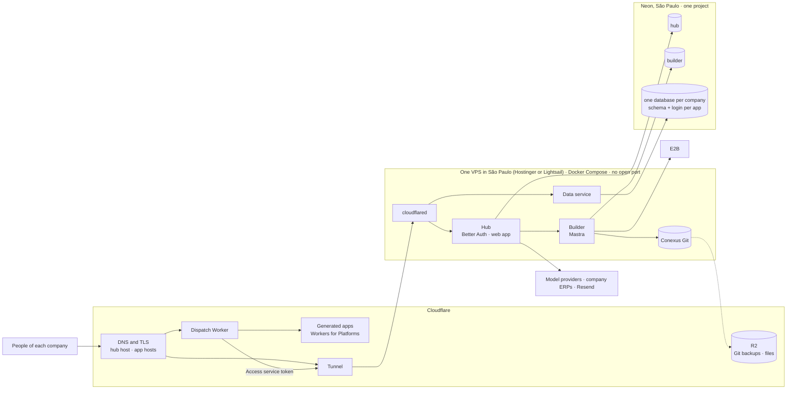

# Study: where Conexus runs for its first companies

**Date**: 2026-10-09
**Base**: `main` at `729bdc5`, with the wave `wave/company-model-accounts-spec` at `7a202a3` read for the
data layer
**Earlier studies used**:
- [hosting](../hosting/study.md): S6, the memory of one installation at rest. Its target shape (a
  cell per company) is superseded by the [tenancy](../hosting/tenancy.md) decision O1. Its cost
  model used third-party price listings; this study replaces them with vendor pages.
- [database](../database/study.md): a database per company, a schema per app (9.1).
- [Builder service](../builder-service/study.md): Mastra in its own database `builder` (9.1).
- [app runtime](../app-runtime/study.md): generated code on Workers for Platforms (9.1), app data
  through a data service next to the database (9.3, recommended, not yet answered).
- [open decisions](../architecture/open-decisions.md): B1 to B11.

The operator's question of 2026-10-09, in short:
- Four companies should start using Conexus now: the operator's own and three of family.
- Should Conexus run on a cloud's managed services, on a VM (Fly, Hetzner), or on a server bought
  for home?
- There are four areas to decide: where Conexus runs, the services Conexus uses, the apps, and the
  database.
- The target is the simplest and cheapest that is still good and reliable. The infrastructure code
  may be refactored as much as needed. The code that matters most today is the Builder's logic on
  Mastra.

Research, not execution authority. Decisions go to the operator (section 9).

## 1. Short answer

**At four companies the place costs little; what it decides is reliability and the operator's
hours.**
- Every option that fits costs $57–123 a month (section 10, `cost.mjs`). The exception is Supabase
  with point-in-time restore, at $190. About $36 of each total is the same everywhere: Cloudflare
  for the apps, E2B for the Builder, mail and the domain.
- At 100 companies every option lands at $5–6 per company. Most of that is the Builder's E2B
  sandboxes, not hosting.

**The data layout already decided runs on any managed PostgreSQL** (spikes P0 to P4).
- The pieces: a database per company, a schema and a login per app, and one simple tenant policy.
- All of it works with one admin role that may create databases and roles, without superuser.
  Neon, Supabase, Cloud SQL and RDS all hand over such a role.
- One company moves between two such hosts by dump and restore, rows identical, and is deleted
  whole (P3).
- So the database host can be changed later, one company at a time.

**One piece of today's code cannot run on any managed database: the Hub's instance lock** (P5, P6).
- A maintenance restart drops it, and the Hub exits with the Builder's live sessions.
- Behind a pooler, two Hubs hold it at once.
- A lease row with an expiry survives both (P7). This refactor is needed whatever the host.

**Recommendation for the first companies:**
- **Neon Launch in São Paulo**, one project with every database, for about $20 a month.
  - It has a 7-day point-in-time restore and a branch per developer and test.
  - It costs about the same as self-hosting, because self-hosting needs a VM twice the size.
- **The cheapest São Paulo VM with root and Docker**, running the Hub, the Builder and the data
  service from one image, behind Cloudflare Tunnel with no open port.
  - Hostinger's VPS KVM 2 (8 GB) is about R$78 a month after its promotion.
  - AWS Lightsail (4 GB, about $24) is the choice with no commitment and possible AWS credits.
  - The VM holds nothing that cannot be rebuilt, so the cheapest one that passes the probe's
    latency check is enough.
- **Cloudflare** for the apps, DNS and TLS; **E2B** for the Builder.
- The total is about **R$360 a month with Hostinger, or R$400 with Lightsail** (T2h, T2).
- Self-hosting PostgreSQL on the same VPS would save about R$100 a month (T1h). Section 9.1 says
  why it is not worth that yet.

**Rejected for company data:**
- **A server at home** saves about $22 a month, with no SLA, residential power and links, and other
  companies' data in a house.
- **Hetzner** has no Brazil region: about 128 ms each way, and an international transfer under the
  LGPD.

**The next step is greenfield:**
- **What:** make the processes stateless. Use a lease row, start jobs from a queue or a scheduler,
  rebuild Builder sessions from storage, and keep Git off the local disk.
- **What it opens:** everything can then run on Cloudflare Containers, which sleep when idle. That
  is about $57 a month at four companies, with no VM to patch (T4).
- **The condition:** a placement test in São Paulo first.

## 2. Today (census)

Command: `bash docs/research/deployment/census.sh`

| Mechanism | Count | Where |
| --- | --- | --- |
| E1 configuration names the Hub and the runner read | 38 | census output |
| E2 secret files the host must mount (`*_FILE`) | 9 | census output |
| E3 directories that must exist or persist on the host | 4 | `CONEXUS_GIT_ROOT`, `CONEXUS_COMPILE_ROOT`, and two of the runner, which goes away with A1 |
| E4 sockets and binaries on the host | 2 | the runner socket (goes away with A1) and `CONEXUS_CLIPROXY_BIN` |
| E5 listeners opened by Hub code | 9 | `apps/hub/src/hub.ts:224-226` and six internal ones |
| E6 periodic jobs inside the Hub process | 6 | `apps/hub/src/builder/module.ts:243-247`, `apps/hub/src/identity-access/expiry.ts:56` |
| E6 the shortest interval: the Builder's run lease | every 10 s | `apps/hub/src/builder/module.ts:91` |
| E7 a session-level lock held for the life of the Hub | 1 connection, always open | `apps/hub/src/platform/db.ts:359-360` |
| E8 container image, Compose file or deploy workflow for the Hub | 0 | none |
| V1 vendor SDKs imported by Hub code | 8 files | `pg` (3, a standard protocol), `openid-client` (1, OIDC), `@mastra/pg` (1), `e2b` and `@mastra/e2b` (3) |
| V2 E2B SDK types used directly by the Builder, beside Mastra's sandbox interface | 15 lines in 3 files | `apps/hub/src/builder/sandbox.ts:5`, `conversation-sandboxes.ts:2`, `application-artifact-runtime.ts:2-3` |
| V3 the sandbox interface and adapters Mastra ships | 4 | `WorkspaceSandbox` (`@mastra/core/dist/workspace/sandbox/sandbox.d.ts:257`), `MastraSandbox` (`mastra-sandbox.d.ts:148`), `E2BSandbox` (`@mastra/e2b/dist/sandbox/index.d.ts:134`), `LocalSandbox` (`local-sandbox.d.ts:128`) |

### How it works now

**Overview.** The pilot runs on one WSL laptop for one company ([hosting §2](../hosting/study.md#2-today-census)):
- the Hub and the application runner run as systemd user units from a checkout;
- two PostgreSQL containers (the Hub's and the Applications') and Keycloak run beside them;
- backups go to the same disk.

**What the decided target keeps and drops.** After the decisions of 2026-10-09, five parts remain.
The "instances" column is what **today's code** imposes, not what the parts need; section 5 asks
which of those limits the refactor should remove.

| Part | State it holds | Instances today | Decided by |
| --- | --- | --- | --- |
| Hub (Fastify, Better Auth inside it, the web app's static files) | none on disk; everything in PostgreSQL | exactly one, always on (E6, E7) | O1, A2 |
| Builder (Mastra AgentController, today inside the Hub process) | live sessions in memory; Conexus Git on disk (E3) | one, sticky | Builder service 9.1, A6, A7 |
| Data service (new: the data plane without the sandbox) | app logins and their pools, in memory | one or more, stateless | app runtime 9.3 (recommended) |
| PostgreSQL | the control databases `hub` and `builder`; one database per company | one instance now (section 9) | database 9.1 |
| Generated apps (handlers and static files) | none | Cloudflare's | app runtime 9.1 |

Outside Conexus: E2B runs the Builder's sandboxes, models are called with each company's own model
account (C-032), and connectors reach each company's ERP.

**Gotchas.**
- **The control database never idles while the Hub runs.** The Builder renews its run lease every
  10 seconds (E6), and the Hub holds one connection open for its instance lock (E7). A provider that
  scales an idle database to zero therefore bills the control database for every hour of the month.
  Company databases have no such job: they are idle when nobody uses their apps.
- **The Builder needs a disk.** Conexus Git lives under `CONEXUS_GIT_ROOT` (E3) until A6 moves it.
- **Nothing builds an image yet** (E8). Every topology in this study starts with one image and its
  modes; that is the first piece of infrastructure code to write.
- **TLS is terminated inside the Hub** with the Preview certificate (`apps/hub/src/hub.ts:189-208`).
  Behind Cloudflare the edge terminates TLS, and those listeners become plain HTTP on loopback.

## 3. Why it is so

- The pilot was built for **one company on one machine** (C-024 before its amendment): systemd
  units, secret files in a home directory, backups to the same disk ([hosting §3](../hosting/study.md#3-why-it-is-so)).
- The **instance lock** (E7) protects in-process jobs and the Builder's live sessions from a second
  Hub on the same database. It was the cheap answer while one laptop ran one Hub.
- The **jobs in the Hub process** (E6) followed the same reasoning: no queue, no second process.
  Windmill keeps background work in a PostgreSQL queue with `SKIP LOCKED` instead, and ToolJet and
  Retool run one image with a mode per role ([hosting §4](../hosting/study.md#comparison)).
- Nothing was ever deployed to a cloud, so no image or deploy workflow exists (E8).

## 4. References

A deployment study's references are the vendors' own pages and price data, not code. Each figure
below was read on 2026-10-09 from the vendor's site, its documentation source on GitHub, or its
price API. Figures marked † come from a search engine's extract of the vendor page and should be
rechecked before money is committed.

### Sources and versions

| Reference | What was read |
| --- | --- |
| Neon | [plans](https://neon.com/docs/introduction/plans) (docs source updated 2026-10-06), [regions](https://neon.com/docs/introduction/regions), [roles](https://neon.com/docs/manage/roles), [databases](https://neon.com/docs/manage/databases), [pooling](https://neon.com/docs/connect/connection-pooling), [multitenancy](https://neon.com/docs/guides/multitenancy) |
| Supabase | [pricing](https://supabase.com/pricing), [compute](https://supabase.com/docs/guides/platform/compute-and-disk), [backups](https://supabase.com/docs/guides/platform/backups), the role migration [`demote-postgres.sql`](https://github.com/supabase/postgres/blob/develop/migrations/db/migrations/10000000000000_demote-postgres.sql) |
| Google Cloud | [Compute Engine prices](https://cloud.google.com/products/compute/pricing/general-purpose), [Cloud SQL prices](https://cloud.google.com/sql/pricing), [Cloud Run prices](https://cloud.google.com/run/pricing), [startup credits](https://cloud.google.com/startup/benefits) |
| AWS | the Price List API for EC2, RDS and Lightsail in `sa-east-1` (published 2026-09-15 to 2026-10-08); [Activate](https://aws.amazon.com/startups/credits/)† |
| Fly.io | the [docs source](https://github.com/superfly/docs): regions, prices, [Managed Postgres](https://fly.io/docs/mpg/) |
| Hetzner, Oracle, Akamai, Magalu Cloud | [Hetzner locations](https://docs.hetzner.com/cloud/general/locations/)† and [price adjustment](https://docs.hetzner.com/general/infrastructure-and-availability/price-adjustment/)†; [Oracle Always Free](https://docs.oracle.com/en-us/iaas/Content/FreeTier/freetier_topic-Always_Free_Resources.htm)†; [Akamai São Paulo](https://www.akamai.com/cloud/pricing/sao-paulo)†; [Magalu Cloud](https://magalu.cloud/precos/virtual-machines/)† |
| Cloudflare | the [docs source](https://github.com/cloudflare/cloudflare-docs): Workers for Platforms pricing and limits, Workers pricing, R2, Tunnel, Hyperdrive limits, Cloudflare for SaaS plans |
| E2B, mail, observability | [E2B pricing](https://e2b.dev/pricing)† and SDK source (`packages/js-sdk/src/sandbox/index.ts:580`); [Better Auth email](https://www.better-auth.com/docs/concepts/email); [Resend](https://resend.com/pricing)†; [Grafana Cloud](https://grafana.com/pricing/)†; [Sentry](https://sentry.io/pricing/)† |
| PostgreSQL | [row security](https://www.postgresql.org/docs/17/ddl-rowsecurity.html): "Superusers and roles with the BYPASSRLS attribute always bypass the row security system" |

### The questions

1. Is there a São Paulo region?
2. What does our size cost: four companies, under 5 GB of data, low traffic?
3. Can Conexus's admin role create databases and roles with SQL, at runtime (P2)?
4. What restore does it give, and how far back?
5. Does it sleep when idle, and what keeps it awake?
6. What makes the bill jump?

### Databases

| | Neon Launch | Supabase Pro | Cloud SQL (Enterprise) | RDS | Fly Managed Postgres | Self-hosted on the VM |
| --- | --- | --- | --- | --- | --- | --- |
| 1 São Paulo | yes, `aws-sa-east-1` | yes, `sa-east-1` | yes | yes | yes, `gru` | where the VM is |
| 2 Price | "$0.106/CU-hour", "$0.35/GB-month", "no minimum monthly fee"; 0.25 CU (about 1 GB of memory) is the smallest | "From $25/month", one Micro project included; each more project adds its compute (about $10) | db-g1-small "$38.325 / 1 month", shared core "not covered by the Cloud SQL SLA"; 1 vCPU with 3.75 GB about $74 | db.t4g.micro "$0.034" an hour, about $25, plus gp3 "$0.219 per GB-month" | Basic "$38.00" (shared, 1 GB), HA included | none beyond a bigger VM |
| 3 Runtime `CREATE DATABASE` and `CREATE ROLE` | yes; `neon_superuser` has "CREATEDB… CREATEROLE… BYPASSRLS"; 500 databases and 500 roles per branch | yes; `postgres` is `NOSUPERUSER CREATEDB CREATEROLE … BYPASSRLS` | yes, `cloudsqlsuperuser` "CREATEROLE, CREATEDB"† | yes, master user `CREATEDB CREATEROLE`† | **no**: databases only from the dashboard, three fixed roles | yes |
| 4 Restore | point in time "Up to 7 days, billed at $0.20/GB-month" of change history | "Daily backups stored for 7 days"; point in time "$100 per month per 7 days retention" and needs Small compute | automated backups, point in time up to 7 days† | automated backups | "backups" included; window not verified | ours: pgBackRest 2.59.3 or WAL-G 3.0.8 to an S3-compatible store |
| 5 Sleeps | after "5 min inactivity"; the Hub keeps it awake (E6, E7) | no; free projects "are paused after 1 week of inactivity" | no | no | no | no |
| 6 Bill jumps | compute hours if the Hub never idles; no SLA below Scale ($0.222/CU-hour) | point in time ($100), compute and IPv4 add-ons are "not covered by the Spend Cap"; restored custom roles lose their passwords | HA doubles it; PostgreSQL 16+ defaults to Enterprise Plus† | Multi-AZ doubles it | Starter "$72.00" | operator hours; a restore nobody tested |

Two more were read on the operator's request (2026-10-09, search extracts†):
- **Magalu Cloud DBaaS:**
  - from "R$ 94,22" a month (1 vCPU, 4 GB, one zone);
  - daily snapshots kept "de 1 a 30 dias";
  - `CREATE DATABASE` works, but `CREATE ROLE` and point-in-time restore are not verified;
  - only "PostgreSQL 16" is documented, and **the Hub needs 17** (hosting §2: `transaction_timeout`).
- **Aurora Serverless v2:** "a minimum capacity of 0 ACUs enables … automatic pause and resume",
  with a resume of "approximately 15 seconds".

Neon also recommends "one project per user" when each customer needs its own restore
([multitenancy](https://neon.com/docs/guides/multitenancy)). Conexus gets the same from one
project: restore a branch at the wanted time, then move that one company's database back with the
P3 procedure.

### Compute in or near São Paulo

| | Region in Brazil | About 2 vCPU, 4 GB | About 2–4 vCPU, 8 GB | Notes |
| --- | --- | --- | --- | --- |
| AWS Lightsail | yes | "$0.03225 per hour of 4GB bundle Instance including public IPv4 address", about $24 with 80 GB and 4 TB of transfer | 8 GB, 2 vCPU: "$0.05913 per hour", about $44 | same AWS region as Neon's São Paulo; burstable CPU |
| Google Compute Engine | yes | e2-medium "$38.825196 / 1 month", plus disk ($0.15/GiB) and IPv4 (about $3.65) | e2-standard-2 "$77.650392 / 1 month" | Start credits "Up to $2,000 … valid for one year", for a startup "planning to seek venture funding soon" |
| AWS EC2 | yes | t4g.medium "$0.0536" an hour, about $39 | t4g.large about $78 | egress $0.15/GB |
| Magalu Cloud | yes | BV2-4-40 "R$ 102,99 por mês"† (about $21) | about R$220† | prices in reais; the page shows two conflicting tables |
| Akamai | yes | "Linode 4 GB" $33.60† | $67.20† | |
| Fly.io | yes, `gru` | shared-cpu-2x 4 GB about $41 (São Paulo costs 1.6 times Ashburn) | about $82 | "New organizations don't have a free tier" |
| Oracle Always Free | São Paulo, short of capacity | $0, now "2 OCPUs and 12 GB of memory"† | — | the free limit was halved in 2026†; idle instances are reclaimed† |
| Hetzner | **no** (EU, US, Singapore) | CX23 €5.49† (EU) | CX33 €8.49† (EU) | about 128 ms round trip São Paulo to Ashburn†; prices raised twice in 2026†; US prices not verified |
| Cloud Run | yes (Tier 2) | always on, 1 vCPU and 1 GiB, about $63 | — | affinity "best effort, not a guarantee"; requests up to 60 minutes |
| Railway, Render | **no** South America region† | | | |
| Hostinger VPS (KVM 2 / KVM 4) | yes, "São Paulo tier-3 data center"† | KVM 1: 1 vCPU, 4 GB | KVM 2: 2 vCPU, 8 GB, 100 GB, about R$44 a month on a 24-month term, renewing at about R$78†; KVM 4: 4 vCPU, 16 GB, about R$60, renewing at about R$150† | root, an Ubuntu template "with both docker-ce and docker-compose pre-installed"†; "weekly backups and one snapshot"†; pick São Paulo at setup |
| Hostinger Cloud hosting (Startup, Enterprise) | Brazil listed† | — | — | **not a VM**: managed shared hosting; SSH "restricted to your home directory"; PostgreSQL only "on VPS Hosting"; "only allow for outgoing connections via WebSocket"†. Conexus cannot run on it |
| Magalu Cloud, full table | yes, `br-se1` (Sudeste) and `br-ne1` (Fortaleza) | BV2-4-40 "R$ 102,99"† | BV2-8-10 R$119,99; BV4-8-10 "R$ 149,99" (the operator's screenshot matches)†; 10 GB of disk, more as block storage at a price not verified | pay as you go, no commitment, in reais; shared CPU; egress "R$ 0,10 / GiB"; VM objective "99,95%"† |
| Locaweb VPS 8 GB | yes† | — | 4 vCPU, 8 GB, 200 GB: "R$ 105,90/mês" on 24 months, "renovação: R$ 145,90"† | older Xeon E5 v4; Docker not verified |
| A server at home | yes | an N100 mini PC with 16 GB, R$1,731–2,799†, 7–12 W | | Enel SP residential about R$0.79/kWh before taxes†; no SLA; Cloudflare Tunnel needs no public IP |

### Processes that sleep when idle

| | Sleeps | Wakes in | Long Builder turns | São Paulo | What it asks of Conexus |
| --- | --- | --- | --- | --- | --- |
| Cloudflare Containers (GA 2026-04-13†) | `sleepAfter`, "default: `"10m"`"; "Incoming requests reset the timer" | "under one second", elsewhere "1-3 second range" | no fixed maximum; in-flight requests keep it awake; host restarts send SIGTERM and wait "up to 15 minutes" | a "South America" placement constraint; an instance may start "farther away from the end-user"; São Paulo itself not verified | "All disk is ephemeral"; minimum "3 GiB memory per vCPU"; billed on provisioned memory and disk, CPU "on active usage only" |
| Cloud Run | "scaled to zero instances" with no traffic | not stated | streaming supported; requests up to 60 minutes | yes, Tier 2 | affinity "best effort, not a guarantee" |
| Fly Machines | `auto_stop_machines`, stop or suspend | stop "about 2s"; suspend "a few hundred milliseconds" | "The proxy won't stop a Machine with active connections" | yes | stopped machines pay rootfs at $0.15/GB |
| Neon | "no active queries for 5 minutes"; "an idle connection doesn't count as active traffic" | "a few hundred milliseconds" | n/a | yes | the Hub's 10-second lease query keeps it awake (E6) |
| Supabase Edge Functions | per call | not stated | **no**: wall clock "Paid plans: 400s", "Maximum CPU Time: 2s", 256 MB | yes | cannot hold a Builder turn |
| Railway, Deno Deploy | yes | not stated / "a few hundred milliseconds" | 15 minutes / while bytes flow | **no** region | |

Sources: Cloudflare [Containers pricing](https://developers.cloudflare.com/containers/platform/pricing/),
[limits](https://developers.cloudflare.com/containers/platform/limits/),
[placement](https://developers.cloudflare.com/containers/concepts/placement/),
[FAQ](https://developers.cloudflare.com/containers/faq);
Cloud Run [autoscaling](https://docs.cloud.google.com/run/docs/about-instance-autoscaling);
Fly [autostop](https://docs.fly.io/reference/fly-proxy-autostop-autostart) and
[long-running tasks](https://docs.fly.io/blueprints/long-running-tasks);
Neon [compute lifecycle](https://neon.com/docs/introduction/compute-lifecycle) and
[connection latency](https://neon.com/docs/connect/connection-latency);
Supabase [function limits](https://supabase.com/docs/guides/functions/limits);
Railway [regions](https://docs.railway.com/deployments/regions);
Deno [migration guide](https://docs.deno.com/deploy/migration_guide/). These were read through
indexed copies of the official documentation; recheck the prices before committing.

### Platform services

| Service | What it costs at our size | Source |
| --- | --- | --- |
| Workers for Platforms | "$25 monthly": 20 million requests, 60 million CPU ms, 1,000 scripts; "Max of 30 seconds of CPU time per invocation"; whether the $5 Workers Paid plan is also needed is not verified | Cloudflare docs source |
| Custom host names (Cloudflare for SaaS) | 100 included, then $0.10 each | Cloudflare docs source |
| Tunnel | all plans; 1,000 tunnels per account | Cloudflare docs source |
| R2 | 10 GB-month free, then $0.015/GB-month; egress free | Cloudflare docs source |
| E2B | Hobby: one-time $100 credit, sessions up to 1 hour, 20 at once; Pro "$150/month", 24 hours. A 2 vCPU, 2 GiB sandbox: about $0.133 an hour; a paused one costs nothing | E2B pricing† and SDK source |
| Mail | Better Auth "works with any transactional email provider". Resend: 3,000 a month free, 100 a day, sends from `sa-east-1`; Pro $20 | Better Auth docs; Resend† |
| Errors, logs, uptime | Grafana Cloud free: 10k series, 50 GB logs, 14 days†; Sentry free: one user, 5k errors† | |
| Build and images | GitHub Actions and GHCR are free for a public repository | GitHub docs source |
| Domain | `.com.br` R$40 a year at Registro.br; Cloudflare DNS by delegation† | |

### Comparison

**Where they agree:**
- Every managed PostgreSQL that fits hands over the same thing: an admin role with `CREATEDB` and
  `CREATEROLE`, without superuser. P0 to P3 run on exactly that.
- Every provider with a São Paulo region charges a premium for it: Google about 59% over Iowa,
  Akamai about 40%, Fly 1.6 times.
- **The exceptions are Lightsail and the Brazilian VPS hosts.** Lightsail is about $24 for 4 GB in
  São Paulo, with transfer and an IPv4 address included. Hostinger's VPS gives 8 GB in São Paulo for
  about R$78 a month after its promotion (R$44 during a 24-month term). Magalu bills in reais with
  no commitment.
- **"Cloud" in a hosting plan's name does not mean a VM.** Hostinger's Cloud plans are shared
  hosting with no root, no Docker and no PostgreSQL.

**Where they differ:**
- **The point-in-time restore.** Neon includes it for a few cents per GB. Supabase charges $100 a
  month for it, so the Pro plan alone restores only from a daily backup.
- **Fly Managed Postgres cannot create a database with SQL,** so it cannot run P2.
- **Only Neon sleeps** when idle.
- **Only Hetzner and Railway/Render have no Brazil region.**

### What we copy and what we adapt

| Mechanism | From | Kept as is | Adapted, and why |
| --- | --- | --- | --- |
| An admin role with `CREATEDB CREATEROLE`, a runtime role that owns nothing | managed PostgreSQL (all of them) | yes | `createrole_self_grant = 'set, inherit'` on the admin, so it owns what it creates (P2) |
| A backup role reading through a policy, not `BYPASSRLS` | PostgreSQL row security | | the provider's own backups cover disasters; this role is only for a logical export (P1) |
| Point in time by branch, then one company moved back | Neon branches; P3 | | restores one company without rolling back the others |
| Outbound-only tunnel, no open port | Cloudflare Tunnel | yes | the data service is reached only by the dispatch Worker, through an Access service token |
| One image, one mode per role | Windmill, ToolJet, Retool ([hosting §4](../hosting/study.md#comparison)) | yes | modes `hub`, `builder`, `data`, `migrate` |

## 5. The premise

- **The question as it arrived**: managed cloud services, a VM (Fly, Hetzner), or a server at home?
- **Why, until the root cause**:
  1. Why does the place matter? It decides what Conexus costs per month, what breaks it, and how
     many of the operator's hours operations take.
  2. What costs money or breaks at four companies? **Not the compute.** One installation at rest
     uses well under 1 GB of memory (hosting S6), and Keycloak, the largest process measured, is
     gone (A2). What costs or breaks is:
     - **company data**, the only thing that cannot be rebuilt;
     - **untrusted generated code**, already moved to Cloudflare (A1);
     - **the Builder's sandboxes**, billed by the second on E2B;
     - **the fixed monthly floor** of each service;
     - **the operator's hours** for patches, backups and restores.
  3. Does the architecture change with the place? **No**, if three seams hold:
     - one container image with modes (Hub, Builder, data service, migrations);
     - a PostgreSQL where Conexus is **not a superuser** (spikes P0 to P3: the whole data layout,
       and moving a company between hosts, work with one admin role that may create databases and
       roles, which is what Neon, Supabase, Cloud SQL and RDS hand over);
     - object storage through the S3 API.
- **Root cause**: the question mixes a design that is already decided with a placement that is
  open, and the placement that matters most is where company data lives and how it is restored.
- **The premise fell in part.** The answer is not one of the four places for everything. It is one
  place per part, each chosen for what that part needs, with the seams above as the exit:
  - compute that holds nothing irreplaceable can go where it is cheapest in São Paulo;
  - company data goes where a restore is tested and does not depend on the operator's hours;
  - the apps already went to Cloudflare, and the Builder's sandboxes to E2B.
- **What today's code wrongly fixes.** The processes look like "one long-lived machine" only
  because of code choices:
  - the session lock (E7);
  - timers in the Hub process (E6);
  - Builder sessions held in memory;
  - Git on a local disk (E3).

  None of these is a requirement, and the first already fails on every managed database (P5, P6).
  Removing them is what lets the place change later without a redesign (section 8).

## 6. Proved and not proved

Spikes: `bash docs/research/deployment/spike.sh` (two PostgreSQL 17.10 containers, the pinned image).
On each host Conexus gets one role, `platform_admin`, with `LOGIN CREATEDB CREATEROLE` and nothing
else: no superuser, no `BYPASSRLS`. That is the least that Neon, Supabase, Cloud SQL and RDS hand
over (section 4 cites each). P4 adds the case of an admin that does bypass row security.

| Claim | How it was tested | Result |
| --- | --- | --- |
| P0. The admin role cannot widen itself | `create role escape bypassrls` as the admin | Refused: "Only roles with the BYPASSRLS attribute may create roles with the BYPASSRLS attribute" |
| P1. The simple tenant policy works without a superuser | Control database `hub` made by the admin; `core.connection` with `FORCE ROW LEVEL SECURITY` and one policy, `workspace_id = nullif(current_setting('app.workspace_id', true), '')::uuid` (section 11 says why `nullif`); a runtime role that owns no table | A query with **no** workspace filter returns only company A's row. With no company set: 0 rows. Writing a row for company B while A is set: refused by the policy. The runtime turning the policy off: "must be owner". The owning admin with no company set: 0 rows (FORCE binds the owner too) |
| P1. What the policy does not stop | The runtime sets company B itself | It reads company B's row. The policy stops a **missed filter**; it does not stop SQL an attacker writes. That is why the company comes from the admission proof, set once per transaction by the Hub, never from a request |
| P1. A logical dump of the control database needs a planned role | `pg_dump` as the owning admin; then as `hub_backup` with a read-all policy and `--enable-row-security` | The owner fails: "query would be affected by row-level security policy". `hub_backup` dumps both companies' rows (2 of 2), with no `BYPASSRLS` anywhere |
| P2. A company database and its apps are made at runtime by the admin | `company_a` with two apps and `company_b` with one; per app a `NOLOGIN` owner and a `LOGIN` runtime role; `CONNECT` revoked from `PUBLIC` | App 1 reads its own 10,000 rows. App 1 reading app 2: "permission denied for schema app2". `SET ROLE` to app 2: refused. Opening company B or the control database: "User does not have CONNECT privilege". Creating a schema, or a table in `public`: refused. App 1 sees the schema names of its own company (`app1,app2`), as C-037 accepts |
| P2. The admin needs one setting to own what it creates | `create schema … authorization <new role>` without, then with, `createrole_self_grant = 'set, inherit'` on the admin role | Without: "must be able to SET ROLE". With it (a setting the admin may set on itself, PostgreSQL 16+): every app schema and table is made and owned by the app's owner role |
| P3. A company moves between two hosts with no superuser on either | `pg_dump -Fc` of `company_a` as the admin on host A; on host B the admin recreates the roles **with new passwords** from Conexus's own register, then `pg_restore --exit-on-error` | Dump 40 KB in about 0.2 s; restore in about 0.15 s; both exit 0. The md5 of all 10,000 rows is identical. Table owners are kept. App 1 logs in with its new password and reads its rows; app 2 is still refused to it |
| P3. A company is deleted whole | `drop database company_a with (force)` and its four roles, as the admin on host A | Databases left: `company_b, hub, postgres`; company A roles left: 0 |
| P4. On Neon and Supabase the admin role bypasses row security; the roles it creates do not | an admin with `BYPASSRLS` (as `neon_superuser` and Supabase's `postgres` have, section 4) makes the control database and the runtime role | The admin with no company set sees both rows. The runtime it created has `rolbypassrls = f`: company A set, it sees only A; no company, 0 rows; becoming the admin, refused. So the Hub must never run as the admin role; migrations do |
| P5. A database restart ends the Hub's instance lock | `bash docs/research/deployment/lock-spike.sh`: a client holds `pg_try_advisory_lock(1538775160)`, the Hub's key; `docker restart` of the database | The lock connection is "lost (Connection terminated unexpectedly)", and a second Hub then takes the lock. Today's Hub exits on that (`apps/hub/src/platform/lifecycle.ts:86-89`), and the Builder's live sessions go with it. Neon restarts computes for updates "typically … weekly" (section 4) |
| P6. Behind a transaction pooler the lock protects nothing | PgBouncer 1.22.0, `pool_mode = transaction`, `default_pool_size = 1`, as Neon's pooled endpoint | Hub A takes the lock: true. Hub B takes the same lock while A holds it: **true**. After both disconnect, a direct client still gets false: the lock stays on the pooled server connection, so the next Hub would refuse to start |
| P7. A lease row with an expiry survives both | a row `instance_lease(id, owner, expires_at)` taken with `INSERT … ON CONFLICT … WHERE owner = $1 OR expires_at < now()`, the pattern of the Builder's run lease | Direct and through the pooler: A acquires; B is refused while A's lease is fresh; after a database restart A reconnects and renews, and B is still refused |
| E6, E7. The control database is never idle while the Hub runs | census | A query every 10 s and one connection held for the Hub's life |
| Memory at rest | hosting S6 | Hub 251–286 MB RSS; PostgreSQL 52 MiB; Keycloak 529 MiB, now dropped (A2) |

**What P0 to P4 settle.** The data layout of the database study, the simple tenant policy of the
defense-in-depth direction, and the move of a company between hosts need no superuser. So the
database host is a placement choice that can be changed later by moving one company at a time,
not a design choice.

**What P5 to P7 settle.** Today's instance lock cannot live on a managed database: a maintenance
restart stops the Hub, and a pooler makes the lock meaningless. A lease row works through both.
That refactor is needed on **every** managed option, so it belongs to the first deployment, not to
a later one.

Not verified:
- each provider's exact role attributes (section 4 cites their documentation; nothing was run on
  their services);
- the latency from a São Paulo VM, or a Cloudflare container, to Neon's São Paulo region;
- whether Cloudflare places a container in São Paulo: its docs offer a South America constraint
  and say an instance may start "farther away from the end-user";
- Lightsail's CPU under a Builder check (its bundles are burstable);
- the memory of the Hub under a real Builder turn;
- a point-in-time restore on any provider;
- Cloudflare Tunnel, Containers and Workers for Platforms on a real account.

## 7. Findings against the guides

| Finding | Guide section | Where |
| --- | --- | --- |
| The instance lock is a session advisory lock: a provider's restart ends it (P5), and a transaction pooler voids it (P6) | [database §6](../../reference/database.md#6-roles-and-transactions): "A transaction's authority must be its role, the row policies and the admission proof". Here a connection's lifetime decides which Hub runs | `apps/hub/src/platform/lifecycle.ts:55-89` |
| On Neon and Supabase the admin role has `BYPASSRLS` (P4), so migrations bypass every policy | [database §6](../../reference/database.md#6-roles-and-transactions): the Hub "must log in as `hub_runtime`, which … has no `BYPASSRLS`". It holds only if the Hub never logs in as the provider's admin | the deployment's role setup (to write) |
| A logical dump of the control database needs a read-all policy for a backup role (P1) | [database §7](../../reference/database.md#7-row-security) lists "A policy `USING (true)` for `hub_reader`" as wrong | only if a logical export is wanted; the provider's own backups need none |
| A restore of the control database brings back sessions and memberships | [security §10](../../reference/security-and-authority.md#10-recovery-and-accepted-risks): "Restored sessions must be invalid" | the restore runbook (to write) |
| Branches give each developer and test its own database **and** its own roles (500 per branch on Neon) | [database §3](../../reference/database.md#3-a-database-for-every-developer-and-every-test): "A test must not change a role on a cluster that hosts a protected database" | met by a branch per test |
| Company data at rest stays in São Paulo, but E2B, the model providers and Resend's account data are in the United States | [security §7](../../reference/security-and-authority.md#7-data-protection-and-egress): each privileged adapter has a pinned destination; the LGPD asks for an article 33 basis (Res. CD/ANPD 19/2024 standard clauses) | the providers' data processing terms (to sign) |

## 8. What the wave wants

**The question for the operator**: where Conexus runs for the first companies, and what the
infrastructure code must change so the place can change later.

**Enters:**
1. **One image with modes** `hub`, `builder`, `data`, `migrate` (E8 is 0 today), built by GitHub
   Actions into GHCR.
2. **A lease row instead of the session lock** (P5 to P7), the run lease's pattern.
3. **Jobs out of the Hub's timers** (E6): rows claimed with `FOR UPDATE SKIP LOCKED`, Windmill's
   pattern, or started by a scheduler. Needed as soon as there are two processes or a process that
   sleeps.
4. **The Builder rebuilds its sessions from storage after a restart**, as Mastra Factory does
   (`factory/src/factory.ts:1017-1024`, Builder service study). Today every deploy also drops
   live sessions.
5. **Addresses from configuration**, TLS at the edge, listeners on plain HTTP behind the tunnel
   (hosting H1, H2).
6. **The provider setup**:
   - one Neon project in `aws-sa-east-1` (databases `hub`, `builder`, one per company);
   - the admin role used only by `migrate` and the data service's allocation, with
     `createrole_self_grant = 'set, inherit'` (P2);
   - the Hub as a runtime role without `BYPASSRLS` (P4);
   - the Hub on the direct endpoint until item 2 is done.
7. **A restore drill**: restore a branch at a point in time, move one company back with P3's steps,
   invalidate sessions (security §10). It runs before the first company's data and then every
   quarter.
8. **Deletion**:
   - the application runner, the relay, the certificate scripts and the Applications cluster
     scripts (app runtime study);
   - Keycloak (A2);
   - the systemd pilot units.

**Stays out:**
- Kubernetes;
- multi-region;
- a replicated database;
- autoscaling;
- a server at home for company data;
- a database per company on a separate provider project, until a company needs its own restore
  window.

**Ends when:**
- the four companies use Conexus from the VM and the Neon project;
- the restore drill has passed once;
- the cost of a month is measured against `cost.mjs`.

## 9. Decisions for the operator

1. **Where company data lives.**
   - Options: A, Neon Launch in São Paulo; B, PostgreSQL on our VM with backups to object storage;
     C, Supabase Pro; D, Cloud SQL, paid by Google credits.
   - Recommendation: **A**.
     - On Lightsail it costs about the same as B, because B needs a VM twice the size. On a
       Hostinger VPS, B is about R$100 a month cheaper (T1h against T2h).
     - That R$100 buys three things:
       - a separate failure domain: a lost VM loses no data;
       - a tested point-in-time restore;
       - no hours spent on backups, upgrades and restore drills.

       Revisit when someone can own those hours, or at about 100 companies, where self-hosting
       saves about $120 a month.
     - It restores to any point of the last 7 days, gives a branch per developer and test, and
       takes no operator hours for patches or backups.
     - C restores only from a daily backup unless $100 a month is added.
     - D costs about twice as much and does not sleep.
     - The way out of A is P3: dump and restore one company at a time.
   - **Answer** (2026-10-09): **Neon, starting on the Free plan, paying when needed.**
   - **What the Free plan asks of the code:**
     - **Quota:** the Free plan gives "100 CU-hours" per project a month. Once they are used, "its
       compute is suspended … until the next billing period, unless you upgrade", and existing
       connections drop
       ([free plan limits](https://neon.com/faqs/free-plan-limits-and-quotas)†,
       [consumption limits](https://neon.com/docs/guides/consumption-limits)†).
     - **Today's Hub never lets the database idle** (E6, E7). At the smallest size (0.25 CU) it
       burns 100 CU-hours in about 400 hours, so the database would stop around day 17 of each
       month.
     - **The fix:** item 4 (a lease row, and no query on a timer while nothing runs). Then the
       database sleeps outside working hours. About 242 awake hours at 0.25 CU is about 60
       CU-hours, inside the quota.
     - **Until that refactor lands,** the companies' installation should run on Launch. Launch
       has "no minimum monthly fee" and costs about $20 a month always on.
     - **Two more limits:** a Free project stores 0.5–1 GB (Neon's pages disagree)†, and it
       restores only 6 hours back.
2. **Where Conexus's processes run now.**
   - Options:
     - A: a Hostinger VPS KVM 2 in São Paulo;
     - B: AWS Lightsail in São Paulo;
     - C: a Magalu Cloud VM;
     - D: a Google VM paid by Start credits;
     - E: a server at home.
   - Recommendation: **A or B, whichever passes the probe's latency check to the database.**
     - The VM holds nothing irreplaceable (the data is in Neon, Git is copied to R2), and the image
       moves anywhere, so price decides.
     - A is the cheapest with 8 GB (about R$78 a month after a 24-month promotion at R$44).
     - B costs about R$120 for 4 GB, has no commitment, may be paid by AWS credits, and sits in
       the same AWS region as Neon.
     - C bills in reais with no commitment, but its 10 GB disk needs block storage at a price not
       yet verified.
     - D is right only if Google accepts the application: its Start tier asks for a startup
       "planning to seek venture funding soon".
     - **Hostinger's "Cloud" plans are not an option:** they are shared hosting with no root,
       Docker or PostgreSQL.
   - **Answer** (2026-10-09): **Hostinger VPS in São Paulo, KVM 2 (or KVM 4).**
     - The operator buys one month first (R$70,99, seen by the operator), then 12 months if it holds.
     - The domain is already registered at Hostinger. It stays there, with its name servers
       delegated to Cloudflare for DNS, Tunnel and app hosts.
     - Pick São Paulo at setup: Hostinger's support says the location "is fixed after initial
       setup"†.
     - KVM 2 (2 vCPU, 8 GB) is enough with the database on Neon. KVM 4 (4 vCPU, 16 GB) is for
       when Builder checks need more CPU.
   - **Google's $300 trial was also weighed:**
     - **The offer:** "a $300 Welcome credit to spend over 90 days"; after that the account closes,
       and "If you don't upgrade during that grace period, your Free Trial resources are permanently
       deleted"
       ([free features and trial](https://docs.cloud.google.com/free/docs/free-cloud-features)†).
     - **What it buys:** three months of a São Paulo VM. After that, an e2-medium is about $48 a
       month with disk and IPv4, about three times the Hostinger VPS, so the move would come anyway.
     - **The free tier:** its e2-micro is US-only.
     - **The verdict:** useful for trying a Google service, not as the home of the companies'
       installation.
3. **A server at home.** Recommendation: **not for company data**; it is fine as a development
   machine.
4. **Stateless processes (section 8, items 2 to 4).** Recommendation: **yes, in the first
   deployment.** Item 2 is needed on every managed database (P5, P6). Items 3 and 4 also stop every
   deploy from dropping Builder sessions.
5. **All on Cloudflare later (T4).**
   - Recommendation: **yes, as a measured step, not now.**
   - Spike Cloudflare Containers once item 4 and A6 (Git off the local disk) are done:
     - placement in São Paulo;
     - cold start;
     - latency to Neon.
   - It removes the VM and costs about $57 a month at four companies.
6. **One PostgreSQL project for control and companies** (database 9.2). Recommendation: **yes,
   now.** A busy or demanding company moves to its own project with P3's steps.
7. **Credits.**
   - Recommendation: **apply to AWS Activate Founders** ($1,000; pre-series B, a company website)
     **and Cloudflare for Startups** ($10,000 tier for bootstrapped companies; credits last one year).
   - Apply to Google's Start tier only if venture funding is really planned.
   - The plan works without any credit.
8. **App runtime decision 3** (the data service next to the database) is still open. Every
   topology here assumes it.
   - **Answer** (2026-10-09) to items 4, 5 and 8: deferred to the implementation session, which
     studies the repository and everything that has to change.
   - The data service, if kept, runs on the same VPS: a third container of the same image, beside
     the Hub and the Builder.
9. **Provider independence (section 11).** **Answer** (2026-10-09): **yes**.
   - A standard protocol first.
   - A port only where none exists, always with a local adapter.
   - No cloud layer of our own.
10. **The provider probe.** The operator will not run it now. The Free plan itself is the trial.

## 10. Draft for the spec

### Target shape, first deployment

### Where each part runs, and its way out

| Part | Service | Why | Month at 4 companies | Way out |
| --- | --- | --- | --- | --- |
| Hub, Builder, data service | one VPS in São Paulo with root and Docker Compose: Hostinger KVM 2, or Lightsail 4 GB | it holds nothing irreplaceable, so price decides | about R$78 (Hostinger after the promotion) or $24 (Lightsail) | the same image on any VM, or Cloudflare Containers (T4) |
| Control and company databases | Neon Launch, `aws-sa-east-1`, one project | point-in-time restore, branches, no operator hours | about $20 | P3 to any PostgreSQL |
| Generated apps, their files and hosts | Workers for Platforms | decided (app runtime 9.1) | $25 (+$5 Workers Paid, not verified) | the isolated-vm executor (app runtime 9.2) |
| DNS, TLS, the path in | Cloudflare DNS, Tunnel, Access service token | no open port, no public database | $0 | any reverse proxy |
| Git backups, files | R2 | free up to 10 GB, no egress fees | $0 | any S3-compatible store |
| Builder sandboxes | E2B Hobby, Pro when sessions need more than an hour | already built in | about $5 of use after the $100 credit | Daytona, at the same price per hour |
| Mail | Resend free (3,000 a month) | Better Auth takes any sender | $0 | Postmark, SES |
| Errors, logs, uptime | Sentry, Grafana Cloud free tiers | spans hold metadata only (decided) | $0 | self-hosted |
| Images and deploys | GitHub Actions, GHCR | free for a public repository | $0 | any registry |
| Domain | Registro.br, DNS at Cloudflare | | about $1 | |

### Cost model

`node docs/research/deployment/cost.mjs` prints these tables. It uses the vendor prices of
section 4 and states its sizes per scenario in the script. T3 and T4 assume the refactors of
section 8.

| Topology | 4 companies | 20 companies | 100 companies |
| --- | --- | --- | --- |
| T0 home server, PostgreSQL on it | $57 | $78 | not viable |
| T1 one VM (Lightsail), PostgreSQL on it, backups to R2 | $79 | $140 | $535 |
| **T2 one VM (Lightsail) + Neon Launch** | **$80** | **$145** | **$596** |
| T2b Google VM + Cloud SQL (credits) | $123 | $186 | $625 |
| T1h Hostinger VPS (São Paulo), PostgreSQL on it, backups to R2 | $52 | $87 | $422 |
| T2h Hostinger VPS (São Paulo) + Neon Launch | $72 | $117 | $544 |
| T2m Magalu Cloud VM + Neon Launch | $80 | $132 | $558 |
| T2c one VM (Lightsail) + Supabase Pro with point-in-time restore | $190 | $231 | $583 |
| T3 refactored to idle: Cloud Run + Neon | $97 | $165 | $596 |
| T4 refactored to idle: all on Cloudflare (Containers) + Neon | $57 | $102 | $637 |

**What the model says:**
- At four companies the spread between real options is about $25 a month. Reliability and the
  operator's hours decide.
- The cheapest real option is a Hostinger VPS with PostgreSQL on it (T1h, about R$260). The
  recommended one adds Neon for about R$100 more (T2h, about R$360).
- Cloud Run does not pay in São Paulo: Tier 2 prices, and a warm instance for the Builder.
- At 100 companies E2B is about half of every total. The Builder's sandbox time is the cost to
  manage then (pause, share, or run them ourselves), not the host.

## 11. Provider independence: protocols and ports

The operator asked, on 2026-10-09, whether Conexus can keep its logic and treat the infrastructure
as an abstraction, the way Mastra runs on Neon, Supabase or E2B.

### The names and the reference

- **Twelve-Factor, factor IV:** "Treat backing services as attached resources". A deploy can swap a
  local database for a managed one "without any changes to the app's code"
  ([12factor.net/backing-services](https://12factor.net/backing-services)).
- **Ports and adapters** (hexagonal architecture): the core depends on an interface it owns; each
  provider is an adapter chosen by configuration.
- **Mastra does exactly this in its installed code** (V3), with three layers:
  - an interface in the core, `WorkspaceSandbox`;
  - a base class, `MastraSandbox`;
  - adapters: one per provider in its own package (`@mastra/e2b`'s `E2BSandbox`), and one local
    adapter in the core (`LocalSandbox`).

  Its storage follows the same pattern: `MastraCompositeStore` (`storage/base.d.ts:252`) in front
  of `@mastra/pg`, `@mastra/libsql` and `@mastra/duckdb`, all installed.

### The rule this study proposes

1. **Prefer a standard protocol to an interface of our own.** PostgreSQL's wire protocol, the S3
   API, an OCI image, OpenTelemetry and OIDC are already abstractions; every provider speaks them.
2. **Write a port only where no standard exists,** and keep **two adapters that run**:
   - the production one;
   - a local one, used in development and CI.

   A port with one adapter is a guess about the future; two prove the seam.
3. **A vendor's own features stay in tooling, never in the product path.** Neon's branch API may
   create a database for a test; the Hub never calls it.
4. **Every provider passes the same probe before it is used** (below).

### Part by part

| Part | Standard or port | Adapters: production / local / alternative | Vendor code in the product path today | What changes |
| --- | --- | --- | --- | --- |
| Databases | **PostgreSQL protocol and plain SQL, no superuser** (P0 to P4) | Neon / PostgreSQL in Docker / Supabase, RDS, Cloud SQL, Magalu, a VM | none: `pg` is the protocol (V1) | nothing; the probe guards it |
| Processes | **OCI image**, configuration by environment, secrets as `*_FILE` (E1, E2) | a VM / Docker Compose on a laptop / Cloudflare Containers, Fly, any VM | no image yet (E8) | build the image |
| Files and Git backups | **S3 API** | R2 / MinIO / S3, Magalu object storage | none (Git on disk, E3) | an S3 client where files leave the disk |
| Mail | SMTP, or one HTTP sender behind Better Auth's send functions | Resend / a local catcher / Postmark, SES | none yet | one small adapter |
| Telemetry | **OpenTelemetry (OTLP)** | Grafana Cloud / `infra/telemetry/compose.dev.yaml` / any OTLP backend | already standard (`@opentelemetry/*`) | nothing |
| Sign-in | Better Auth inside the Hub; OIDC and SAML for company SSO | — | `openid-client` for Keycloak (V1) | replaced by Better Auth (A2) |
| Builder sandbox | **port: Mastra's `WorkspaceSandbox`** | E2B / `LocalSandbox` / Daytona | **15 lines in 3 files use the E2B SDK directly** (V2): listing, killing, file types, build output | put them behind the interface (or a small Conexus port beside it); then a sandbox provider is configuration |
| App runtime | **port: the handler contract** (`apps/hub/src/app-runner/worker.ts:165`) | Workers for Platforms / the isolated-vm executor | the runner, deleted by A1 | decided (app runtime 9.1, 9.2) |
| The path in | configuration, not code | Cloudflare Tunnel / a reverse proxy | none | nothing |

**What not to abstract.** A general "cloud layer" of our own (one API over AWS, Google and Magalu)
costs more than it saves. Every row above is either a standard or one narrow port with a local
twin. The infrastructure code (image, Compose file, tunnel configuration, provider setup) is
**per provider by design**: it is small, it lives in `infra/`, and changing provider means writing
a new copy of it, not changing the product.

### The provider probe

`docs/research/deployment/provider-probe.mjs` runs the target data layout's checks against **any**
PostgreSQL, given the admin connection string the provider hands over. It creates two throwaway
databases and four roles, checks them, and drops them all:
- the version (17 or later) and the admin's attributes;
- the latency of a reused connection and of a fresh login, from where it runs;
- a company database with two apps made at runtime: the app reads its own table; it cannot read
  the other app, become it, create a schema or open another company's database;
- the simple tenant policy with a runtime role that owns nothing.

Run against PostgreSQL 17.10 with the two kinds of admin found in section 4:

| Admin | Result | What it showed |
| --- | --- | --- |
| `CREATEDB CREATEROLE` (Cloud SQL, RDS) | all checks passed | the admin with no company set sees 0 rows: `FORCE` binds it |
| `CREATEDB CREATEROLE BYPASSRLS` (Neon, Supabase) | all checks passed | the admin sees both companies' rows: the Hub must never run as it (P4) |

**Two findings from the probe:**
- **On a reused connection the company setting reads `''`, not null,** once an earlier transaction
  set it.
  - With the policy as first written (`current_setting(…)::uuid`), a query with no company set
    **failed** with "invalid input syntax for type uuid" instead of returning no rows. It fails
    closed, so nothing leaks, but the error is misleading.
  - The Hub reuses pooled connections, so the policy must be
    `nullif(current_setting('app.workspace_id', true), '')::uuid`.
  - The spike and the open-decisions direction now use that form.
- **An app login can open the provider's default database `postgres`,** where `CONNECT` is granted
  to `PUBLIC`.
  - The admin of a managed provider usually does not own that database, so it cannot revoke this.
  - Two things keep it harmless:
    - only the data service holds app passwords (app runtime 11);
    - nothing of Conexus is kept in `postgres`.

**How the operator uses it:**
1. Open a free account at the provider.
2. Copy the admin connection string, from its **direct** endpoint.
3. Run `PROBE_ADMIN_URL='…' node docs/research/deployment/provider-probe.mjs` from a checkout.

Run it from the VM that will host Conexus, and the latency lines measure the real distance.
