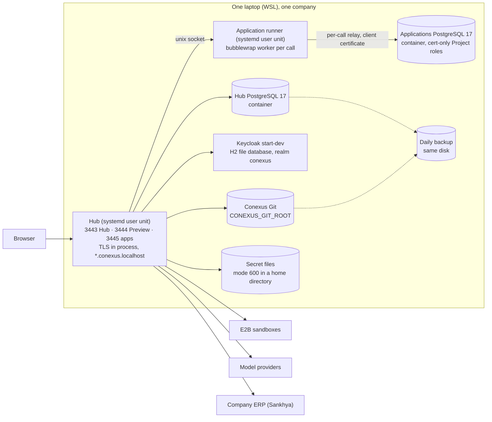
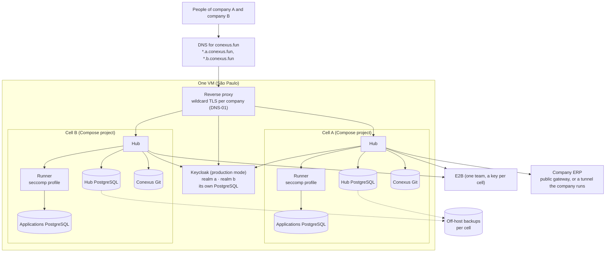

# Study: hosting and tenancy, putting Conexus online for several companies

**Date**: 2026-10-09
**Base**: `main` at `729bdc5`
**Earlier studies used**: [Mitra](../mitra/index.md). This study corrects it in four places, from the
code of the two Mitra SDKs (section 4): MySQL, the "Docker container per project", the
`*.build`/`*.prod.mitralab.io` hosts and the Railway WebSocket come from watching the live platform,
and none of them is in the SDK code. `X-TenantID` carries the **project** id, not a company id.
Cloudflare tunnels belong to a workspace. No company or organization concept exists in the SDKs.

Research, not execution authority. The decisions in section 9 belong to the operator, and an
accepted one goes to its owning guide, the [decision register](../../decisions/index.md) or the
[roadmap](../../roadmap.md).

## 1. Short answer

Today an installation of Conexus is a set of processes made by hand on one laptop, not a unit that
can be copied to a server:
- 4 host names are fixed to `conexus.localhost` in product code;
- every listener terminates its own TLS;
- 17 inputs are host-local files, sockets or binaries;
- Keycloak runs in development mode on its H2 file database;
- no container image exists.

The data model rightly knows no company: 0 tenant keys, by decision C-024.

The root cause is not the choice of a cloud or a database. The installation was never packaged,
because the roadmap put "server installation and operation" after Stage 2. The operator now wants
several small companies online, cheaply and safely.

The references split the same way:
- **Shared deployment:** Windmill Cloud, ToolJet Cloud, Budibase Cloud and Mitra run many companies
  in one deployment and separate them by a tenant column checked in application code.
- **Retreat at scale:** ToolJet gave up its per-workspace schema in its cloud, and Windmill refuses
  per-workspace databases in its cloud.
- **Self-hosting:** every reference that self-hosts ships one image with a mode switch.

Spikes on PostgreSQL 17.10 proved the following:
- **Neon:** the Hub's migrations, as written, cannot run under a Neon-like role that is not
  superuser.
- **Shared cluster:** two installations in one cluster silently share their roles, and with them
  access to each other's database.
- **Docker:** the runner's sandbox is refused by Docker's default seccomp profile.

The wave should make one installation a portable **cell**. A cell is one Compose project per
company: Hub, runner, two PostgreSQL containers and one Keycloak realm. The wave packs several
cells on one cheap VM behind one reverse proxy and keeps C-024. Neon waits for Q5.

## 2. Today (census)

Command: `bash docs/research/hosting/census.sh`

| Mechanism | Count | Where |
| --- | --- | --- |
| H1 host names fixed to `conexus.localhost` in product code | 4 | `apps/hub/src/hosting/module.ts:31`, `apps/hub/src/platform/config.ts:191`, `apps/hub/src/identity-access/oidc.ts:103`, `apps/hub/src/hub.ts:178` |
| H2 listeners that terminate TLS in the Hub process, all with the Preview certificate | 3 | `apps/hub/src/hub.ts:189`, `:199`, `:208` |
| H3 listeners bound to loopback | 3 | `apps/hub/src/hub.ts:224-226` |
| M1 host-local file, directory, socket or binary inputs | 17 | `CONEXUS_*_FILE`, `_DIR`, `_ROOT`, `_SOCKET`, `_BIN` names, census output |
| M2 session-level advisory locks: one live Hub per database | 2 | `apps/hub/src/platform/db.ts:359-360`, used at `apps/hub/src/platform/lifecycle.ts:60` |
| M3 periodic jobs inside the Hub process | 6 | `apps/hub/src/identity-access/expiry.ts:56`, `apps/hub/src/builder/module.ts:243-247` |
| D1 roles in the role register, all cluster-global | 7 | `contracts/technical/hub-database-roles.json` |
| D2 `CREATE ROLE` statements in Hub migrations | 23 | `apps/hub/migrations/0001_baseline.sql:11` and 22 more |
| D3 the Applications cluster admits Project roles only by client certificate | 1 rule | `scripts/confine-application-cluster.mjs:89` (`hostssl … cert map=`) |
| D4 superuser-only grants in Applications provisioning | 2 | `scripts/provision-application-database.mjs:87`, `:90` |
| D5 company or tenant key in the Hub schema | 0 | none |
| D6 `workspace_id` columns, the widest scope inside an installation | 11 | `apps/hub/migrations/0001_baseline.sql:2002` and 10 more |
| X1 the runner's sandbox needs unprivileged user namespaces | 1 sandbox | `apps/hub/src/app-runner/sandbox.ts:65`, probe at `:75` |
| K1 Keycloak in development mode on its H2 file database | 2 | `infra/keycloak/provision.sh:67`, `infra/keycloak/export-realm.sh:34` |
| K2 one realm, with its redirect address fixed to localhost | 2 | `infra/keycloak/realm-conexus.json:2`, `:24` |
| P1 container image or Compose file for the Hub | 0 | none |
| P2 systemd units shipped | 4 | `infra/pilot/units/`, `infra/backup/` |

### How it works now

**Overview.** The pilot runs on one WSL laptop ([pilot runbook](../../../infra/pilot/README.md)):
- **Hub and runner:** two systemd user units, each from a detached checkout of `main`, built by
  `scripts/build-hub-local.mjs` at start.
- **Listeners:** the Hub listens on `127.0.0.1` with three Fastify listeners, Hub 3443,
  Preview 3444 and applications 3445. Each terminates TLS with one certificate file.
- **Runner:** the application runner listens on an owner-only unix socket and starts one bubblewrap
  worker per call.
- **Other processes:** the Hub PostgreSQL, the Applications PostgreSQL and Keycloak run as Docker
  containers started by hand or by scripts. The telemetry backend has a development Compose file.
- **Backups:** a daily timer backs up to the same disk.

**Key concepts.**
- An **installation** serves one company (C-024): one Keycloak realm, one Hub database, one
  Applications database, one Conexus Git root, one sealing key.
- Inside it, a **Workspace** is the widest scope (D6), and Projects live in Workspaces.
- The Hub holds a session-level advisory lock, so a second Hub on the same database refuses to start
  (`HUB_ALREADY_RUNNING`).
- Periodic work runs in the Hub process. The database therefore never goes idle.

**Where things live.**
- Configuration is read in `apps/hub/src/platform/config.ts`. Listeners and TLS are in
  `apps/hub/src/hub.ts`, and host routing for Previews and apps is in `apps/hub/src/hosting/`.
- The Applications data plane is in `apps/hub/src/app-runner/data-plane.ts`, and its cluster setup
  is in `scripts/provision-application-database.mjs` and `scripts/confine-application-cluster.mjs`.
- The Keycloak scripts are in `infra/keycloak/`.

**Gotchas.**
- **Preview host and origin:** the Preview host must be `preview-<uuid>.conexus.localhost`
  (`hosting/module.ts:31-32`). The Hub origin must be `hub.conexus.localhost` whenever the Preview
  listener is on (`config.ts:191`). A Hub on a public name cannot serve Previews today.
- **Application domain:** this one is configurable (`CONEXUS_APPLICATION_DOMAIN`, `config.ts:199`),
  but it reuses the Preview certificate (`hub.ts:208`).
- **Hub roles are cluster-global,** created by name in migrations (D2). Spike S4 shows what that
  means for a second installation in the same cluster.
- **PostgreSQL 17 is required.** On 16.15 the migrations stop at `unrecognized configuration
  parameter "transaction_timeout"`. A managed provider must offer 17.

## 3. Why it is so

| Source | What it decided | What it was solving |
| --- | --- | --- |
| [C-024](../../decisions/index.md) | One installation serves one company; another company runs its own installation | "Avoids a tenancy model nobody needs yet." Hence D5 = 0 |
| [C-028](../../decisions/index.md) | A managed application platform, no backend per Project | No container or server per Project; one runner and one Applications cluster per installation |
| [C-037](../../decisions/index.md) | A handler can read other Projects' schema names in the shared Applications cluster | Accepted for the pilot. **Reopen when the cluster serves more than one installation** |
| [Database §1](../../reference/database.md#1-stores) | Project roles admitted only over TLS with the runner's client certificate | A role password can never be the secret a handler holds; the relay holds the certificate (D3) |
| [Database §3](../../reference/database.md#3-a-database-for-every-developer-and-every-test) | "Roles are cluster-global"; a test never changes a role on a cluster with a protected database | The same fact makes a cluster shared by installations unsafe (S4) |
| [Architecture §7](../../reference/architecture.md#7-deployment-view) | Two independent PostgreSQL clusters; the runner apart from the Hub | A full Applications cluster never stops the control plane |
| [Roadmap, technology baseline](../../roadmap.md#technology-baseline) | Cloud Run, Fly, Kubernetes and deployment per Project deferred | No real consumer yet |
| [Roadmap, after Stage 2](../../roadmap.md#after-stage-2-planned-order) | "Server installation and operation" is step 3 after Stage 2 | Capabilities proved on the pilot first |
| [Roadmap, before a production installation](../../roadmap.md#before-a-production-installation) | A dedicated OS user, secrets from the service manager, the key apart from the database, separate Applications storage, the runner on its own user | Named, not built. This study's wave is where most of them land |
| [Backup](../../reference/backup.md#what-this-does-not-prove) | Daily verified backup | "There is no off-machine copy" |
| [Delivery, Git](../../development/delivery.md#git-and-pull-requests) | "A capability **must** work on the WSL laptop pilot before any server installation" | Proof before exposure. A cell keeps this order: each capability is still proved on the laptop, and the cell only packages what passed |
| Q3 (#210) and S3 (#507) | Each application on its own host; one access rule for every route | The hosts were proved under `*.conexus.localhost` on the pilot, so the names stayed constants (H1) |

The repository is shallow in this session, so `git log -S` reaches back only to #507. The constant
`PREVIEW_DOMAIN` was already there at that point.

## 4. References

### Sources and versions

| Reference | Version or commit | What we read |
| --- | --- | --- |
| Windmill | `windmill-labs/windmill` at `ab8606f3` | `backend/` (api, auth, worker, queue, common), `backend/migrations`, `docker-compose.yml`, `backend/windmill-worker/nsjail/` |
| ToolJet | `ToolJet/tooljet` at `3094637b` | `server/src`, `server/migrations`, `docker/`, `deploy/`. The `server/ee` submodule is not public, so the enterprise workflow engine, sandbox and custom domains are not in the code read |
| Budibase | `Budibase/budibase` at `dfd89260` | `packages/backend-core`, `packages/server`, `hosting/`, `charts/budibase` |
| Retool | `tryretool/retool-helm` at `7b0ab79a` | `charts/retool/values.yaml`, `templates/`. No server source is public |
| Mitra | npm `mitra-sdk` 1.0.65, `mitra-interactions-sdk` 1.0.70 | `dist/index.js`, `dist/index.d.ts`, `README.md` of both |
| Neon, Replit, Lovable, Bolt, v0, Supabase for Platforms, Superblocks, Fivetran | Vendor documentation, October 2026 | **Not code.** Their claims below are marked not verified |

### The questions

1. **Tenancy unit.** What separates one customer company from another, and how is it resolved per
   request? Does PostgreSQL enforce it?
2. **Per-app data.** Where does the data an app creates live, how is it provisioned, and with which
   credentials?
3. **User code.** How does user code on the server run and stay isolated, and which host capability
   does that need?
4. **Packaging.** Which processes ship, is it one image with a mode, how do migrations run, and what
   resources are declared?
5. **Private networks.** How does the platform reach a customer's private systems?
6. **Background work.** Queue, schedules and workflows: what engine, and where does state live?
7. **Environments and publishing.** How do development and production split, and what URL shape
   does a published app get?
8. **Cloud and self-host.** How does one code base run as a shared cloud and as a self-hosted
   install?

### Windmill

1. **The workspace, in one shared database.**
   - Routes nest under `/w/{workspace_id}` (`backend/windmill-api/src/lib.rs:648`). Auth checks
     membership: `SELECT … FROM usr WHERE email = $1 AND workspace_id = $2`
     (`backend/windmill-api-auth/src/auth.rs:597-599`).
   - Row security keys on user, group and folder (`backend/migrations/20220123221903_first.up.sql:458`),
     never on workspace.
   - The admin role is `CREATE ROLE windmill_admin WITH BYPASSRLS` (`first.up.sql:547`).
   - So companies are separated by application filters only, e.g.
     `backend/windmill-api-scripts/src/scripts.rs:1353` `WHERE path = $1 AND workspace_id = $2`.
   - 109 of 174 tables carry `workspace_id` (static replay of 673 migrations).
2. **Results in the platform database; separate databases on request.**
   - Job results go to the platform database (`v2_job_completed.result`).
   - "Data tables" are separate databases created on Windmill's own cluster
     (`backend/windmill-common/src/lib.rs:1879` `CREATE DATABASE "{}"`) and reached as a dedicated
     role (`workspaces.rs:2035-2041`).
   - The cloud refuses them: `workspaces.rs:1633` `if *crate::worker::CLOUD_HOSTED {`.
3. **Isolation is off by default.**
   - nsjail is off by default (`backend/windmill-worker/src/worker.rs:370-373`,
     `DISABLE_NSJAIL … unwrap_or(true)`).
   - The `unshare` alternative uses `--user --map-root-user --pid --fork --mount-proc`
     (`worker.rs:395-396`).
   - The shipped worker is privileged: `docker-compose.yml:76-78` "Requires privileged mode for
     --mount-proc flag".
4. **One image, a mode, and a migration lock.**
   - One image, `MODE` = `Worker | Agent | Server | Standalone | Indexer | MCP`
     (`backend/windmill-common/src/utils.rs:687-693`).
   - The server migrates and workers wait (`backend/src/main.rs:1002-1006`), under
     `pg_try_advisory_lock` (`backend/windmill-api/src/db.rs:170`).
   - Compose services: db, server, 3 workers, a native worker, extra, caddy. Workers are capped at
     `memory: 2048M`.
5. **Agent workers.** They hold only `AGENT_TOKEN` and `BASE_INTERNAL_URL`
   (`backend/windmill-common/src/agent_workers.rs:25-28`), open the connection and poll
   `/api/agent_workers/pull_job` (`backend/windmill-worker/src/agent_workers.rs:36`). The server side
   is in the enterprise code.
6. **The queue is a PostgreSQL table.**
   - Dequeue: `… FOR UPDATE SKIP LOCKED LIMIT 1` (`backend/windmill-common/src/worker.rs:858-864`).
   - Schedules are rows that enqueue their next run with a future `scheduled_for`
     (`backend/windmill-queue/src/schedule.rs:650`).
   - Flow steps are child jobs, and flow state is JSONB
     (`backend/migrations/20250201124345_v2_job_status.up.sql:5`).
7. **Environments are forked workspaces.**
   - A fork has a `parent_workspace_id` (`backend/migrations/20250826120000_add_parent_to_workspace.up.sql:5`).
   - Scripts are immutable hashes.
   - Apps are served under `/apps/get/…` or a public secret path. Custom paths are an enterprise
     feature, and one instance-wide `PUBLIC_APP_DOMAIN` exists.
8. **One code base switched by an environment variable.**
   - `CLOUD_HOSTED` (`backend/windmill-common/src/worker.rs:528`), 68 call sites.
   - Free-tier caps: `MAX_FREE_EXECS: i32 = 1000`, `MAX_FREE_CONCURRENT_RUNS: i32 = 30`
     (`backend/windmill-queue/src/jobs.rs:164-166`).

### ToolJet

1. **An `organizations` row per workspace.**
   - Workspaces are rows of `organizations` (`server/src/entities/organization.entity.ts:27`).
   - The request names one in the `tj-workspace-id` header, and the JWT is checked against it
     (`server/src/modules/session/jwt/jwt.strategy.ts:88-91`, `:124`).
   - Separation is by repository filters only (`server/src/modules/apps/repository.ts:236`). No
     `CREATE POLICY` exists in the code.
2. **A separate database for app data.**
   - It is held apart from the platform's (`ormconfig.ts:42` `PG_DB`, `:73-77` `TOOLJET_DB`; they
     must differ, `scripts/create-database.ts:86-87`).
   - Self-hosted: a schema and a role per workspace (`tooljet_db.helper.ts:104`
     `CREATE ROLE "${dbUser}" WITH LOGIN NOCREATEDB PASSWORD …`, `:120-122`). The role password is
     encrypted in the platform database (`:183-187`).
   - Reads go through PostgREST with a one-minute JWT for the workspace role
     (`postgrest-proxy.service.ts:216-221`).
   - **The cloud drops the per-workspace schema**, and every workspace shares `public` with one
     login (`tooljet_db.helper.ts:80-81`). The reason, from `:77-79`: PostgREST "doesn't handle
     loading large amount of schemas".
3. **User code.**
   - App JavaScript and Python run in the browser (`queryPanelSlice.js:689-692`, Pyodide).
   - Server workflows use isolated-vm, and Python runs under nsjail, which "Requires CAP_SYS_ADMIN"
     (`docker/nsjail/python-execution.cfg:13`). The nsjail binary is setuid
     (`ee-production.Dockerfile:208`).
   - The opt-out is named for hosts without that capability: `.env.example:64-67`
     `TOOLJET_WORKFLOW_SANDBOX_BYPASS`, "e.g., AWS Fargate, Render".
4. **One image per edition.**
   - The image runs `npm run start:prod` and becomes a worker when `WORKER=true`
     (`server/package.json:59`).
   - Migrations run in the entrypoint, serialized by `LOCK TABLE migrations`
     (`run-all-migrations.ts:41-43`).
   - Kubernetes requests are `1000Mi` memory and 1 CPU (`deploy/kubernetes/deployment.yaml:27-33`).
5. **SSH tunnels per data source** (`plugins/packages/postgresql/lib/index.ts:839-840`). No agent and
   no allowlist exist.
6. **BullMQ on Redis** (`server/src/modules/app/loader.ts:58-60`). Workflow state is in PostgreSQL
   entities.
7. **Release and URL.**
   - Release requires a version promoted to production (`apps/service.ts:1101`). Credentials are per
     environment.
   - Apps are served at `/applications/:slug`. One custom domain per workspace is provisioned
     through Cloudflare custom hostnames (`custom-domains/scheduler.ts:67`).
8. **`TOOLJET_EDITION` = `ce | ee | cloud`** (`helpers/utils.helper.ts:656-661`). The cloud counts
   licences per workspace (`licensing/services/count.service.ts:89`).

### Budibase

1. **A tenant id prefixed on database names.**
   - The tenant is a prefix: `${tenantId}_global-db` (`packages/backend-core/src/context/mainContext.ts:54-58`).
   - It is on only with `MULTI_TENANCY` (`:66-67`); otherwise every request runs as `default`.
   - The tenant is resolved from the user, a header, the query, the subdomain or the path
     (`tenancy/tenancy.ts:70-120`).
2. **One CouchDB database per app,** with separate development and production databases
   (`packages/types/src/documents/document.ts:11-13`, `app` and `app_dev`). Internal tables are
   queried through an SQLite sidecar (`hosting/couchdb/runner.sh:173`).
3. **User JavaScript runs in a V8 isolate** inside the app process
   (`packages/server/src/jsRunner/vm/isolated-vm.ts:41-42`), with a 64 MB default. No host
   capability is needed. Self-hosted installs add a raw bash automation step
   (`automations/actions.ts:127-129`).
4. **Packaging.**
   - Compose has app, worker, MinIO, proxy, CouchDB and Redis.
   - The single image runs everything under pm2.
   - `APP_FEATURES` = `api | automations` splits workers in the Helm chart.
   - Migrations run as app middleware (`api/index.ts:86`).
5. **No tunnel.** Self-hosted installs replace the default SSRF blacklist with `BLACKLIST_IPS`
   (`blacklist/blacklist.ts:28-29`).
6. **Bull on Redis.** Schedules are repeat jobs (`server/src/automations/utils.ts:321`) and are
   rehydrated at boot "due to reddis being ephemeral" (`automations/index.ts:22-24`).
7. **Publishing replicates the development database into production**
   (`server/src/api/controllers/deploy/index.ts:470-474`) and takes a backup on each publish
   (`:465-466`). Apps are served at `/app/<url>`. The subdomain selects the tenant in the cloud.
8. **Same code both ways.** `SELF_HOSTED` and `MULTI_TENANCY` switch it. The chart says multi-tenancy
   "doesn't work out of the box for self-hosted users, only meant for Budicloud"
   (`charts/budibase/values.yaml:99-100`).

### Retool (Helm chart only)

1. **The whole install is the unit:** one database, `hammerhead_production` (`values.yaml:252`). No
   tenant settings exist in the chart.
2. **Platform PostgreSQL only.** The chart configures it at `values.yaml:37-50`, with
   `ENCRYPTION_KEY` and `JWT_SECRET` from secrets. No Retool Database keys are in the chart.
3. **The `code-executor` runs nsjail and is privileged by default**
   (`templates/deployment_code_executor.yaml:154`, `privileged: true`).
   - Opt-in `codeExecutor.useSeccompProfile` (`values.yaml:925`, which needs Kubernetes 1.33 or
     later, `:922`) drops ALL capabilities and adds back `NET_ADMIN, NET_RAW, SETUID, SETGID`. It
     also sets `procMount: Unmasked`, a localhost seccomp profile and `hostUsers: false`
     (`deployment_code_executor.yaml:134-144`, `:59`).
   - An init container writes the profile to the node (`:82-84`).
4. **One image, `tryretool/backend`, with a `SERVICE_TYPE`.**
   - Values include `MAIN_BACKEND`, `JOBS_RUNNER`, `WORKFLOW_BACKEND` and `WORKFLOW_TEMPORAL_WORKER`
     (`deployment_backend.yaml:83`, `deployment_jobs.yaml:75-76`).
   - The jobs runner is a singleton (`deployment_jobs.yaml:19`). Only the backend migrates; the other
     roles set `DISABLE_DATABASE_MIGRATIONS`.
   - Backend requests: 2 CPU and 4 GiB (`values.yaml:366-376`).
5. **SSH tunnels run as a connector role,** `DB_SSH_CONNECTOR` (`deployment_backend.yaml:96`).
   `networkPolicy.blockCloudMetadataEgress` exists (`values.yaml:308`).
6. **Workflows run on Temporal,** external or bundled (`values.yaml:1683`, `:1702`). Temporal keeps
   its own databases.
7. **Not in the chart.** Only `BASE_DOMAIN` and the ingress hosts are there.
8. **The chart is self-hosted only.**

### Mitra (SDK code)

1. **Workspace and project.**
   - Projects are listed per workspace (`mitra-sdk/dist/index.js:286`).
   - The runtime sends `X-TenantID` set to the **project** id
     (`mitra-interactions-sdk/dist/index.js:656`; `index.d.ts:197` "ID do projeto (tenant)"), only on
     the `/interactions/records/*` calls (`index.js:653-680`).
   - No company or organization concept exists.
2. **One database per project.**
   - "null = banco do tenant" (`mitra-sdk/dist/index.d.ts:473`); "Omitido = banco do projeto"
     (`:813`).
   - `runDdl`, `runDml` and `runQuery` post SQL with a `projectId` (`mitra-sdk/dist/index.js:330-345`).
   - MySQL and the container per project are **not in the code**.
3. **Server functions, run on the platform.**
   - Types are `JAVASCRIPT`, `SQL` and `INTEGRATION` (`mitra-sdk/dist/index.d.ts:471`).
   - They run synchronously within 60 s (`mitra-interactions-sdk/dist/index.d.ts:1301`), or
     asynchronously with an execution id.
   - Public, unauthenticated functions exist at `/public/serverFunction/{projectId}/{id}/execute`
     (`index.js:762`).
   - "token assinado que SÓ o sandbox da execução recebe" (`index.d.ts:1451`).
4. **Deploy and build.**
   - The project is uploaded as a tar.gz (`mitra-sdk/dist/index.js:1195-1201`) and built on the
     platform: `NONE/BUILDING/DEPLOYED/FAILED` (`index.d.ts:1265-1267`).
   - The deploy URL is opaque (`deployUrl?: string`).
5. **Cloudflare tunnels per workspace.**
   - `/agentAiShortcut/cloudflare` manages them (`mitra-sdk/dist/index.js:634-685`).
   - A route holds `subdomain, hostname, internalDbUrl, internalDbPort, dnsRecordId`
     (`index.d.ts:684-690`).
6. **Spring cron schedules** on server functions (`mitra-sdk/dist/index.d.ts:475`), plus
   asynchronous executions and data loaders.
7. **Environments: fields only.** `environment` and `devProdModel` exist
   (`mitra-sdk/dist/index.d.ts:48-49`). Promote and PROD are mentioned in the README only.
8. **Hosts and credentials.**
   - Two front ends map to two API hosts on non-standard ports (`mitra-interactions-sdk/dist/index.js:286-289`).
   - The WebSocket token rides in the query string (`index.js:1611`).
   - The SDK names no cloud provider.

### Comparison

| Question | Windmill | ToolJet | Budibase | Retool (chart) | Mitra | Conexus today |
| --- | --- | --- | --- | --- | --- | --- |
| 1 Company boundary | `workspace_id` filter; RLS not by tenant | `organization_id` filter; no RLS | tenant prefix on DB names | the install | workspace; tenant = project | **the installation** (C-024); RLS per caller inside |
| 2 App data | platform DB; optional DB per workspace (not in cloud) | separate DB; schema+role per workspace (not in cloud) | CouchDB DB per app, dev and prod | separate Postgres | DB per project | separate cluster; schema + 2 roles per Project, cert only |
| 3 User code isolation | nsjail or unshare, **off by default; privileged** | nsjail, CAP_SYS_ADMIN, bypass flag | V8 isolate in process | nsjail, **privileged by default**, seccomp opt-in | platform-side sandbox (not visible) | bubblewrap per call, **always on**, refuses to start without user namespaces |
| 4 Packaging | one image, `MODE`; server migrates under lock | one image, `WORKER`; entrypoint migrates under lock | single image or compose; `APP_FEATURES` | one image, `SERVICE_TYPE`; backend migrates | SaaS only | **no image**; systemd units; migration script by hand |
| 5 Private systems | agent workers poll over HTTP (enterprise) | SSH tunnel per source | direct | SSH connector role | Cloudflare tunnel per workspace | Hub executor to a public gateway (Sankhya) |
| 6 Background work | Postgres queue, `SKIP LOCKED` | BullMQ/Redis | Bull/Redis | Temporal | cron on functions | `platform/jobs.ts` timers in the Hub |
| 7 Environments | forked workspaces | promoted versions | dev DB replicated to prod | not in chart | forked project | Preview only; Publish is Q5 |
| 8 Cloud vs self-host | `CLOUD_HOSTED` | `TOOLJET_EDITION` | `MULTI_TENANCY`, `SELF_HOSTED` | self-host only | cloud only | one installation per company |

**Where all agree:**
- One artifact runs every way: one image with a mode, the same code with a flag.
- Exactly one process runs migrations, under a database lock.
- Background work rests on a store the platform already has.

**Where they differ, and why:**
- **The company boundary.** The shared clouds (Windmill, ToolJet, Budibase, Mitra) put every
  company in one database behind a tenant id checked by application code. The cost is that a missed
  filter leaks across companies.
  - At scale they walk back per-tenant database objects: ToolJet's cloud shares `public`, and
    Windmill's cloud refuses data tables.
  - Retool keeps the install as the unit and sells a dedicated install to the customers who need
    isolation.
- **The code sandbox.** Windmill and Retool trade isolation for operability and ship it privileged
  or off by default. Conexus already holds the stricter line: always on, rootless, no network.

### What we copy and what we adapt

| Mechanism | Copy from | Kept as is | Adapted, and why |
| --- | --- | --- | --- |
| One image, a mode variable, one process migrates under a lock | Windmill `utils.rs:687-693`, `main.rs:1002-1006`; Retool `deployment_jobs.yaml:19` | the mode switch; migrations only from the migrate mode | Conexus already has `run-hub-migrations.mjs` with its own advisory lock; it becomes the image's `migrate` mode, run once per deploy, never by the Hub |
| Hardened sandbox in a container: drop all capabilities, a seccomp profile, unmasked proc | Retool `deployment_code_executor.yaml:134-144` | no `privileged`, no `CAP_SYS_ADMIN` | Docker, not Kubernetes: `security_opt` with a profile that allows user namespaces, plus `systempaths=unconfined` (proved in S5) |
| Separate app-data database with a role per tenant unit | ToolJet `tooljet_db.helper.ts:104-122` | the separate cluster (Conexus has it) | Conexus keeps its stricter certificate login; no PostgREST |
| Dedicated install as the isolation product | Retool (chart is install-scoped) | the install is the company boundary | Many small installs packed on one host (a cell per company), not one big install per customer |
| Outbound tunnel from the customer's network | Mitra `mitra-sdk/dist/index.d.ts:684-706`; Windmill agent workers | the customer runs `cloudflared`; no inbound port | Only when a company's ERP is not reachable from the internet; the Hub executor stays the one path (C-030) |
| Postgres queue with `SKIP LOCKED` for future workflows and automations | Windmill `worker.rs:858-864` | | Not now. It enters with the first real consumer (roadmap: jobs and automations after Stage 2) |

Not copied:
- a tenant column and application filters (C-024 stands);
- running user code privileged or with isolation off;
- Redis or Temporal as a second store;
- a token in a query string (Mitra).

## 5. The premise

- **The question as it arrived**: where to host Conexus online, using provider credits, and whether
  Neon's serverless PostgreSQL (scale to zero, branching) would be a better database architecture
  than the one shaped by the laptop.
- **Why, until the root cause**:
  1. Why can't Conexus go online today?
     - Hosts are fixed to `conexus.localhost` (H1).
     - TLS is terminated in process with one certificate (H2).
     - Secrets are files in a home directory (M1).
     - Keycloak runs in development mode on H2 (K1).
     - There is no image (P1).
  2. Why? The installation was never packaged. The pilot proved capabilities on one machine, and the
     roadmap put server installation after Stage 2.
  3. Why does it matter now? The operator wants several companies (friends and family) to try
     Conexus. That means several installations. C-024 already expects them, but nothing makes them
     repeatable.
  4. Is the database the constraint? No.
     - The Hub database is never idle (M2, M3), so scale to zero saves nothing there.
     - Neon cannot run the Hub's migrations as written (S2, S3).
     - The Applications database could gain from Neon (idle apps, branches for Preview), but its
       certificate rule (D3) and its superuser-only grants (D4) block it.
- **Root cause**: Conexus has no deployable unit. An installation is hand-made host processes with
  fixed addresses, not a portable artifact.
- **The premise held / fell**: it partly fell. The provider and the credits matter for cost, not for
  feasibility, and Neon is the wrong first move. The real question is: **what is the smallest safe,
  portable installation, and how many fit on one cheap host?**

## 6. Proved and not proved

Spikes rerun with `bash docs/research/hosting/spike.sh` (Docker, `npm ci`), on PostgreSQL 17.10, the
image CI pins.

| Claim | How it was tested | Result |
| --- | --- | --- |
| The Hub migrations need PostgreSQL 17 | Ran them on 16.15 | Refused: `unrecognized configuration parameter "transaction_timeout"` |
| S1. The Hub migrations pass for a superuser | 70 migrations on a fresh cluster | `PASS` |
| S2. They fail for a Neon-like role, `LOGIN CREATEDB CREATEROLE BYPASSRLS`, a member of `neon_superuser`, PostgreSQL's default `createrole_self_grant` | Same | Refused: `must be able to SET ROLE "builder_owner"` (42501) |
| S3. They fail with `createrole_self_grant = 'set, inherit'` too | Same, then file by file | 62 files pass. `0063_workspace_admission.sql` fails with `permission denied for schema iam` at `ALTER FUNCTION … OWNER TO iam_rls`: a non-superuser may give an object only to a role with `CREATE` on its schema |
| S3b. A non-superuser creator becomes a member of every role it creates, which `assertRoleInvariants` refuses (`scripts/hub-catalog.mjs:107-115`) | Counted `pg_auth_members` after 62 files | 38 rows: the creator holds an ADMIN row and a SET+INHERIT row in each of 19 Hub and owner roles. The refusal itself is read from the code, not run |
| S4. Two installations in one cluster share their roles | Two databases, migrations for each | Both `PASS`, silently, and `hub_runtime` may connect to both databases with one password. **One PostgreSQL cluster per installation** |
| S5. The runner's sandbox runs under Docker only with an adjusted profile | `unshare -U -r -n -p -f --mount-proc` as uid 999 | Docker defaults: refused. `seccomp=unconfined`: refused (the `/proc` mount). Plus `systempaths=unconfined`: allowed. `--cap-add SYS_ADMIN` also allows user namespaces but is broader |
| S6. Memory of one installation at rest | The `verify` launcher: Hub, Hub PostgreSQL, Keycloak; Node 22 (the pin is 24) | Hub 251–286 MB RSS (heap capped at 512 MB as on the pilot, `infra/pilot/hub.sh:19`); Hub PostgreSQL 52 MiB; Keycloak `start-dev` 529 MiB of a 640 MiB cap |

**Not verified:**
- **Neon's own settings:** `createrole_self_grant` and the attributes Neon gives its roles. S2 and S3
  bracket both likely settings, and both fail.
- **Other measurements and hosts:**
  - the memory of the runner, the Applications cluster and a Builder turn;
  - Keycloak in production mode on PostgreSQL;
  - Cloud Run gen2 and Fly Machines with user namespaces;
  - Ubuntu 24.04's AppArmor restriction on unprivileged user namespaces (no AppArmor here).
- **Pricing and availability:** every price in section 10, Oracle A1 capacity in São Paulo, and
  E2B's Hobby session limit against the Builder's sandbox lifetime.
- **Mitra:** its cloud provider and region.
- **Third-party reports from vendor documentation:** Replit's Neon production databases, Retool's
  300k Neon databases, Lovable Cloud's hidden Supabase.

## 7. Findings against the guides

| Finding | Guide section | `file:line` |
| --- | --- | --- |
| Host names are constants, so an installation cannot be addressed anywhere but the laptop | [Architecture §7](../../reference/architecture.md#7-deployment-view) (one host each per channel); the roadmap's "configuration as one schema" | `apps/hub/src/hosting/module.ts:31`, `apps/hub/src/platform/config.ts:191`, `apps/hub/src/identity-access/oidc.ts:103`, `apps/hub/src/hub.ts:178` |
| Keycloak runs `start-dev` on an H2 file, and the realm export reads that file | [Security](../../reference/security-and-authority.md); [backup](../../reference/backup.md#back-up) | `infra/keycloak/provision.sh:67`, `infra/keycloak/export-realm.sh:34` |
| A shared cluster would hand one installation's roles to another | [Database §3](../../reference/database.md#3-a-database-for-every-developer-and-every-test) ("Roles are cluster-global"); C-024 | spike S4; `apps/hub/migrations/0062_runtime_data_boundary.sql:4` |
| A shared Applications cluster across companies reopens C-037 | [Decision register](../../decisions/index.md) C-037 trigger | `apps/hub/src/app-runner/data-plane.ts:32-41` |
| No off-machine backup | [Backup, what this does not prove](../../reference/backup.md#what-this-does-not-prove) | `infra/backup/` |
| No rate limit, no brute-force protection, no key rotation | [Architecture §11](../../reference/architecture.md#11-risks-and-technical-debt) | listed there |
| Secrets in files in a home directory; the runner and Hub on one OS user | [Roadmap, before a production installation](../../roadmap.md#before-a-production-installation) | `infra/pilot/README.md` |

## 8. What the wave wants

- **Wants**: an installation as a portable cell, and a host that runs several cells safely.
  1. **Addresses from configuration.**
     - The Hub origin, the Preview domain and the application domain come from configuration.
     - The Keycloak issuer and its redirect URI do too; no `conexus.localhost` remains in product
       code.
     - Certificates per listener come from configuration, or TLS ends at the reverse proxy
       (decision 6).
  2. **One image** with a mode: `hub`, `runner` or `migrate`. The runner gets a seccomp profile that
     allows user namespaces and nothing privileged.
  3. **One Compose project per cell**: Hub, runner, Hub PostgreSQL, Applications PostgreSQL, with
     secrets mounted as files. This keeps the `*_FILE` convention and covers the "dedicated user"
     and "secrets from the service manager" items.
  4. **Keycloak in production mode** on PostgreSQL, one realm per company, the realm templated from
     `realm-conexus.json`.
  5. **One host layer.**
     - A reverse proxy with wildcard certificates per company (DNS-01).
     - DNS on the operator's domain.
     - Off-machine backups for each cell.
  6. **A runbook:** create a cell, update every cell to one SHA, back up and restore a cell, move a
     cell to another host.
- **Stays out**:
  - a shared multi-tenant Hub (C-024 stands);
  - Neon or any managed PostgreSQL;
  - Kubernetes;
  - deployment per Project;
  - autoscaling, billing and self-signup;
  - the ERP tunnel, unless a pilot company's ERP is not reachable from the internet;
  - Q5 Publish itself.
- **Done when**:
  - `bash docs/research/hosting/census.sh` prints H1 = 0, K1 = 0 and P1 ≥ 1.
  - Two cells run on one host with different domains. A person signed in to one gets nothing from
    the other: separate clusters, realms, keys and Git roots, proved by a test that tries.
  - The runner refuses a generated handler's network connection inside the container, as on the
    pilot, with no `privileged` and no `CAP_SYS_ADMIN` in the Compose file.
  - A cell's verified backup lands off the host, restores into a fresh cell, and the restored cell
    signs in.
  - One deploy command moves every cell to one SHA, and migrations run once per cell under the lock.
- **Lane**: `lane:qualification` (a security boundary: the sandbox in a container, public
  exposure, and secrets custody).

## 9. Decisions for the operator

1. **Tenancy: how do several companies share Conexus?**
   - Options:
     - A: a cell per company on shared hosts (keep C-024).
     - B: one shared multi-tenant Hub (reopen C-024; a company key on every table, row policy and
       route).
     - C: a cell per company, with heavy services shared behind them (A now, C later).
   - Recommendation: **A now, growing into C.**
   - Reference: every shared cloud read here relies on application filters, and Windmill keeps row
     security off the tenant. Conexus's first quality goal is isolation
     ([architecture §1.2](../../reference/architecture.md#12-quality-goals)), and S1 to S4 show the
     installation boundary is real today.
   - B is a rewrite of what S1 just finished.
   - **Answer**: pending.
2. **Keycloak: one server per cell, or one shared server with a realm per company?**
   - Recommendation: **one shared server, one realm per company.**
   - It saves about 0.5 GB per company (S6). C-024 forbids sharing a realm, not a server.
   - Costs: one Keycloak outage reaches every company, and upgrades go together.
   - **Answer**: pending.
3. **Where the first host lives.**
   - Options:
     - A: a Google Cloud VM in `southamerica-east1`, paid by the Google for Startups Start credits.
     - B: Oracle Always Free A1 (ARM, 4 OCPU and 24 GB), converted to pay-as-you-go so it is not
       reclaimed.
     - C: a server at home.
   - Recommendation: **A for the companies, B as staging and a restore target, not C.**
   - Why not C: a home connection is often behind CGNAT, has a residential address, no redundant
     power and no service level. It also puts company data under LGPD in a house.
   - **Answer**: pending.
4. **The runner: in a container with a custom seccomp profile, or on the host under systemd?**
   - Recommendation: **a container with a profile**, as Retool's hardened mode does, never
     privileged.
   - **Answer**: pending.
5. **Applications data: self-managed per cell now, or Neon per Project?**
   - Recommendation: **self-managed now; study Neon at Q5**, where its branches could give a Preview
     a copy of the published data.
   - The study would reopen [database §1](../../reference/database.md#1-stores) (certificate-only
     login) and the superuser-only grants (D4).
   - **Answer**: pending.
6. **Address shape and TLS.**
   - Options:
     - A: `<company>.conexus.fun` for the Hub, `<app>.<company>.conexus.fun` for apps and
       `preview-<id>.<company>.conexus.fun` for Previews, with a wildcard certificate per company
       from Let's Encrypt by DNS-01 at the proxy.
     - B: one level under `conexus.fun` (`<app>--<company>.conexus.fun`) to stay inside one wildcard.
   - Recommendation: **A.**
   - The company boundary shows in the name, and cookies and CSP scope by host.
   - Cloudflare's free proxy covers only one level of wildcard. With A, Cloudflare serves DNS only,
     or Advanced Certificate Manager is bought.
   - **Answer**: pending.
7. **When.**
   - Recommendation: **a small wave after S1 closes and before Q5.**
   - Q5 asks for "a stable URL", which needs real addresses (wants 1 and 5). The pilot companies
     need the cells before they can try anything.
   - **Answer**: pending.

## 10. Draft for the spec

### Target shape

### Where each thing lives

| Thing | Where |
| --- | --- |
| Address configuration (Hub origin, Preview domain, application domain, issuer) | `apps/hub/src/platform/config.ts`, replacing the H1 constants |
| Image and modes | a new `infra/image/` (Dockerfile; `hub`, `runner`, `migrate`) |
| One cell | a new `infra/cell/` (Compose file, seccomp profile, environment template with no values) |
| Host layer | a new `infra/host/` (proxy configuration, Keycloak production Compose, backup shipping) |
| Realm per company | `infra/keycloak/realm-conexus.json` becomes a template; the issuer and redirect come from the cell |
| Runbook | `infra/cell/README.md`, linked from `docs/index.md` |

**Cut list:**
- the four `conexus.localhost` constants;
- `start-dev` and the H2 export path for an installation (the laptop may keep a development mode);
- "same disk" as the only backup copy.

**Does not enter:**
- a tenant column;
- Neon;
- Kubernetes;
- Redis or Temporal;
- billing;
- any company value, address or secret in the repository (the repository is public,
  [security §7](../../reference/security-and-authority.md#7-data-protection-and-egress)).

### Cost model (not verified; prices from third-party listings, October 2026)

| Item | Figure | Source |
| --- | --- | --- |
| One cell at rest | about 0.4–0.7 GB (Hub 0.25–0.3 GB, two PostgreSQL about 0.1 GB, runner not measured), up to about 1.2 GB with a Builder turn under the 512 MB heap cap | S6 |
| Shared Keycloak | about 0.6–1 GB for every realm | S6 |
| `e2-standard-4` (4 vCPU, 16 GB), São Paulo | about US$155 per month on demand; about US$98 with a one-year commitment | [Holori calculator](https://calculator.holori.com/gcp/vm/e2-standard-4/southamerica-east1) |
| Cells per 16 GB host | about 8–12, keeping 2 GB for the system and 1 GB for Keycloak and the proxy | arithmetic from the two rows above |
| Host cost per company | about US$13–19 on demand, about US$8–12 committed, at 8–12 companies | arithmetic |
| Google for Startups Start credits | US$2,000 for 12 months, for a founder with no institutional funding | [Google Cloud](https://cloud.google.com/startup/benefits) |
| Oracle Always Free A1 | 4 OCPU and 24 GB ARM at no charge; idle instances may be reclaimed unless the tenancy is pay-as-you-go | [Oracle](https://docs.oracle.com/en-us/iaas/Content/FreeTier/resourceref.htm) |
| E2B | Hobby: US$0 plus usage, US$100 one-time credit, sessions up to 1 hour, 20 concurrent. Pro: US$150 per month. About US$0.05 per vCPU-hour and US$0.016 per GiB-hour | [E2B pricing](https://www.e2b.dev/pricing) |
| Model calls | carried by each person's or company's own model account (C-032, spec 0017), not by the platform | the decisions register |

The variable cost that grows with Builder use is E2B, not the host. A 2 vCPU sandbox with 2 GiB costs
about US$0.13 per running hour, and paused sandboxes are not billed.

One point is unverified: an aggregator lists Mitra from about R$150 per month, but the listing may
not refer to the same product.

### The road for agents, workflows and automations

The cell keeps them inside the company's installation, on the stores it already has.
- Mastra workflows and memory live in the Hub PostgreSQL (`factory` schema).
- When the first consumer of jobs and automations arrives (roadmap, after Stage 2), Windmill's
  pattern fits a cell: a PostgreSQL queue with `SKIP LOCKED` and workers as an image mode.
- No second store is needed until a measured limit says so.
- A busy company's cell moves to its own VM with the same Compose project. That is the cell's growth
  path, and it needs no code change.
