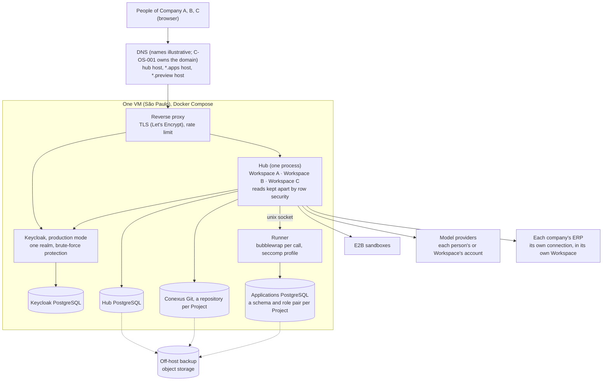

# Study part: stress test of the tenancy decision

**Date**: 2026-10-09
**Base**: `main` at `729bdc5`, branch `docs/hosting-study`
**Part of**: [the hosting study](study.md), decision 1. This part replaces that decision's
recommendation.

## 1. The question

The operator asked:
- Is multi-tenant the cheapest way to put several small companies on Conexus for validation?
- What is the minimal architecture a solo founder can run without a DevOps engineer?

How a company gets onto Conexus (created by the operator, invited, or signing up) was offered as an
intuition, not a requirement, so it is a decision here too.

## 2. The premise

- **As it arrived**: multi-tenant means a new tenancy model built into Conexus, and it is probably
  the cheapest.
- **Why**:
  1. Why would multi-tenant be cheaper? One Hub, one database and one Keycloak serve every company,
     so the marginal cost of a company is near zero (section 5).
  2. Why does that look like a large change? C-024 says one installation per company, so "company"
     appears nowhere in the code (study census D5 = 0).
  3. Is there already a unit that behaves like a company? **Yes, the Workspace.**
     - 17 of the 27 Hub tables are scoped by Workspace or Project (census below).
     - PostgreSQL row security, not only TypeScript, keeps one Workspace's reads out of another's
       on `main` (S7). Spec 0018 removes it; see section 11.
  4. What crosses Workspaces today? A short list: shared model accounts (S8), the model default, the
     operations only the installation administrator may perform, one sealing key, one Applications
     cluster, one Hub process, one Keycloak realm (section 3).
- **Root cause of the confusion**: the code already has a tenant boundary, the Workspace. The
  decision register names the company boundary as the installation (C-024), so the existing boundary
  was not seen as a tenant boundary.
- **The premise held / fell**:
  - It held on cost: shared is cheapest, in money and in operations.
  - It fell on size: no new tenancy model is needed. The cheapest multi-tenant Conexus is **one
    shared installation where each company is a Workspace**, plus the fixes in section 6.

## 3. Today (census)

Command: `bash docs/research/hosting/census.sh` (T1 to T3) and `bash docs/research/hosting/spike.sh`
(S7, S8). The table scopes come from `information_schema` on a migrated database: the column a table
carries decides its scope.

| Scope | Tables | Count |
| --- | --- | --- |
| Workspace | `connector.connection`, `connector.project_binding`, `iam.workspace_invitation`, `iam.workspace_membership`, `project.project`, `project.project_deletion`, `workspace.workspace` | 7 |
| Project (inside one Workspace) | `builder.builder_run`, `builder.conversation_session`, `builder.project_repository`, `builder.project_working_state`, `iam.application`, `iam.application_grant`, `iam.application_invitation`, `iam.handoff`, `iam.host_session`, `reg.artifact_revision` | 10 |
| Person (account) | `iam.account`, `iam.installation_administrator`, `model.model_account`, `platform.operation_receipt` | 4 |
| No scope column | `builder.builder_run_model_account`, `iam.oidc_transaction`, `iam.schema_migration`, `model.installation_default`, `model.model_account_sharing_history`, `reg.application_thumbnail` | 6 |

What crosses Workspaces, with where it is:

| # | Crossing | Where | What it would mean with one company per Workspace |
| --- | --- | --- | --- |
| C1 | A model account shared with `everyone` is readable by every account | policy `model.model_account reader … OR sharing = 'everyone'`; `apps/hub/src/builder/model-account/accounts.ts:79`, `:99` | Company B's shared model key is used for Company A's runs (S8). **A leak** |
| C2 | One model default for the installation | `apps/hub/migrations/0033_model_account.sql:47` | Every company gets the operator's default. Fine if the operator provides the model; otherwise a per-Workspace default |
| C3 | Only the installation administrator creates, checks and disables connections, and deletes Projects | `apps/hub/src/connectors/store.ts:92`, `:110`, `:119`; `apps/hub/src/project/deletion.ts:48` | The operator must type each company's ERP credential. A company cannot connect its own systems |
| C4 | The installation administrator reads every connection's metadata | policy `connector.connection reader_admin` | The operator sees every company's connection names (never the sealed credential) |
| C5 | One sealing key | `CONEXUS_FACTORY_SECRET_KEY_FILE` (study census M1) | One key protects every company's credentials |
| C6 | One Applications cluster; handlers can read other Projects' schema names | C-037; `apps/hub/src/app-runner/data-plane.ts:32-41` | Table and column names of one company's apps are visible to another company's handlers. C-037's reopen trigger fires |
| C7 | Writes run as `hub_command`, whose policies pass every row | policies `… command … :: true` on every table | Write isolation rests on the admission proof in TypeScript (S3, spec 0014), not on PostgreSQL |
| C8 | One Hub process per database (instance lock) | `apps/hub/src/platform/lifecycle.ts:60` | Every company shares one Node process: a crash or a memory spike reaches all of them |
| C9 | One Keycloak realm | `infra/keycloak/realm-conexus.json:2` | One sign-in page and one people directory for everyone. Keycloak grants nothing (C-015) |
| C10 | Backup and restore are whole-installation | [backup](../../reference/backup.md) | One company cannot be restored alone, nor exported to its own installation |

## 4. Proved and not proved

| Claim | How it was tested | Result |
| --- | --- | --- |
| S7. PostgreSQL keeps one Workspace's reads out of another's | Two accounts, two Workspaces, one owner each; read as `hub_reader` with `conexus.account_id` set to A | A sees Workspaces: `Company A` only. Memberships of B: 0. Accounts: `Person A` only |
| S7b. With no acting account nothing is read | The same, with no `conexus.account_id` | 0 Workspaces |
| S8. A model account shared with everyone crosses Workspaces | B owns a model account with `sharing = 'everyone'`; read as A | A sees 1 |

**Not verified:**
- write isolation across Workspaces (C7). It rests on the admission rule of spec 0014, which is
  tested in its own suites, not here;
- the Hub's memory and latency with several companies running the Builder at once (C8);
- whether the Conexus Git root and Mastra's `factory` schema can be exported per Workspace (C10).

## 5. The options

- **O1, shared installation, a company is a Workspace.** One installation. The operator creates a
  Workspace per company and fixes C1 to C3. The other crossings are accepted for validation with
  named limits.
- **O2, shared installation with a new Company level above Workspaces.** C-024 reopens. The work:
  - a company key on the Workspace;
  - a company administrator role;
  - row policies and admission rules across the 27 tables;
  - a sealing key per company;
  - Keycloak organizations or a realm per company.
- **O3, a cell per company.** The study's earlier recommendation: an installation per company,
  packed on shared hosts.

| | O1 Workspace as company | O2 Company level | O3 Cells |
| --- | --- | --- | --- |
| Servers for 5 companies | one 8 GB VM, about US$78/month on demand in São Paulo, or Oracle Always Free | the same as O1 | one 16 GB VM, about US$155 |
| Servers for 20 companies | one 16 GB VM, about US$155 | the same as O1 | two 16 GB VMs, about US$310 |
| Servers for 100 companies | one Hub process is the ceiling (C8); the Builder must leave the Hub first (roadmap, after Q5) | the same as O1 | about 8–12 VMs, about US$1,200–1,900 |
| Code before the first company | the base (section 6) plus C1–C3: about 3 units | the base plus a tenancy wave across 27 tables: 2 or more waves | the base plus cell provisioning, per-cell realm, proxy routing and a fleet loop: about 4–5 units |
| What the operator runs | **one** Hub, one database pair, one Keycloak realm, one backup | the same as O1 | N Hubs, N database pairs, N realms, N backups, N migrations per release |
| Adding a company | create a Workspace and invite its owner (the screens exist) | the same, plus a company record | run the cell script; DNS, certificate and realm per company |
| Isolation of reads between companies | PostgreSQL row security (S7) | the same, plus a company key | separate clusters (S4) |
| Isolation of writes | admission rule in TypeScript (C7) | the same | separate clusters |
| Failure blast radius | all companies (C8) | all companies | one company |
| One company leaves or needs its own server | needs a Workspace export (C10, not built) | needs an export | copy the cell |
| Decisions reopened | C-024 (its trigger fires), C-037, C-030 (who creates a connection) | C-024, C-015, C-037, C-030 | none |

The prices are third-party listings (the study's section 10): an `e2-standard-4` costs about
US$155/month on demand in `southamerica-east1`. The `e2-standard-2` figure is half of that, by E2's
linear pricing, and is not separately verified. Units are estimates for planning, not a spec.

## 6. What the references do

| Reference | Its tenant inside one deployment | How reads are kept apart | Code |
| --- | --- | --- | --- |
| Windmill Cloud | workspace | application filter, `WHERE … workspace_id = $2` | `backend/windmill-api-scripts/src/scripts.rs:1353` |
| ToolJet Cloud | organization (a workspace) | application filter, chosen by the `tj-workspace-id` header | `server/src/modules/apps/repository.ts:236`; `jwt.strategy.ts:88-91` |
| Budibase Cloud | tenant prefix on database names | separate CouchDB databases | `packages/backend-core/src/context/mainContext.ts:54-58` |
| Mitra | workspace; each project has its own database | platform API, `X-TenantID` = project | `mitra-interactions-sdk/dist/index.js:656` |
| Retool self-hosted | the install; Spaces inside it "function the same as multiple instances" (enterprise) | separate orgs per space | documentation only |
| **Conexus, O1** | **Workspace** | **PostgreSQL row security on reads** (S7), admission on writes | policies above; spec 0014 |

All five run many companies in one deployment with the workspace (or something like it) as the
tenant.
- Windmill and ToolJet separate reads by application code alone.
- Budibase separates them by database.
- Mitra's mechanism is not visible in its SDKs.

Conexus, with row security on reads, already does better than the two that filter in code.

The references also show where shared tenancy breaks:
- per-tenant database objects at scale: ToolJet's cloud dropped its per-workspace schema
  (`tooljet_db.helper.ts:77-81`);
- privileged sandboxes (Windmill, Retool).

Conexus avoids both: one Applications cluster with a role pair per Project, and a rootless sandbox.

## 7. Recommendation

**O1 now. O3 as a paid "dedicated installation" later. O2 not at all until a real consumer needs a
company with several Workspaces.**

1. **Cheapest in money**: one small VM for the first 5 to 20 companies, or Oracle Always Free.
2. **Cheapest in operations**, the cost that matters most to a founder without DevOps: one thing to
   deploy, migrate, back up and watch.
3. **Strongest read isolation among the shared references**, proved in S7 on `main`. After spec
   0018 it is typed admission in TypeScript instead; section 11 names the backstops.
4. **The work is shared.** The base (addresses, Keycloak in production mode, one image, off-host
   backup, rate limit and brute-force protection) is needed by every option. O3 later reuses all of
   it.



The price is a named boundary, which the operator states to each validating company:
- Every company shares one server process and one sealing key.
- The operator, as installation administrator, can see connection names.
- A company cannot yet be moved out on its own.
- This is a validation installation, not the dedicated product.

### Onboarding a company (the operator's intuition, examined)

| Way | Exists today? | Fits O1? |
| --- | --- | --- |
| a. The operator creates the Workspace and invites the owner's email; the owner then invites their people | Workspace creation (`apps/hub/src/workspace/routes.ts:16`) and invitations exist. The Keycloak user is still made by hand (`infra/keycloak/create-first-user.sh`) | **Yes, now** |
| b. The operator creates people on a Pessoas screen; the Hub creates the Keycloak user and emails an invite | Spec 0006, proposed | Yes, with one change: in O1 the screen must be scoped to a Workspace, so a company owner adds their own people and never sees another company's |
| c. Open self-registration (a free trial like Mitra's) | No | Not for validation: it needs quotas, abuse protection and billing first |

**Recommendation: a now, b next**, with spec 0006 adapted to the Workspace scope.

## 8. What changes in the wave

**The base, for every option.** These are the study's section 8 wants 1, 2 (the image), 4 (Keycloak
production mode) and 5 (proxy, DNS, off-host backup), plus two items the study left to the
architecture backlog:
- the rate limit and the realm's brute-force protection ([architecture §11](../../reference/architecture.md#11-risks-and-technical-debt)),
  which matter as soon as the Hub is on the internet;
- one installation on one VM, run by Compose, with the runner's seccomp profile.

**O1 adds:**

| Unit | What | Reopens |
| --- | --- | --- |
| C1 | `sharing` becomes "just me" or "my Workspace"; a shared model account is read only inside the Workspaces of its owner | spec 0017's company account |
| C2 | The model default may be set per Workspace, falling back to the installation's | — |
| C3 | A Workspace owner creates, checks and disables the connections of their own Workspace; the installation administrator keeps the right too | C-030 ("an administrator creates it") |
| Limits | A cap per Workspace on concurrent Builder runs and on Applications storage per Project (an architecture §11 debt) | — |
| Boundary | C-024 is amended: "a validation installation may serve several companies, one Workspace each; a company that needs isolation gets its own installation". C-037 is accepted again for that boundary, or schema names become opaque | C-024, C-037 |

**Stays out of O1:**
- a Company entity;
- a per-company sealing key;
- per-company backup and export;
- Keycloak organizations;
- open sign-up.

Each enters only with a company that needs it. The usual answer is O3 for that company.

**Done when** (in addition to the study's base lines):
- the census prints T1 = 0;
- a person in one Workspace cannot use, list or learn of another Workspace's model accounts, connections, people, Projects or apps, proved by a test that tries each;
- a Workspace owner connects their own ERP without the installation administrator.

## 9. Decisions for the operator

1. **Tenancy for validation.** Options O1, O2, O3. Recommendation: **O1**, for the reasons in
   section 7.
   **Answer** (2026-10-09): O1. A Workspace is a company.
2. **Who provides the models.**
   - Options:
     - A: each person or company brings its own model account, with the Workspace sharing of C1.
     - B: the operator provides one through the installation default (C2) and absorbs its cost.
   - Recommendation: **A, with B allowed for a trial period**, because model cost is the one cost
     that grows per use.
   - **Answer** (2026-10-09): A, and wider. Every configuration and every account a company holds
     belongs to its Workspace: model accounts, the model default, connections and settings. No
     account or default is installation-wide.
   - Consequence: spec 0017 (company model accounts, in build on
     `wave/company-model-accounts-spec`, migration `0071`) creates a `scope = 'installation'` account,
     one per provider for the whole installation. That scope becomes the Workspace: a
     `workspace_id` on the company account, and its unique index per Workspace and provider. This is
     an input to that wave before it goes further.
3. **Onboarding.** Options a, b, c of section 7. Recommendation: **a now, b next**.
   **Answer**: the operator asked for the end-to-end flow first (section 10). Pending.
4. **Amend C-024 and re-accept C-037 for a validation installation.** Recommendation: **yes**, with
   the boundary text in section 8.
   **Answer** (2026-10-09): yes. C-024 and C-037 are amended in the
   [decision register](../../decisions/index.md).
5. **Who may create a Workspace, now that a Workspace is a company.**
   - Today any signed-in account may (`apps/hub/src/workspace/routes.ts:16`, `admitAccount`), so a
     member could open a second "company".
   - Recommendation: **only the installation administrator creates a Workspace**; its first owner is
     invited by email.
   - **Answer**: pending.
6. **Who connects a company's ERP.** Today only the installation administrator (C3, C-030).
   - Recommendation: **the Workspace owner, for their own Workspace**, so the operator never types
     a company's credential; the administrator keeps the right.
   - **Answer**: pending.
7. **Accept spec 0018's removal of row security for a multi-company installation** (section 11).
   - Recommendation: **yes**, with the tests and the Applications layout named there.
   - **Answer**: pending.

## 10. The flow from end to end

Who does what, from a new company to an employee using its app.
- The operator is the installation administrator.
- *Built* means the code exists on `main` or a wave branch today.
- *Missing* names the work.

```mermaid
sequenceDiagram
  autonumber
  actor Op as Operator (installation administrator)
  actor Own as Company owner
  actor Cre as Creator in the company
  actor Emp as Employee (app user)
  participant KC as Keycloak (one realm)
  participant Hub as Hub
  participant E2B as E2B sandbox
  participant Apps as Applications PostgreSQL
  participant ERP as Company ERP
  Op->>Hub: create Workspace "Company X"
  Op->>Hub: invite the owner's email as owner
  Op->>KC: create the owner's sign-in (by hand today; spec 0006 screen later)
  Own->>KC: sign in
  KC-->>Hub: verified identity
  Hub-->>Own: invitation claimed, owner of Company X
  Own->>Hub: connect the company's model account (Workspace scope)
  Own->>Hub: connect the ERP (Sankhya), credential sealed in the Hub
  Own->>Hub: invite colleagues (member role)
  Cre->>Hub: create a Project, describe the app
  Hub->>E2B: the Builder writes, checks and builds the app
  Hub->>Apps: allocate the Project's schema and roles
  Own->>Hub: bind the ERP connection to the Project
  Cre->>Hub: open the Preview (preview host)
  Hub->>ERP: reads through the connector executor
  Own->>Hub: publish (Q5) and give the employee access
  Emp->>KC: sign in on the app's host
  Emp->>Hub: use the app
  Hub->>Apps: handler in the runner, Project role only
  Hub->>ERP: read through the bound connection
```

| Step | Who | Built today? | Missing for a multi-company installation |
| --- | --- | --- | --- |
| 1–2 Create the company and invite its owner | operator | built: Workspace creation and invitations | only the administrator may create a Workspace (decision 5) |
| 3 Create the owner's sign-in | operator | by hand in Keycloak (`infra/keycloak/create-first-user.sh`) | spec 0006 Pessoas screen, scoped to the Workspace (decision 3) |
| 4–6 Owner signs in, claims the invitation | owner | built | — |
| 7 Company model account | owner | built for persons; company account in build (0017) as installation scope | Workspace scope (decision 2) |
| 8 Connect the ERP | owner | built for the administrator only | the owner may connect (decision 6) |
| 9 Invite colleagues | owner | built; each still needs a Keycloak sign-in | spec 0006 |
| 10–13 Build, check, Preview, app data | creator | built | the public Preview domain (study H1) |
| 14–15 Bind the ERP, read it | owner, creator | built | — |
| 16 Publish and give access | owner | access built (Q3); Publish is Q5 | Q5 |
| 17–20 Employee uses the app | employee | built on the pilot hosts | the public app domain; app users' sign-ins (spec 0006) |

## 11. Correction: row security leaves with spec 0018

Section 2 and S7 rest on PostgreSQL row security, which is true on `main` today. Spec 0018 changes
that:
- It is approved and built on `wave/authorization-model`.
- Its migrations `0072` to `0074` are also on `wave/company-model-accounts-spec`.
- It removes every Hub row policy. Its AC-7 reads: "The Hub catalog has zero policies/RLS/FORCE
  flags".
- A migrated database from `wave/company-model-accounts-spec` (`7a202a3`) shows 0 policies, 0
  tables with row security, 1 function and 3 roles. `main` shows 50 policies on 26 tables, 4
  functions and 7 roles.

After that wave, one Workspace is kept from another by the admission owner: closed read gates and
proof-scoped SQL filters, the Documenso pattern of 0018's references. That is the same class of
boundary as Windmill and ToolJet, with stronger types. The wave records the accepted loss as a new
decision. Its reopen trigger is "a consumer requires database-enforced row or column isolation".

**Is a multi-company installation that consumer?** Not necessarily. Three backstops cover the risk
without returning the role and policy machinery the wave just removed:
1. A test per operation that tries another Workspace's ids (section 8, done-when). 0018's AC-1
   already makes an outsider's id indistinguishable from an unknown one.
2. The Applications data, the companies' own rows, kept apart by **PostgreSQL itself**: a database
   per company in the Applications cluster, a schema per Project inside it. This is to be settled by
   the database study.
3. Reopen on the first observed disclosure, as the trigger says.

**Numbering.** The wave names its new decision C-039. `main` already has a different C-039 (S1's
child specs), and C-040 and C-041. The wave's entry needs the next free number when it merges.
